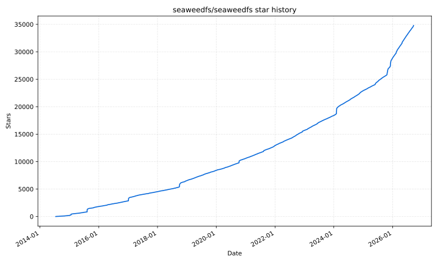

# SeaweedFS


[](https://join.slack.com/t/seaweedfs/shared_invite/enQtMzI4MTMwMjU2MzA3LTEyYzZmZWYzOGQ3MDJlZWMzYmI0OTE4OTJiZjJjODBmMzUxNmYwODg0YjY3MTNlMjBmZDQ1NzQ5NDJhZWI2ZmY)
[](https://twitter.com/intent/follow?screen_name=seaweedfs)
[](https://github.com/seaweedfs/seaweedfs/actions/workflows/go.yml)
[](https://godoc.org/github.com/seaweedfs/seaweedfs/weed)
[](https://github.com/seaweedfs/seaweedfs/wiki)
[](https://hub.docker.com/r/chrislusf/seaweedfs/)
[](https://search.maven.org/search?q=g:com.github.chrislusf)
[](https://artifacthub.io/packages/search?repo=seaweedfs)


SeaweedFS is a simple and highly scalable distributed file system. There are two objectives:

1. to store billions of files!
2. to serve the files fast!

One `weed` binary serves an S3 object store, a POSIX file system, and a lakehouse with S3 Tables, all over the same data. Each blob is one disk read away, capacity grows by starting another volume server, and cloud storage can be cached or tiered transparently.

- [Download Binaries for different platforms](https://github.com/seaweedfs/seaweedfs/releases/latest)
- [Wiki Documentation](https://github.com/seaweedfs/seaweedfs/wiki)
- Community: [Slack](https://join.slack.com/t/seaweedfs/shared_invite/enQtMzI4MTMwMjU2MzA3LTEyYzZmZWYzOGQ3MDJlZWMzYmI0OTE4OTJiZjJjODBmMzUxNmYwODg0YjY3MTNlMjBmZDQ1NzQ5NDJhZWI2ZmY), [Twitter](https://twitter.com/SeaweedFS), [Telegram](https://t.me/Seaweedfs), [Reddit](https://www.reddit.com/r/SeaweedFS/), [Mailing List](https://groups.google.com/d/forum/seaweedfs)
- [SeaweedFS White Paper](https://github.com/seaweedfs/seaweedfs/wiki/SeaweedFS_Architecture.pdf) and introduction slides: [2025.5](https://docs.google.com/presentation/d/1tdkp45J01oRV68dIm4yoTXKJDof-EhainlA0LMXexQE/edit?usp=sharing), [2021.5](https://docs.google.com/presentation/d/1DcxKWlINc-HNCjhYeERkpGXXm6nTCES8mi2W5G0Z4Ts/edit?usp=sharing), [2019.3](https://www.slideshare.net/chrislusf/seaweedfs-introduction)

Table of Contents
=================

* [Quick Start](#quick-start)
    * [One command](#one-command)
    * [Docker](#docker)
    * [Docker Compose](#docker-compose)
    * [Kubernetes with Helm](#kubernetes-with-helm)
    * [Build from source](#build-from-source)
    * [Scale out](#scale-out)
* [Why SeaweedFS](#why-seaweedfs)
    * [Fast](#fast)
    * [Scalable](#scalable)
    * [The most complete S3 API](#the-most-complete-s3-api)
    * [A data warehouse with S3 Tables](#a-data-warehouse-with-s3-tables)
    * [A fast cache for cloud storage](#a-fast-cache-for-cloud-storage)
    * [Active-active replication and more](#active-active-replication-and-more)
* [Architecture](#architecture)
* [Compared to Other Systems](#compared-to-other-systems)
    * [Compared to HDFS](#compared-to-hdfs)
    * [Compared to GlusterFS, Ceph](#compared-to-glusterfs-ceph)
    * [Compared to MooseFS](#compared-to-moosefs)
    * [Compared to Ceph](#compared-to-ceph)
    * [Compared to MinIO, RustFS](#compared-to-minio-rustfs)
* [Benchmark](#benchmark)
* [Enterprise](#enterprise)
* [License](#license)
* [Sponsors](#sponsors)

# Quick Start #

## One command ##

Download the latest binary from the [releases](https://github.com/seaweedfs/seaweedfs/releases/latest) page and unzip the single `weed` (or `weed.exe`) file, or let the install script put it in `/usr/local/bin`:

```bash
curl -fsSL https://raw.githubusercontent.com/seaweedfs/seaweedfs/master/install.sh | bash
```

Then start a ready-to-use S3 object store:

```bash
AWS_ACCESS_KEY_ID=admin \
AWS_SECRET_ACCESS_KEY=secret \
S3_BUCKET=my-bucket \
./weed mini -dir=./data
```

That's it. The S3 endpoint is at http://localhost:8333, `my-bucket` exists, and `admin`/`secret` are valid credentials:

```bash
AWS_ACCESS_KEY_ID=admin AWS_SECRET_ACCESS_KEY=secret \
  aws --endpoint-url http://localhost:8333 s3 cp README.md s3://my-bucket/
```

The same process also runs the master, a volume server, the filer, WebDAV, the Iceberg REST catalog, and the Admin UI. Add `S3_TABLE_BUCKET=warehouse` to also create an Iceberg table bucket, or `warehouse:LANCE` for a Lance one. Drop the AWS keys to run without authentication for development.

> macOS: if the binary is quarantined, run `xattr -d com.apple.quarantine ./weed` first.

`weed mini` is auto-tuned for one node and is fine for single-node production, such as an S3 gateway that issues presigned URLs. See [Quick Start with weed mini][WeedMini].

## Docker ##

```bash
docker run -p 8333:8333 -v weed-data:/data \
  -e AWS_ACCESS_KEY_ID=admin \
  -e AWS_SECRET_ACCESS_KEY=secret \
  -e S3_BUCKET=my-bucket \
  chrislusf/seaweedfs
```

Same behavior as the `weed mini` command above.

## Docker Compose ##

To run master, volume server, filer, S3, and WebDAV as separate services:

```bash
wget https://raw.githubusercontent.com/seaweedfs/seaweedfs/master/docker/seaweedfs-compose.yml
wget -P prometheus https://raw.githubusercontent.com/seaweedfs/seaweedfs/master/docker/prometheus/prometheus.yml
docker compose -f seaweedfs-compose.yml -p seaweedfs up
```

[Docker Compose for S3][DockerComposeS3] adds credentials, and the [docker/compose](docker/compose) folder has variants for replication, mounts, message queues, and more.

## Kubernetes with Helm ##

```bash
helm repo add seaweedfs https://seaweedfs.github.io/seaweedfs/helm
helm install seaweedfs seaweedfs/seaweedfs -n seaweedfs --create-namespace -f values.yaml
```

A production-shaped `values.yaml` for a three-node cluster: two copies of every write, three masters, and an S3 endpoint with credentials and a bucket.

```yaml
global:
  seaweedfs:
    enableReplication: true
    replicationPlacement: "001"   # one extra copy on another server; "002" for two

master:
  replicas: 3
  data:
    type: persistentVolumeClaim   # the cluster's default storage class; add storageClass to pick one
    size: 1Gi

volume:
  replicas: 3                     # at least 1 + the sum of the replication digits
  dataDirs:
    - name: data
      type: persistentVolumeClaim
      size: 500Gi
      maxVolumes: 0               # size the volume count from the disk

filer:
  replicas: 2
  data:
    type: persistentVolumeClaim
    size: 20Gi

s3:
  enabled: true
  replicas: 2
  enableAuth: true
  credentials:
    admin:
      accessKey: admin
      secretKey: change-me
  createBuckets:
    - name: app-storage
```

The S3 endpoint is the `seaweedfs-s3` service on port 8333. [Helm Chart Recipes][HelmRecipes] has values for a development cluster, a lakehouse with the Iceberg catalog exposed, filer metadata on PostgreSQL, and node-local disks. The [SeaweedFS Operator][Operator] and the [CSI driver][SeaweedFsCsiDriver] are the other Kubernetes paths.

## Build from source ##

```bash
git clone https://github.com/seaweedfs/seaweedfs.git
cd seaweedfs/weed && make install
```

`weed` lands in `$GOPATH/bin`. [Getting Started][GettingStarted] covers running master, volume, filer, and S3 as separate processes.

## Scale out ##

Capacity is a volume server. Start one on any machine with disk and point it at the master:

```bash
weed volume -dir=/data -master=<master_host>:9333
```

Nothing rebalances until you ask it to. Throughput is a filer or S3 gateway; they are stateless, so run as many as you need behind a load balancer. [Production Setup][ProductionSetup] walks through a multi-node cluster.

[Back to TOC](#table-of-contents)

# Why SeaweedFS #

## Fast ##

* One disk read per blob. A small file is one blob; a large file is split into chunks of a few MB, each its own blob. A volume server keeps a 16-byte index entry per blob in memory and reads it in a single seek, also for erasure-coded data.
* The master is not in the read path. Clients cache the volume-to-server mapping and talk to volume servers directly.
* 40 bytes of metadata per file on disk. Small files are packed into append-only volume files, so there is no per-file inode, no per-file metadata file, no fragmentation, and writes are SSD friendly.
* Hot data is replicated; [erasure coding][ErasureCoding] is applied to warm data in the background, so writes never pay the encoding cost.
* The [Rust volume server][RustVolume] is a drop-in for higher throughput and lower tail latency on the same on-disk format.

On one laptop, [`weed benchmark`][Benchmarks] writes 1KB files at 15,700 per second and reads them back at 47,000 per second, and a mixed S3 [warp][S3Benchmark] run totals 3.2 GiB/s. Numbers are in the [Benchmark](#benchmark) section; throughput grows with volume servers and gateways.

## Scalable ##

* The master tracks volumes, not files. A cluster with billions of files has a few thousand volumes, so the master stays small. One master is enough for most clusters; run three for [Raft failover][FailoverMaster].
* Adding a server adds capacity with no data reshuffle. Balancing, vacuum, erasure coding, and repair run on demand from [`weed shell`][WeedShell] or the [maintenance worker][Worker].
* Filer and S3 gateways are stateless and scale linearly. Directory metadata lives in a [store you already run][FilerStores]: LevelDB, RocksDB, SQLite, MySQL, PostgreSQL, Cassandra, HBase, MongoDB, Redis, Elasticsearch, etcd, TiKV, FoundationDB, YDB, ArangoDB, Tarantool, and MySQL or PostgreSQL compatible databases such as TiDB, CockroachDB, and MemSQL.
* Rack and data center aware [replication][Replication], [tiered storage][TieredStorage] across disk types, and [transparent cloud tiering][CloudTier] for unlimited capacity.
* Files from a byte to [tens of TB][SuperLargeFiles]. Volumes up to 8TB with the large-disk build.

## The most complete S3 API ##

The S3 gateway implements the object, bucket, S3 Tables, IAM, and STS APIs on one endpoint, so the AWS SDKs and CLI, rclone, restic, Spark, and Trino work unchanged.

| API | Operations |
| --- | --- |
| S3 bucket and object | 73 |
| S3 Tables | 36 |
| IAM | 39 |
| STS | 5 |

* [Versioning][Versioning], [Object Lock][ObjectLock] with retention and legal hold, [lifecycle][Lifecycle] rules, tagging, [CORS][CORS], [conditional reads and writes][ConditionalOps], checksums, presigned URLs, browser POST uploads, multipart uploads, and an atomic [RenameObject][RenameObject].
* [Bucket policies][BucketPolicies] with [conditions][PolicyConditions] and [variables][PolicyVariables]; IAM users, groups, and policies; STS with [OIDC][OIDC], LDAP, and [Kubernetes service accounts][K8sSA].
* [SSE-S3, SSE-KMS, and SSE-C][SSE] server-side encryption, with OpenBao and Vault, AWS KMS, Azure Key Vault, and GCP KMS as key providers.
* [Audit log][AuditLog], [bucket quota][BucketQuota], and [rate limiting][RateLimiting].
* Each bucket is its own collection, so deleting a bucket is instant.

The full operation list is in [Amazon S3 API][AmazonS3API], and [Supported APIs vs MinIO][S3vsMinio] compares. The S3 compatibility suite and the SDK, IAM, SSE, policy, and Spark integration tests run in CI on every change.

## A data warehouse with S3 Tables ##

SeaweedFS is a lakehouse in one system. [S3 Table Buckets][S3TableBucket] hold Apache Iceberg tables by default, or [Lance][LanceCatalog] tables for vectors and multimodal data, and the built-in [Iceberg REST Catalog][IcebergCatalog] and Lance namespace serve them directly. There is no Hive Metastore, Glue, or separate catalog service to deploy, secure, and back up.

* Query engines operate on the same tables at the same time: [Spark][SparkIceberg], [Trino][TrinoIceberg], [Dremio][DremioIceberg], [DuckDB][DuckDBIceberg], [Apache Doris][DorisIceberg], [RisingWave][RisingWaveIceberg], ClickHouse, and [LanceDB][LanceDB]. Catalog commits are atomic compare-and-swap, so concurrent writers are safe. [Lakekeeper][Lakekeeper] can front the same storage with STS-vended credentials.
* [Automated table maintenance][IcebergMaintenance]: compaction, snapshot expiration, orphan file removal, and manifest rewriting, configured per bucket or table through the S3 Tables maintenance APIs, and the same for [Lance][LanceMaintenance].
* IAM at the bucket, namespace, and table level with standard bucket policies, see [S3 Tables Security][S3TablesSecurity].
* A [Hadoop compatible file system][Hadoop] for Spark, Flink, and HBase.

`S3_TABLE_BUCKET=warehouse ./weed mini -dir=./data` brings the whole stack up on a laptop.

## A fast cache for cloud storage ##

[Cloud Drive][CloudDrive] mounts a bucket from S3, Google Cloud Storage, Azure, Backblaze B2, Wasabi, Storj, or any S3-compatible store into SeaweedFS and serves it at local speed:

* Metadata is pulled once, so listing, stat, and directory walks cost no cloud API calls.
* File content is downloaded once, on first read or [warmed][CacheRemote] by folder, name pattern, size, or age, and cached with the capacity of the whole cluster: cache everything, no churn.
* Local writes complete at local latency and are written back to the cloud asynchronously in the cloud's native layout, so other tools keep reading the bucket directly.
* Uncache by the same rules to free local disk while keeping the metadata.

[Cloud Tier][CloudTier] goes the other direction, moving whole warm volumes to cloud storage while keeping one-read access, and the [Gateway to Remote Object Storage][GatewayToRemoteObjectStore] mirrors every bucket to a remote store. Faster and cheaper than reading the cloud directly.

## Active-active replication and more ##

* [Active-active or active-passive replication][ActiveActiveAsyncReplication] between clusters, continuous and resumable, for the whole tree or chosen folders, across data centers.
* [Filer store replication][FilerStoreReplication] for metadata HA, [async backup][AsyncBackup] to cloud storage, [metadata backup][MetaBackup], and [change data capture][CDC] with [webhooks][Webhook] on every metadata event.
* The same data as a [FUSE mount][Mount] on Linux, macOS, and [Windows][MountWindows], over [WebDAV][WebDAV], [SFTP][SFTP], HDFS, HTTP, and [TUS resumable uploads][TUS]; on Kubernetes through the [CSI driver][SeaweedFsCsiDriver] and [Operator][Operator].
* [AES256-GCM encryption at rest][FilerDataEncryption], TLS and mTLS between components, JWT-signed volume access, and [FIPS][FIPS] builds.
* [Admin UI][AdminUI], Prometheus [metrics][Metrics], [TTL][VolumeServerTTL] per file or volume, automatic compression and compaction, and [seaweed-up][SeaweedUp] for bare-metal clusters.

[Back to TOC](#table-of-contents)

# Architecture #


* **Master** servers, one or a Raft group of three, track which volume lives on which volume server and hand out file ids. They are not in the read path.
* **Volume** servers store blobs in append-only volume files, keep a 16-byte in-memory index per blob, and replicate or erasure-code at the volume level.
* **Filer** servers add directories and files on top, with metadata in a store of your choice, and expose HTTP, S3, WebDAV, SFTP, FUSE, and the table catalogs.

The blob store started from [Facebook's Haystack](http://www.usenix.org/event/osdi10/tech/full_papers/Beaver.pdf), erasure coding takes ideas from [f4](https://www.usenix.org/system/files/conference/osdi14/osdi14-paper-muralidhar.pdf), and the whole has a lot in common with [Tectonic](https://www.usenix.org/system/files/fast21-pan.pdf) and [Colossus](https://cloud.google.com/blog/products/storage-data-transfer/a-peek-behind-colossus-googles-file-system). How file ids are assigned, written, and looked up, and why a master that tracks volumes scales, is in [Blob Store Architecture][BlobStoreArchitecture]; the services are in [Components][Components] and the [white paper][WhitePaper].

[Back to TOC](#table-of-contents)

# Compared to Other Systems #

Most other distributed file systems seem more complicated than necessary.

SeaweedFS is meant to be fast and simple, in both setup and operation. If you do not understand how it works when you reach here, we've failed! Please raise an issue with any questions or update this file with clarifications.

SeaweedFS is constantly moving forward. Same with other systems. These comparisons can be outdated quickly. Please help to keep them updated.

## Compared to HDFS ##

HDFS uses the chunk approach for each file, and is ideal for storing large files.

SeaweedFS is ideal for serving relatively smaller files quickly and concurrently.

SeaweedFS can also store extra large files by splitting them into manageable data chunks, and store the file ids of the data chunks into a meta chunk. This is managed by "weed upload/download" tool, and the weed master or volume servers are agnostic about it.

## Compared to GlusterFS, Ceph ##

The architectures are mostly the same. SeaweedFS aims to store and read files fast, with a simple and flat architecture. The main differences are

* SeaweedFS optimizes for small files, ensuring O(1) disk seek operation, and can also handle large files.
* SeaweedFS statically assigns a volume id for a file. Locating file content becomes just a lookup of the volume id, which can be easily cached.
* SeaweedFS Filer metadata store can be any well-known and proven data store, e.g., Redis, Cassandra, HBase, Mongodb, Elastic Search, MySql, Postgres, Sqlite, MemSql, TiDB, CockroachDB, Etcd, YDB etc, and is easy to customize.
* SeaweedFS Volume server also communicates directly with clients via HTTP, supporting range queries, direct uploads, etc.

| System         | File Metadata                   | File Content Read| POSIX  | REST API | Optimized for large number of small files |
| -------------  | ------------------------------- | ---------------- | ------ | -------- | ------------------------- |
| SeaweedFS      | lookup volume id, cacheable     | O(1) disk seek   |        | Yes      | Yes                       |
| SeaweedFS Filer| Linearly Scalable, Customizable | O(1) disk seek   | FUSE   | Yes      | Yes                       |
| GlusterFS      | hashing          |                  | FUSE, NFS          |          |                           |
| Ceph           | hashing + rules  |                  | FUSE               | Yes      |                           |
| MooseFS        | in memory        |                  | FUSE               |       | No                          |
| MinIO          | separate meta file per drive for each file  |                  |         | Yes   | No                          |
| RustFS         | separate meta file per drive for each file  |                  |         | Yes   | No                          |

GlusterFS stores files, both directories and content, in configurable volumes called "bricks". It hashes the path and filename into ids, and assigned to virtual volumes, and then mapped to "bricks".

## Compared to MooseFS ##

MooseFS chooses to neglect small file issue. From moosefs 3.0 manual, "even a small file will occupy 64KiB plus additionally 4KiB of checksums and 1KiB for the header", because it "was initially designed for keeping large amounts (like several thousands) of very big files"

MooseFS Master Server keeps all meta data in memory. Same issue as HDFS namenode.

## Compared to Ceph ##

Ceph can be setup similar to SeaweedFS as a key->blob store. It is much more complicated, with the need to support layers on top of it. [Here is a more detailed comparison](https://github.com/seaweedfs/seaweedfs/issues/120)

SeaweedFS has a centralized master group to look up free volumes, while Ceph uses hashing and metadata servers to locate its objects. Having a centralized master makes it easy to code and manage.

Ceph, like SeaweedFS, is based on the object store RADOS. Ceph is rather complicated with mixed reviews.

Ceph uses CRUSH hashing to automatically manage data placement, which is efficient to locate the data. But the data has to be placed according to the CRUSH algorithm. Any wrong configuration would cause data loss. Topology changes, such as adding new servers to increase capacity, will cause data migration with high IO cost to fit the CRUSH algorithm. SeaweedFS places data by assigning them to any writable volumes. If writes to one volume failed, just pick another volume to write. Adding more volumes is also as simple as it can be.

SeaweedFS is optimized for small files. Small files are stored as one continuous block of content, with at most 8 unused bytes between files. Small file access is O(1) disk read.

SeaweedFS Filer uses off-the-shelf stores, such as MySql, Postgres, Sqlite, Mongodb, Redis, Elastic Search, Cassandra, HBase, MemSql, TiDB, CockroachCB, Etcd, YDB, to manage file directories. These stores are proven, scalable, and easier to manage.

| SeaweedFS         | comparable to Ceph | advantage |
| -------------  | ------------- | ---------------- |
| Master  | MDS | simpler |
| Volume  | OSD | optimized for small files |
| Filer  | Ceph FS | linearly scalable, Customizable, O(1) or O(logN) |

## Compared to MinIO, RustFS ##

Please note, as Apr 25, 2026 MinIO ceased development. It's strongly discouraged to use that unmaintained software with multiple security bugs. RustFS is a MinIO reimplementation in Rust, Apache 2.0 licensed and still developed, keeping MinIO's storage model down to a byte-compatible on-disk format. So the points below apply to both.

MinIO followed AWS S3 closely and was ideal for testing for S3 API. It had good UI, policies, versionings, etc. SeaweedFS is trying to catch up here.

The metadata are in simple files. Each file write incurs extra writes to the corresponding meta file, on every drive of the erasure set. Changing only tags or retention rewrites that meta file on all of them, so the write amplification does not shrink with object size.

There is no optimization for lots of small files. The files are simply stored as is to local disks.
Plus the extra meta file and shards for erasure coding, it only amplifies the LOSF problem.

Multiple disk IO are needed to read one file. SeaweedFS has O(1) disk reads, even for erasure coded files.

Erasure coding is full-time. SeaweedFS uses replication on hot data for faster speed and optionally applies erasure coding on warm data.

No POSIX-like API support.

There are specific requirements on storage layout, which makes it hard to scale out and to maintain. An erasure set must be 2 to 16 drives and must divide the drive list symmetrically, and capacity grows or shrinks a whole pool at a time. In SeaweedFS, just start one volume server pointing to the master. That's all.

[Back to TOC](#table-of-contents)

# Benchmark #

Unscientific single-machine numbers from a MacBook with an SSD. [`weed benchmark`][Benchmarks], 1 million 1KB files, concurrency 16:

| | Requests per second | p50 | p99 |
| --- | --- | --- | --- |
| Write | 15,708 | 0.8 ms | 2.6 ms |
| Random read | 47,019 | 0.3 ms | 0.7 ms |

`make benchmark` runs [warp][S3Benchmark] mixed S3 traffic against a local `weed server`:

```
Mixed operations.
Operation: DELETE, 10%, Concurrency: 20, Ran 42s.
 * Throughput: 55.13 obj/s

Operation: GET, 45%, Concurrency: 20, Ran 42s.
 * Throughput: 2477.45 MiB/s, 247.75 obj/s

Operation: PUT, 15%, Concurrency: 20, Ran 42s.
 * Throughput: 825.85 MiB/s, 82.59 obj/s

Operation: STAT, 30%, Concurrency: 20, Ran 42s.
 * Throughput: 165.27 obj/s

Cluster Total: 3302.88 MiB/s, 550.51 obj/s over 43s.
```

Read throughput is bounded by the random read speed of the disks, and grows with every volume server added. More numbers, including multi-node, FUSE, and Hadoop, are in [Benchmarks][Benchmarks], [S3 API Benchmark][S3Benchmark], [FIO benchmark][FIO], and [Independent Benchmarks][IndependentBenchmarks].

[Back to TOC](#table-of-contents)

# Enterprise #

For enterprise users, please visit [seaweedfs.com](https://seaweedfs.com) for the SeaweedFS Enterprise Edition,
which has advanced features, including data recovery, self-healing storage,
customizable erasure coding, EC vacuum and repair, etc.

[Back to TOC](#table-of-contents)

# License #

Licensed under the Apache License, Version 2.0 (the "License");
you may not use this file except in compliance with the License.
You may obtain a copy of the License at

    http://www.apache.org/licenses/LICENSE-2.0

Unless required by applicable law or agreed to in writing, software
distributed under the License is distributed on an "AS IS" BASIS,
WITHOUT WARRANTIES OR CONDITIONS OF ANY KIND, either express or implied.
See the License for the specific language governing permissions and
limitations under the License.

The text of this page is available for modification and reuse under the terms of the Creative Commons Attribution-Sharealike 3.0 Unported License and the GNU Free Documentation License (unversioned, with no invariant sections, front-cover texts, or back-cover texts).

[Back to TOC](#table-of-contents)

# Sponsors #

<h3 align="center"><a href="https://www.patreon.com/seaweedfs">Sponsor SeaweedFS via Patreon</a></h3>

SeaweedFS is an independent Apache-licensed open source project with its ongoing development made
possible entirely thanks to the support of these awesome [backers](https://github.com/seaweedfs/seaweedfs/blob/master/backers.md).
If you'd like to grow SeaweedFS even stronger, please consider joining our
<a href="https://www.patreon.com/seaweedfs">sponsors on Patreon</a>.

Your support will be really appreciated by me and other supporters!

<!--
<h4 align="center">Platinum</h4>

<p align="center">
  <a href="" target="_blank">
    
  </a>
</p>
-->

### Gold Sponsors
[](https://www.nodion.com)
[](https://www.piknik.com)
[](https://www.keepsec.ca)
[](https://zyner.org)

[Back to TOC](#table-of-contents)

## Star History



[WeedMini]: https://github.com/seaweedfs/seaweedfs/wiki/Quick-Start-with-weed-mini
[DockerComposeS3]: https://github.com/seaweedfs/seaweedfs/wiki/Docker-Compose-for-S3
[HelmRecipes]: https://github.com/seaweedfs/seaweedfs/wiki/Helm-Chart-Recipes
[Operator]: https://github.com/seaweedfs/seaweedfs-operator
[SeaweedFsCsiDriver]: https://github.com/seaweedfs/seaweedfs-csi-driver
[GettingStarted]: https://github.com/seaweedfs/seaweedfs/wiki/Getting-Started
[ProductionSetup]: https://github.com/seaweedfs/seaweedfs/wiki/Production-Setup
[ErasureCoding]: https://github.com/seaweedfs/seaweedfs/wiki/Erasure-Coding-for-warm-storage
[RustVolume]: https://github.com/seaweedfs/seaweedfs/wiki/Rust-Volume-Server
[Benchmarks]: https://github.com/seaweedfs/seaweedfs/wiki/Benchmarks
[S3Benchmark]: https://github.com/seaweedfs/seaweedfs/wiki/S3-API-Benchmark
[FIO]: https://github.com/seaweedfs/seaweedfs/wiki/FIO-benchmark
[IndependentBenchmarks]: https://github.com/seaweedfs/seaweedfs/wiki/Independent-Benchmarks
[FailoverMaster]: https://github.com/seaweedfs/seaweedfs/wiki/Failover-Master-Server
[WeedShell]: https://github.com/seaweedfs/seaweedfs/wiki/weed-shell
[Worker]: https://github.com/seaweedfs/seaweedfs/wiki/Worker
[FilerStores]: https://github.com/seaweedfs/seaweedfs/wiki/Filer-Stores
[Replication]: https://github.com/seaweedfs/seaweedfs/wiki/Replication
[TieredStorage]: https://github.com/seaweedfs/seaweedfs/wiki/Tiered-Storage
[CloudTier]: https://github.com/seaweedfs/seaweedfs/wiki/Cloud-Tier
[SuperLargeFiles]: https://github.com/seaweedfs/seaweedfs/wiki/Data-Structure-for-Large-Files
[Versioning]: https://github.com/seaweedfs/seaweedfs/wiki/S3-Object-Versioning
[ObjectLock]: https://github.com/seaweedfs/seaweedfs/wiki/S3-Object-Lock-and-Retention
[Lifecycle]: https://github.com/seaweedfs/seaweedfs/wiki/S3-Lifecycle
[CORS]: https://github.com/seaweedfs/seaweedfs/wiki/S3-CORS
[ConditionalOps]: https://github.com/seaweedfs/seaweedfs/wiki/S3-Conditional-Operations
[RenameObject]: https://github.com/seaweedfs/seaweedfs/wiki/S3-RenameObject
[BucketPolicies]: https://github.com/seaweedfs/seaweedfs/wiki/S3-Bucket-Policies
[PolicyConditions]: https://github.com/seaweedfs/seaweedfs/wiki/S3-Policy-Conditions
[PolicyVariables]: https://github.com/seaweedfs/seaweedfs/wiki/S3-Policy-Variables
[OIDC]: https://github.com/seaweedfs/seaweedfs/wiki/OIDC-Integration
[K8sSA]: https://github.com/seaweedfs/seaweedfs/wiki/Kubernetes-ServiceAccount-Authentication
[SSE]: https://github.com/seaweedfs/seaweedfs/wiki/Server-Side-Encryption
[AuditLog]: https://github.com/seaweedfs/seaweedfs/wiki/S3-API-Audit-log
[BucketQuota]: https://github.com/seaweedfs/seaweedfs/wiki/S3-Bucket-Quota
[RateLimiting]: https://github.com/seaweedfs/seaweedfs/wiki/S3-Rate-Limiting
[AmazonS3API]: https://github.com/seaweedfs/seaweedfs/wiki/Amazon-S3-API
[S3vsMinio]: https://github.com/seaweedfs/seaweedfs/wiki/Supported-APIs-vs-Minio
[S3TableBucket]: https://github.com/seaweedfs/seaweedfs/wiki/S3-Table-Bucket
[LanceCatalog]: https://github.com/seaweedfs/seaweedfs/wiki/SeaweedFS-Lance-Catalog
[IcebergCatalog]: https://github.com/seaweedfs/seaweedfs/wiki/SeaweedFS-Iceberg-Catalog
[SparkIceberg]: https://github.com/seaweedfs/seaweedfs/wiki/Spark-Iceberg-Integration
[TrinoIceberg]: https://github.com/seaweedfs/seaweedfs/wiki/Trino-Iceberg-Integration
[DremioIceberg]: https://github.com/seaweedfs/seaweedfs/wiki/Dremio-Iceberg-Integration
[DuckDBIceberg]: https://github.com/seaweedfs/seaweedfs/wiki/DuckDB-Iceberg-Integration
[DorisIceberg]: https://github.com/seaweedfs/seaweedfs/wiki/Doris-Iceberg-Integration
[RisingWaveIceberg]: https://github.com/seaweedfs/seaweedfs/wiki/RisingWave-Iceberg-Integration
[LanceDB]: https://github.com/seaweedfs/seaweedfs/wiki/LanceDB-Integration
[Lakekeeper]: https://github.com/seaweedfs/seaweedfs/wiki/Lakekeeper-Iceberg-Integration
[IcebergMaintenance]: https://github.com/seaweedfs/seaweedfs/wiki/Iceberg-Table-Maintenance
[LanceMaintenance]: https://github.com/seaweedfs/seaweedfs/wiki/Lance-Maintenance-Worker
[S3TablesSecurity]: https://github.com/seaweedfs/seaweedfs/wiki/S3-Tables-Security
[Hadoop]: https://github.com/seaweedfs/seaweedfs/wiki/Hadoop-Compatible-File-System
[CloudDrive]: https://github.com/seaweedfs/seaweedfs/wiki/Cloud-Drive-Architecture
[CacheRemote]: https://github.com/seaweedfs/seaweedfs/wiki/Cache-Remote-Storage
[GatewayToRemoteObjectStore]: https://github.com/seaweedfs/seaweedfs/wiki/Gateway-to-Remote-Object-Storage
[ActiveActiveAsyncReplication]: https://github.com/seaweedfs/seaweedfs/wiki/Filer-Active-Active-cross-cluster-continuous-synchronization
[FilerStoreReplication]: https://github.com/seaweedfs/seaweedfs/wiki/Filer-Store-Replication
[AsyncBackup]: https://github.com/seaweedfs/seaweedfs/wiki/Async-Backup
[MetaBackup]: https://github.com/seaweedfs/seaweedfs/wiki/Async-Filer-Metadata-Backup
[CDC]: https://github.com/seaweedfs/seaweedfs/wiki/Filer-Change-Data-Capture
[Webhook]: https://github.com/seaweedfs/seaweedfs/wiki/Filer-Notification-Webhook
[Mount]: https://github.com/seaweedfs/seaweedfs/wiki/FUSE-Mount
[MountWindows]: https://github.com/seaweedfs/seaweedfs/wiki/Mount-on-Windows
[WebDAV]: https://github.com/seaweedfs/seaweedfs/wiki/WebDAV
[SFTP]: https://github.com/seaweedfs/seaweedfs/wiki/SFTP-Server
[TUS]: https://github.com/seaweedfs/seaweedfs/wiki/TUS-Resumable-Uploads
[FilerDataEncryption]: https://github.com/seaweedfs/seaweedfs/wiki/Filer-Data-Encryption
[FIPS]: https://github.com/seaweedfs/seaweedfs/wiki/Cryptography-and-FIPS-Compliance
[AdminUI]: https://github.com/seaweedfs/seaweedfs/wiki/Admin-UI
[Metrics]: https://github.com/seaweedfs/seaweedfs/wiki/System-Metrics
[VolumeServerTTL]: https://github.com/seaweedfs/seaweedfs/wiki/Store-file-with-a-Time-To-Live
[SeaweedUp]: https://github.com/seaweedfs/seaweedfs/wiki/Deployment-with-seaweed-up
[BlobStoreArchitecture]: https://github.com/seaweedfs/seaweedfs/wiki/Blob-Store-Architecture
[Components]: https://github.com/seaweedfs/seaweedfs/wiki/Components
[WhitePaper]: https://github.com/seaweedfs/seaweedfs/wiki/SeaweedFS_Architecture.pdf
