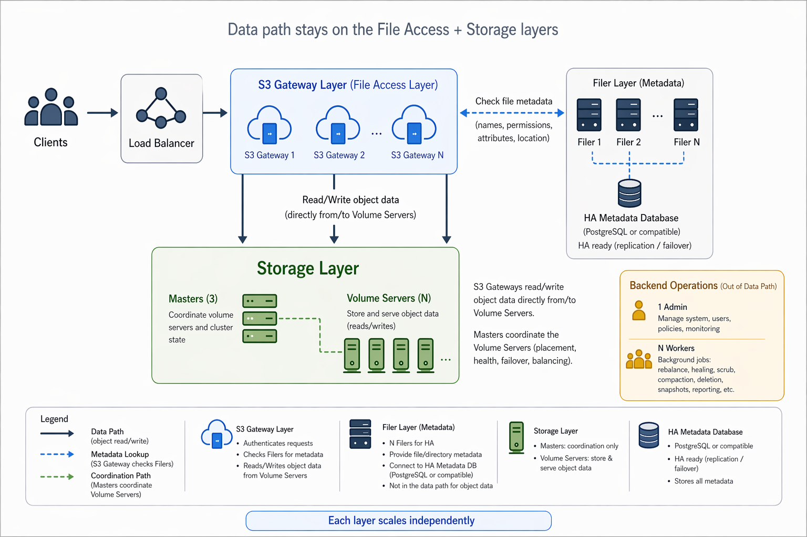

# SeaweedFS Production Setup

A walkthrough of the recommended deployment topology

- Storage layer
- File access layer
- Backend operations
- Erasure coding for durability

---



---

# Storage Layer

**3 Masters + Volume Servers**

- **Masters (run 3)**
  - Form a Raft quorum; tolerate 1 failure
  - Track volume locations and cluster topology
  - Lightweight; not on the data path for reads/writes after lookup

- **Volume Servers (scale out)**
  - Hold the actual needle data on local disks
  - Add more servers for capacity and throughput
  - Heartbeat to masters; clients talk to them directly for I/O

Rule of thumb: start with 3 masters, then grow volume servers with data.

---

# File Access Layer

**Filer + DB for metadata**

- Filer serves POSIX-like directory and file metadata
- Metadata store options: PostgreSQL, MySQL, Redis, Cassandra, TiKV, etc.
- Run **3 filers** for HA
- Filers are stateless relative to each other — state lives in the DB

**S3 Servers**

- Expose the S3 API on top of the filer
- Scale the count based on throughput requirements
- Can be co-located with filers or run independently

---

# Backend Operations

**1 Admin Server + a few Workers**

- **Admin server (1 is enough)**
  - Coordinates background jobs: balancing, EC encoding, vacuum, replication fixes
  - **Not on the data path** — a restart does not affect object store reads/writes
  - No HA required for normal operation

- **Workers (a few)**
  - Execute long-running tasks issued by the admin server
  - Horizontally scalable based on maintenance workload

Keeps housekeeping off the hot path.

---

# Production Topology Summary

| Component      | Count                | Role                              |
|----------------|----------------------|-----------------------------------|
| Master         | 3                    | Raft quorum, topology, volume map |
| Volume Server  | N (scale out)        | Stores data needles               |
| Filer          | 3                    | Metadata gateway                  |
| Metadata DB    | HA cluster           | Persists filer metadata           |
| S3 Server      | N (by throughput)    | S3 API frontend                   |
| Admin          | 1                    | Background job coordinator        |
| Worker         | A few                | Executes admin-scheduled tasks    |

---

# Erasure Coding for Durability

Prefer **many volume servers** so EC shards spread across failure domains.

**Example: 8 volume servers, EC 5+3**

- Each volume becomes 5 data shards + 3 parity shards
- Shards are placed on 8 distinct volume servers
- **Tolerates up to 3 simultaneous volume server failures**
- Storage overhead: 1.6x vs 3x for full replication

```
Volume -> [D1][D2][D3][D4][D5] + [P1][P2][P3]
           |   |   |   |   |     |   |   |
          VS1 VS2 VS3 VS4 VS5  VS6 VS7 VS8
```

More volume servers = more EC layouts available (e.g. 10+4, 6+3).

---

# Getting Started Checklist

1. Provision 3 master nodes (small boxes are fine)
2. Provision volume servers sized to your data footprint
3. Stand up an HA metadata DB, then 3 filers pointing at it
4. Add S3 servers sized to required throughput
5. Run 1 admin + a few workers for background maintenance
6. Once you have enough volume servers, enable EC (e.g. 5+3 on 8 servers)

Scale each layer independently as usage grows.
