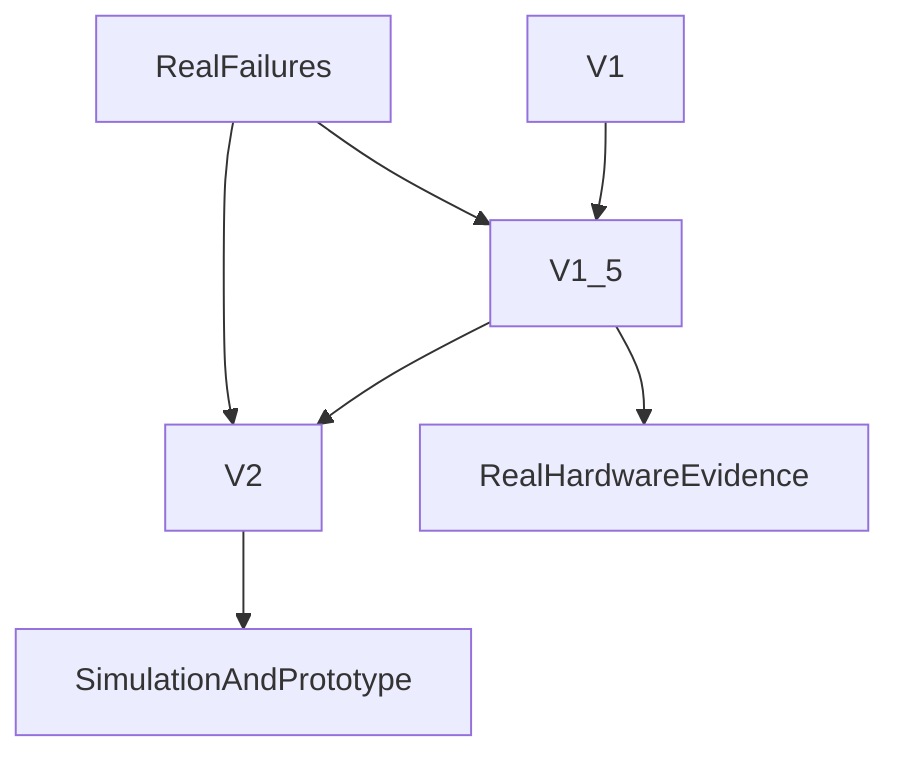
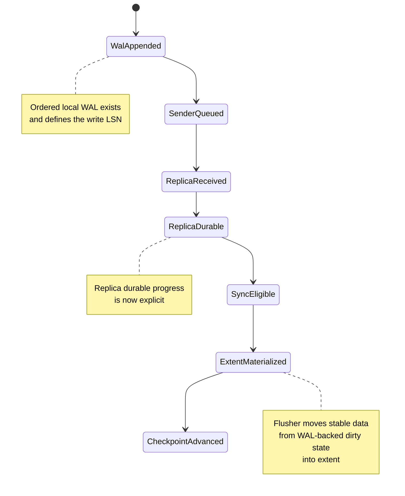
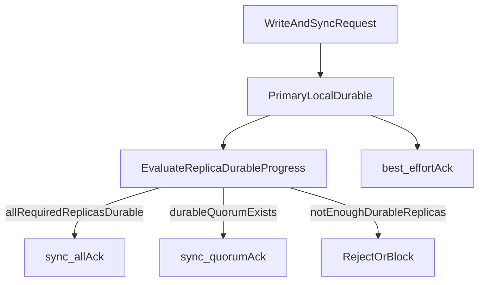
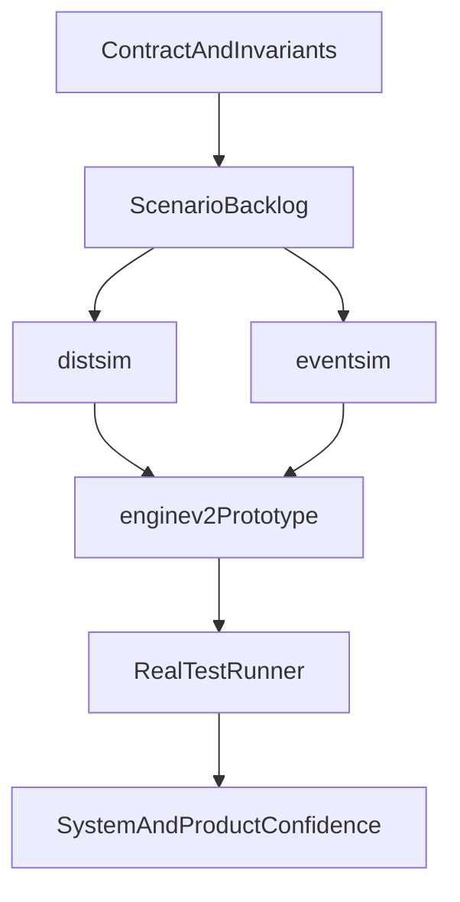

# V2 Algorithm Overview

Date: 2026-03-27
Status: strategic design overview
Audience: CEO / owner / technical leadership

## Purpose

This document explains the current V2 direction for `sw-block`:

- what V2 is trying to solve
- why V1 and V1.5 are not enough as the long-term architecture
- why a WAL-based design is still worth pursuing
- how V2 compares with major market and paper directions
- how simulation and the real test runner systematically build confidence

This is not a phase report and not a production-commitment document.

It is the high-level technical rationale for the V2 line.

## Relationship To Other Documents

| Document | Role |
|----------|------|
| `v1-v15-v2-comparison.md` | Detailed comparison of the three lines |
| `v2-acceptance-criteria.md` | Protocol validation bar |
| `v2_scenarios.md` | Scenario backlog and simulator mapping |
| `v2-open-questions.md` | Remaining algorithmic questions |
| `protocol-development-process.md` | Method for protocol work |
| `learn/projects/sw-block/algorithm_overview.md` | Current V1/V1.5 system review |
| `learn/projects/sw-block/design/algorithm_survey.md` | Paper and vendor survey |
| `learn/projects/sw-block/test/README.md` | Real test runner overview |
| `learn/projects/sw-block/test/test-platform-review.md` | Test platform maturity and standalone direction |

## 1. Executive Summary

The current judgment is:

- `V1` proved that the basic WAL-based replicated block model can work.
- `V1.5` materially improved real recovery behavior and now has stronger operational evidence on real hardware.
- `V2` exists because the next correctness problems should not be solved by incremental local fixes. They should be made explicit in the protocol itself.

The central V2 idea is simple:

- short-gap recovery should be explicit
- stale authority should be explicitly fenced
- catch-up vs rebuild should be an explicit decision
- recovery ownership should be a protocol object, not an implementation accident

`V2` is not yet a production engine. But it is already the stronger architectural direction.

The correct strategic posture today is:

- continue `V1.5` as the production line
- continue `V2` as the long-term architecture line
- continue WAL investigation because we now have a serious validation framework
- if prototype evidence later shows a structural flaw, evolve to `V2.5` before heavy implementation

## 2. The Real Problem V2 Tries To Solve

At the frontend, a block service looks simple:

- `write`
- `flush` / `sync`
- failover
- recovery

But the real difficulty is not the frontend verb set. The real difficulty is the asynchronous distributed boundary between:

- local WAL append on the primary
- durable progress on replicas
- client-visible commit / sync truth
- failover and promotion safety
- recovery after lag, restart, endpoint change, or timeout

This is the root reason V2 exists.

The project has already learned that correctness problems in block storage do not usually come from the happy path. They come from:

- a replica going briefly down and coming back
- a replica coming back on a new address
- a delayed stale barrier or stale reconnect result
- a lagging node that is almost, but not quite, recoverable
- a failover decision made on insufficient lineage information

V2 is the attempt to make those cases first-class protocol behavior instead of post-hoc patching.

## 3. Why V1 And V1.5 Are Not Enough

This overview does not need a long retelling of `V1` and `V1.5`.

What matters is their architectural limit.

### What `V1` got right

`V1` proved the basic shape:

- ordered WAL
- primary-replica replication
- extent-backed storage
- epoch and lease as the first fencing model

### Why `V1` is not enough

Its main shortcomings were:

- short-gap recovery was too weak and too implicit
- lagging replicas too easily fell into rebuild or long degraded states
- changed-address restart was fragile
- stale authority and stale results were not modeled as first-class protocol objects
- the system did not cleanly separate:
  - current WAL head
  - committed prefix
  - recoverable retained range
  - stale or divergent replica tail

### Why `V1.5` is still not enough

`V1.5` fixed several real operational problems:

- retained-WAL catch-up
- same-address reconnect
- `sync_all` correctness on real tests
- rebuild fallback after unrecoverable gap
- control-plane refresh after changed-address restart

Those fixes matter, and they are why `V1.5` is the stronger production line today.

But `V1.5` is still not the long-term architecture because its recovery model remains too incremental:

- reconnect logic is still layered onto an older shipper model
- recovery ownership was discovered as a bug class before it became a protocol object
- catch-up vs rebuild became clearer, but still not clean enough as a top-level protocol contract
- the system still looks too much like "repair V1" rather than "define the next replication model"

### What `V2` changes

`V2` is not trying to invent a completely different storage model.

It is trying to make the critical parts explicit:

- recovery ownership
- lineage-safe recovery boundary
- catch-up vs rebuild classification
- per-replica sender authority
- stale-result rejection
- explicit recovery orchestration

So the correct comparison is still:

- `V1.5` is stronger operationally today
- `V2` is stronger architecturally today

That is not a contradiction. It is the right split between a current production line and the next architecture line.

## 4. How V2 Solves WAL And Extent Synchronization

The core V2 question is not simply "do we keep WAL?"

The real question is:

**how do WAL and extent stay synchronized across primary and replica while preserving both stability and performance?**

This is the center of the V2 design.

### 4.1 The basic separation of roles

V2 treats the storage path as two different but coordinated layers:

- **WAL** is the ordered truth for recent history
- **extent** is the stable materialized image

WAL is used for:

- strict write ordering
- local crash recovery
- short-gap replica catch-up
- durable progress accounting through `LSN`

Extent is used for:

- stable read image
- long-lived storage
- checkpoint and base-image creation
- long-gap recovery only through a real checkpoint/snapshot base, not through guessing from the current live extent

This separation is the first stability rule:

- do not ask current extent to behave like historical state
- do not ask WAL to be the only long-range recovery mechanism forever

### 4.2 Primary-replica synchronization model

The intended V2 steady-state model is:

1. primary allocates monotonic `LSN`
2. primary appends ordered WAL locally
3. primary enqueues the record to per-replica sender loops
4. replicas receive in order and advance explicit progress
5. barrier/sync uses **durable replica progress**, not optimistic send progress
6. flusher later materializes WAL-backed dirty state into extent

The local WAL-to-extent lifecycle can be understood as:

The critical synchronization rule is:

- **client-visible sync truth must follow durable replica progress**
- not local send progress
- not local WAL head
- not "replica probably received it"

This is why V2 uses a lineage-safe recovery target such as `CommittedLSN` instead of a looser notion like "current primary head."

### 4.2.1 Sync mode and result model

V2 also makes the sync-result logic more explicit.

- `best_effort` should succeed after the primary has reached its local durability point, even if replicas are degraded.
- `sync_all` should succeed only when all required replicas are durable through the target boundary.
- `sync_quorum` should succeed only when a true durable quorum exists through the target boundary.

This decision path can be presented as:

The key point is that sync success is no longer inferred from send progress or socket health.
It is derived from explicit durable progress at the right safety boundary.

### 4.3 Why this should be stable

This model is designed to be stable because the dangerous ambiguities are separated:

- **write ordering** is carried by WAL and `LSN`
- **durability truth** is carried by barrier / flushed progress
- **recovery ownership** is carried by sender + recovery attempt identity
- **catch-up vs rebuild** is an explicit classification, not an accidental timeout side effect
- **promotion safety** depends on committed prefix and lineage, not on whichever node looks newest

In other words, V2 stability comes from reducing hidden coupling.

The design tries to remove cases where one piece of state silently stands in for another.

### 4.4 Why this can still be high-performance

The performance argument is not that V2 is magically faster in all cases.

The argument is narrower and more realistic:

- keep the primary write path simple:
  - ordered local WAL append
  - enqueue to per-replica sender loops
  - no heavy inline recovery logic in foreground writes
- keep most complexity off the healthy hot path:
  - sender ownership
  - reconnect classification
  - catch-up / rebuild decisions
  - timeout and stale-result fencing
  live mostly in recovery/control paths
- use WAL for what it is good at:
  - recent ordered delta
  - short-gap replay
- stop using WAL as the answer to every lag problem:
  - long-gap recovery should move toward checkpoint/snapshot base plus tail replay

So the V2 performance thesis is:

- **healthy steady-state should remain close to V1.5**
- **degraded/recovery behavior should become much cleaner**
- **short-gap recovery should be cheaper than rebuild**
- **long-gap recovery should stop forcing an unbounded WAL-retention tax**

That is a much stronger and more believable claim than saying "V2 will just be faster."

### 4.5 Why WAL is still worth choosing

The reason to keep the WAL-based direction is that it gives the best foundation for this exact synchronization problem:

- explicit order
- explicit history
- explicit committed prefix
- explicit short-gap replay
- explicit failover reasoning

WAL is risky only if the design blurs:

- local write acceptance
- replica durable progress
- committed boundary
- recoverable retained history

V2 exists precisely to stop blurring those things.

So the current project position is:

- WAL is not automatically safe
- but WAL is still the most promising base for this block service
- because the project now has enough real evidence, simulator coverage, and prototype work to investigate it rigorously

## 5. Comparison With Market And Papers

The current V2 direction is not chosen because other vendors are wrong. It is chosen because other directions solve different problems and carry different costs.

### Ceph / RBD style systems

Ceph-style block systems avoid this exact per-volume replicated WAL shape. They gain:

- deep integration with object-backed distributed storage
- mature placement and recovery machinery
- strong cluster-scale distribution logic

But they pay elsewhere:

- more system layers
- more object-store and peering complexity
- a heavier operational and conceptual model

This is not a free simplification. It is a different complexity trade.

For `sw-block`, the design choice is to keep a narrower software block service with more explicit per-volume replication semantics instead of inheriting the full distributed object-backed block complexity stack.

### PolarFS / ParallelRaft style work

These systems explore more aggressive ordering and apply strategies:

- out-of-order or conflict-aware work
- deeper parallelism
- more sophisticated log handling

They are valuable references, especially for:

- LBA conflict reasoning
- recovery and replay cost thinking
- future flusher parallelization ideas

But they also introduce a much heavier correctness surface.

The project does not currently want to buy that complexity before fully proving the simpler strict-order path.

### AWS chain replication / EBS-style lessons

Chain replication and related work are attractive because they address real bandwidth and recovery concerns:

- Primary NIC pressure
- forwarding topology
- cleaner scaling for RF=3

This is one of the more plausible borrowable directions later.

But it changes:

- latency profile
- failure handling
- barrier semantics
- operational topology

So it belongs to a later architecture stage, not to the current V2 core proof.

### The actual strategic choice

The project is deliberately choosing:

- a narrower software-first block design
- explicit per-volume correctness
- strict reasoning before performance heroics
- validation before feature expansion

That is not conservatism for its own sake. It is how to build a block product that can later be trusted.

## 6. Why This Direction Fits SeaweedFS And Future Standalone sw-block

`sw-block` started inside SeaweedFS, but V2 is already being shaped as the next standalone block service line.

That means the architecture should preserve two things at once:

### What should remain compatible

- placement and topology concepts where they remain useful
- explainable control-plane contracts
- operational continuity with the SeaweedFS ecosystem

### What should become more block-specific

- replication correctness
- recovery ownership
- recoverability classification
- block-specific test and evidence story

So the current direction is:

- use SeaweedFS as the practical ecosystem and experience base
- but shape V2 as a true block-service architecture, not as a minor sub-feature of `weed/`

This is why the V2 line belongs under `sw-block/` rather than as a direct patch path inside the existing production tree.

## 7. The Systematic Validation Method

The second major reason the current direction is rational is the validation method.

The project is no longer relying on:

- implement first
- discover behavior later
- patch after failure

Instead, the intended ladder is:

- contract and invariants
- scenario backlog
- simulator
- timer/race simulator
- standalone prototype
- real engine test runner

This is the right shape for a risky block-storage algorithm:

- simulation for protocol truth
- prototype for executable truth
- real runner for product/system truth

## 8. What The Simulation System Proves

The simulation system exists to answer:

- what should happen
- what must never happen
- which V1/V1.5 shapes fail
- why the V2 shape is better

### `distsim`

`distsim` is the main protocol simulator.

It is used for:

- protocol correctness
- state transitions
- stale authority fencing
- promotion and lineage safety
- catch-up vs rebuild
- changed-address restart
- candidate safety
- reference-state checking

### `eventsim`

`eventsim` is the timing/race layer.

It is used for:

- barrier timeout behavior
- catch-up timeout behavior
- reservation timeout behavior
- same-tick and delayed event ordering
- stale timeout effects

### What the simulator is good at

It is especially strong for proving:

- stale traffic rejection
- explicit recovery boundaries
- timeout/race semantics
- failover correctness at committed prefix
- why old authority must not mutate current lineage

### What the simulator does not prove

It does not prove:

- real TCP behavior
- real OS scheduling behavior
- disk timing
- real `WALShipper` integration
- real frontend behavior under iSCSI or NVMe

So the simulator is not the whole truth.

It is the algorithm/protocol truth layer.

## 9. What The Real Test Runner Proves

The real test runner under `learn/projects/sw-block/test/` is the system and product validation layer.

It is not merely QA support. It is a core part of whether the design can be trusted.

### What it covers

The runner and surrounding test system already span:

- unit tests
- component tests
- integration tests
- distributed scenarios
- real hardware workflows

The environment already includes:

- real nodes
- real block targets
- real fault injection
- benchmark and result capture
- run bundles and scenario traceability

### Why it matters

The runner is what tells us whether:

- the implemented engine behaves like the design says
- the product works under real restart/failover/rejoin conditions
- the operator workflows are credible
- benchmark claims are real rather than accidental

This is why the runner is best thought of as:

- implementation truth
- system truth
- product truth

not just test automation.

## 10. How Simulation And Test Runner Progress Systematically

The intended feedback loop is:

1. V1/V1.5 real failures happen
2. those failures are turned into design requirements
3. scenarios are distilled for simulator use
4. the simulator closes protocol ambiguity
5. the standalone prototype closes execution ambiguity
6. the real test runner validates system behavior on real environments
7. new failures or mismatches feed back into design again

This gives the project two different but complementary truths:

- `simulation -> algorithm / protocol correctness`
- `test runner -> implementation / system / product correctness`

That separation is healthy.

It prevents two common mistakes:

- trusting design without real behavior
- trusting green system tests without understanding the protocol deeply enough

## 11. Current Status And Honest Limits

### What is already strong

- `V1.5` has materially better recovery behavior than `V1` and stronger operational evidence
- `V2` has stronger architectural structure than `V1.5`
- the simulator has serious acceptance coverage
- the prototype line has already started closing ownership and orchestration risk
- the real test runner is large enough to support serious system validation

### What is not yet done

- `V2` is not a production engine
- prototype work is still in early-to-mid stages
- historical-data / recovery-boundary prototype work is not complete
- steady-state performance of `V2` is not yet proven
- real hardware validation of `V2` does not yet exist

So the correct statement is not:

- "V2 is already better in production"

The correct statement is:

- "V2 is the better long-term architecture, but not yet the stronger deployed engine"

## 12. Why The Current Direction Is Rational

The current direction is rational because it keeps the right split:

- `V1.5` continues as the production line today
- `V2` continues as the next architecture line

This lets the project:

- keep shipping and hardening what already works
- explore the better architecture without destabilizing the current engine
- use simulation, prototype work, and the real runner to decide whether V2 should become the next real engine

The final strategic rule should remain:

- continue WAL investigation because the project now has a credible validation framework
- continue V2 because the architectural evidence is strong
- if prototype evidence later reveals a structural flaw, redesign to `V2.5` before heavy implementation

That is the disciplined path for a block-storage algorithm.

## Bottom Line

If choosing based on current production proof:

- use `V1.5`

If choosing based on long-term protocol quality:

- choose `V2`

If choosing based on whether WAL should still be investigated:

- yes, because the project now has the right validation stack to investigate it responsibly

That is the current strategic answer.
