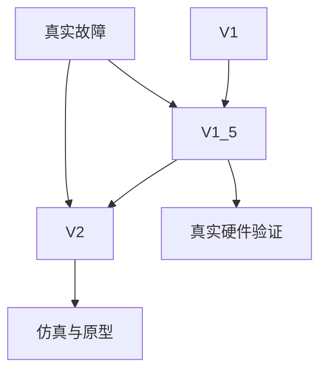
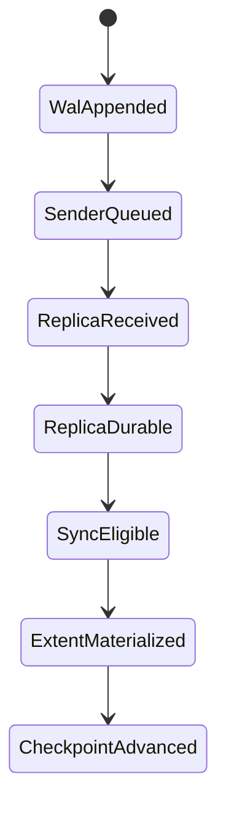
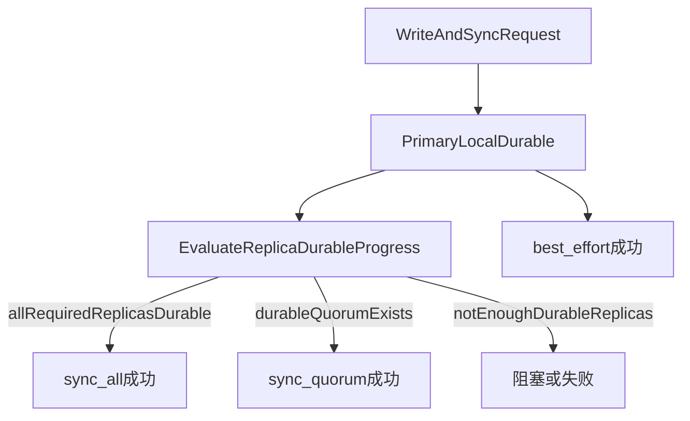
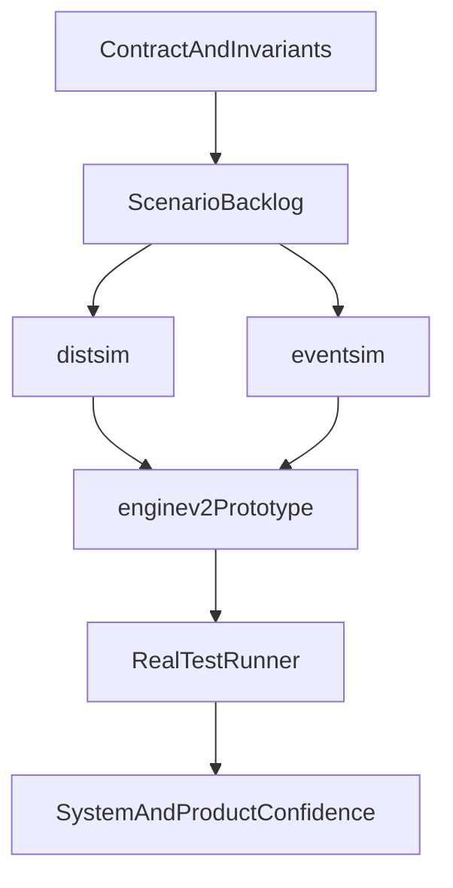

# V2 算法综述

日期：2026-03-27
状态：战略级设计综述
读者：CEO / owner / 技术管理层

## 文档目的

本文用于说明 `sw-block` 当前 `V2` 方向背后的核心判断：

- `V2` 到底想解决什么问题
- 为什么 `V1` / `V1.5` 不足以作为长期架构
- 为什么我们仍然认为基于 `WAL` 的方向值得继续走
- `V2` 与主要市场方案 / 论文路线相比的取舍是什么
- `simulation` 与真实 `test runner` 如何形成系统化验证闭环

这不是 phase 汇报，也不是对生产可用性的承诺文档。

它是对 `V2` 这条架构线的高层技术解释。

## 与其他文档的关系

| 文档 | 作用 |
|------|------|
| `v1-v15-v2-comparison.md` | 三条技术线的详细比较 |
| `v2-acceptance-criteria.md` | V2 协议验证下限 |
| `v2_scenarios.md` | 场景清单与 simulator 覆盖 |
| `v2-open-questions.md` | 仍未关闭的算法问题 |
| `protocol-development-process.md` | 协议开发方法论 |
| `learn/projects/sw-block/algorithm_overview.md` | 当前 V1/V1.5 系统级算法综述 |
| `learn/projects/sw-block/design/algorithm_survey.md` | 论文 / vendor 调研与借鉴项 |
| `learn/projects/sw-block/test/README.md` | 真实测试系统入口 |
| `learn/projects/sw-block/test/test-platform-review.md` | test runner 的平台化方向 |

## 1. 执行摘要

当前最准确的结论是：

- `V1` 证明了基于 `WAL` 的复制块存储基本路径是可行的。
- `V1.5` 在真实恢复场景上已经比 `V1` 明显更强，并且有真实硬件上的运行证据。
- `V2` 的意义，不是在已有逻辑上继续打补丁，而是把最关键的恢复与一致性问题直接上升为协议对象。

`V2` 的核心想法可以概括为：

- 短间隙恢复要显式
- 过期 authority 要显式 fencing
- `catch-up` 与 `rebuild` 的边界要显式
- 恢复 ownership 要成为协议的一部分，而不是实现细节里的偶然行为

所以今天正确的策略是：

- 继续用 `V1.5` 作为当前生产线
- 继续用 `V2` 作为长期架构线
- 继续认真研究 `WAL` 路线，因为现在我们已经具备了可信的验证框架
- 如果后续 prototype 证明 `V2` 有结构性缺陷，就应当先演进到 `V2.5`，而不是硬着头皮直接实现

## 2. V2 真正要解决的问题

从前端看，块存储似乎只有几个简单动作：

- `write`
- `flush` / `sync`
- failover
- recovery

但真正难的，不是这些前端动作本身，而是异步分布式边界：

- primary 本地 WAL 追加
- replica 端 durable progress
- client 可见的 sync / commit 真值
- failover / promote 时的数据边界
- lag、restart、address change、timeout 后的恢复正确性

这才是 `V2` 存在的根因。

项目已经反复验证过：块存储真正的 bug 通常不出在 happy path，而出在：

- replica 短暂掉线又回来
- replica 重启后地址变化
- 延迟到达的 stale barrier / stale reconnect 结果
- 一个 lagging replica 看起来“差一点点就能恢复”
- failover 时基于错误 lineage 做了 promote

`V2` 就是要把这些情况变成协议的第一公民，而不是上线后再继续被动修补。

## 3. 为什么 V1 / V1.5 不够

这份综述不需要长篇回顾 `V1` 和 `V1.5` 的所有细节。

只需要讲清它们为什么不足以作为长期架构。

### `V1` 做对了什么

`V1` 建立了最重要的基础：

- 严格有序的 `WAL`
- primary-replica 复制
- 基于 `epoch + lease` 的初步 fencing
- 以 `extent` 作为稳定数据面，而不是一开始就做全日志结构

### `V1` 的不足

它的关键短板主要在恢复与退化场景：

- 短 outage 很容易演化成 rebuild 或长期 degraded
- 恢复结构过于隐式
- changed-address restart 脆弱
- stale authority / stale result 还不是协议层的显式对象
- 系统没有足够清晰地区分：
  - 当前 head
  - committed prefix
  - recoverable retained range
  - stale / divergent tail

### `V1.5` 的不足

`V1.5` 已经解决了不少真实问题：

- retained-WAL catch-up
- same-address reconnect
- `sync_all` 的真实行为
- catch-up 失败后的 rebuild fallback
- changed-address restart 之后的 control-plane 刷新

所以它今天是更强的生产线。

但它仍然不是长期架构，因为它本质上仍然是增量修复：

- reconnect 逻辑仍然附着在旧 shipper 模型上
- 恢复 ownership 是先作为 bug 暴露出来，再逐步被抽象
- `catch-up` vs `rebuild` 更清楚了，但还不够成为协议顶层契约
- 整体感觉仍然更像“继续修 V1”，而不是“定义下一代复制协议”

### `V2` 的变化

`V2` 不是重新发明一个完全不同的存储模型。

它的目标是把最关键的东西显式化：

- recovery ownership
- lineage-safe recovery boundary
- `catch-up` / `rebuild` 分类
- per-replica sender authority
- stale-result rejection
- 明确的 recovery orchestration

因此最诚实的比较是：

- `V1.5` 今天在运行证据上更强
- `V2` 今天在架构质量上更强

这不是矛盾，而是“当前生产线”和“下一代架构线”应有的分工。

## 4. V2 如何解决 WAL 与 Extent 的同步问题

`V2` 的核心问题不是“还要不要 WAL”。

真正的问题是：

**primary 与 replica 之间，WAL 和 extent 如何保持同步，同时还能兼顾稳定性与性能。**

这才是 `V2` 的中心。

### 4.1 基本分工

`V2` 把数据路径拆成两个既分离又协作的层：

- **WAL**：近期历史的有序真相
- **extent**：稳定的物化数据镜像

WAL 负责：

- 严格写入顺序
- 本地崩溃恢复
- 短间隙 replica catch-up
- 基于 `LSN` 的 durable progress 计量

Extent 负责：

- 稳定读镜像
- 长期存储
- checkpoint / base image 生成
- 长间隙恢复时作为真正 base image 的来源

第一条稳定性原则就是：

- 不要让当前 extent 冒充历史状态
- 不要让 WAL 永远承担所有长距离恢复责任

### 4.2 Primary-replica 同步模型

`V2` 理想中的 steady-state 同步模型是：

1. primary 分配单调递增的 `LSN`
2. primary 本地顺序追加 `WAL`
3. primary 把记录放入 per-replica sender loop
4. replica 按顺序接收并推进显式 progress
5. `barrier/sync` 依赖 replica 的 durable progress，而不是 optimistic send progress
6. flusher 再把 WAL-backed dirty state 物化到 extent

本地 `WAL -> extent` 生命周期可以理解为：

这里最关键的规则是：

- **client 可见的 sync 真值必须跟随 durable replica progress**
- 不能跟随 send progress
- 不能跟随 local WAL head
- 不能跟随“看起来 replica 应该已经收到了”

这也是为什么 `V2` 使用像 `CommittedLSN` 这样的 lineage-safe 边界，而不是松散的“当前 primary head”。

### 4.2.1 不同 sync mode 如何判断结果

`V2` 让不同 sync mode 的成功条件变得更明确：

- `best_effort`：primary 达到本地 durability point 后即可成功，replica 可以后台恢复
- `sync_all`：所有 required replica 都要在目标边界上 durable
- `sync_quorum`：必须存在真实 durable quorum

其判断路径可以表示为：

这意味着 sync 结果不再依赖：

- socket 看起来还活着
- sender 好像还在发
- replica 似乎“差不多收到了”

而是依赖显式 durable progress。

### 4.3 为什么这个设计应该更稳定

它试图把最危险的模糊边界拆开：

- **写入顺序** 由 `WAL + LSN` 表达
- **durability truth** 由 barrier / flushed progress 表达
- **recovery ownership** 由 sender + recovery attempt identity 表达
- **catch-up vs rebuild** 由显式分类表达
- **promotion safety** 由 committed prefix 与 lineage 表达

也就是说，`V2` 的稳定性来自于减少隐式耦合。

### 4.4 为什么它仍然可以有高性能

这里不能夸大说 `V2` 一定在所有情况下都更快。

更准确的性能论点是：

- 保持 primary 前台写路径简单：
  - 本地顺序 `WAL append`
  - 投递到 per-replica sender loop
  - 不把复杂恢复逻辑塞进前台写路径
- 把复杂度主要放在健康热路径之外：
  - sender ownership
  - reconnect classification
  - catch-up / rebuild decision
  - timeout 和 stale-result fencing
  主要都在 recovery / control path
- 让 WAL 只承担它擅长的工作：
  - 近期 ordered delta
  - 短间隙 replay
- 不再让 WAL 承担所有长距离恢复：
  - 长间隙恢复转向 checkpoint/snapshot base + tail replay

所以 `V2` 的性能论点应该是：

- **健康 steady-state 应该尽量接近 `V1.5`**
- **退化与恢复路径会更干净**
- **短间隙恢复会比 rebuild 更便宜**
- **长间隙恢复不再逼迫系统支付无上限的 WAL retention 税**

这比“V2 天然更快”要可信得多。

### 4.5 为什么仍然选择 WAL

之所以还继续走 WAL，是因为它仍然是解决这个同步问题最有力的基础：

- 显式顺序
- 显式历史
- 显式 committed prefix
- 显式短间隙 replay
- 显式 failover reasoning

只有当设计把以下概念混淆时，WAL 才会变得危险：

- 本地写入接受
- replica durable progress
- committed boundary
- recoverable retained history

而 `V2` 的存在，正是为了不再混淆这些东西。

## 5. 与市场和论文路线的比较

选择 `V2` 这条路线，并不是因为别的 vendor 都错了，而是因为他们解决的是不同问题，也承担了不同复杂度。

### Ceph / RBD 路线

Ceph/RBD 避开了这种 per-volume replicated WAL 形态。

它获得的是：

- 对象存储深度一体化
- 成熟的 placement 与 recovery 体系
- 更强的集群级分布能力

但代价是：

- 系统层次更多
- object-store / peering 复杂度更重
- 运维与概念模型更重

所以这不是“更简单”，而是把复杂度迁移到了别处。

对 `sw-block` 而言，当前选择是：

- 保持更窄的软件块服务模型
- 用更显式的 per-volume correctness 来换取更可控的复杂度

### PolarFS / ParallelRaft 路线

这类系统探索更激进的顺序与并行策略：

- conflict-aware 或乱序并行
- 更深的日志并行
- 更复杂的 apply / replay 机制

它们在未来仍然值得借鉴：

- LBA conflict reasoning
- replay 成本与恢复成本
- flusher 并行优化

但它们也明显扩大了正确性边界。

在当前阶段，项目不应该在还没彻底证明严格顺序模型之前，就过早买入这类复杂度。

### AWS 链式复制 / EBS 类经验

链式复制之类的路线吸引人，是因为它们能解决真实问题：

- Primary NIC 压力
- forward 拓扑
- RF=3 时更好的扩展性

这是后续较有希望借鉴的方向。

但它会改变：

- 延迟画像
- 失败处理方式
- barrier 语义
- 运维拓扑

所以它属于更后面的架构阶段，而不是当前 V2 核心证明。

### 当前的真实选择

项目当前选择的是：

- 更窄的软件优先 block 设计
- 明确的 per-volume correctness
- 在性能英雄主义之前先把逻辑讲清
- 在功能扩张之前先建立验证闭环

这不是保守，而是为了让这个 block 产品未来真的值得信任。

## 6. 为什么这条方向适合 SeaweedFS 与未来独立 sw-block

`sw-block` 起步于 SeaweedFS，但 `V2` 已经在按下一代独立 block service 的方向成形。

这意味着架构上要同时保留两类东西：

### 需要保持兼容的部分

- placement / topology 这些概念
- 可解释的 control-plane contract
- 与 SeaweedFS 生态的运维连续性

### 应该更 block-specific 的部分

- replication correctness
- recovery ownership
- recoverability classification
- block 特有的 test / evidence 体系

因此当前方向不是“继续把 V2 当成 weed 里的一个 patch”，而是：

- 以 SeaweedFS 作为经验与生态基础
- 同时把 `V2` 逐步塑造成真正独立的块服务架构

## 7. 系统化验证方法

当前方向之所以合理，另一个重要原因是验证方法本身已经系统化。

项目不再依赖：

- 先实现
- 再观察
- 出 bug 再修

而是依赖如下层次：

- contract / invariants
- scenario backlog
- simulator
- timer/race simulator
- standalone prototype
- real engine test runner

这对于一个高风险块存储算法是非常正确的结构：

- simulation 用来证明协议逻辑
- prototype 用来证明执行语义
- 真实 runner 用来证明系统与产品行为

## 8. Simulation 系统证明什么

simulation 系统的目标是回答：

- 应该发生什么
- 绝不能发生什么
- 为什么旧设计会失败
- 为什么 V2 更好

### `distsim`

`distsim` 是主协议仿真器，主要用于：

- 协议正确性
- 状态迁移
- stale authority fencing
- promotion / lineage safety
- catch-up vs rebuild
- changed-address restart
- candidate safety
- reference-state checking

### `eventsim`

`eventsim` 是时间 / race 层，主要用于：

- barrier timeout
- catch-up timeout
- reservation timeout
- 同 tick / 延迟事件顺序
- stale timeout 的影响

### simulation 擅长证明什么

它特别擅长证明：

- stale traffic rejection
- recovery boundary 的显式性
- timeout/race 语义
- committed prefix 下的 failover 正确性
- 旧 authority 不能修改新 lineage

### simulation 不证明什么

它不证明：

- 真实 TCP 行为
- 真实 OS 调度
- 磁盘时序
- 真正的 `WALShipper` 集成
- iSCSI / NVMe 前端的真实行为

因此 simulation 不是全部真相。

它是 **算法 / 协议真相层**。

## 9. 真实 test runner 证明什么

`learn/projects/sw-block/test/` 下的真实 test runner 是系统与产品验证层。

它不只是 QA 工具，而是设计是否可信的重要组成部分。

### 它覆盖什么

当前 runner 与周边测试体系已经覆盖：

- unit
- component
- integration
- distributed scenario
- 真实硬件 workflow

而且环境已经包含：

- 真实节点
- 真实 block target
- 真实 fault injection
- benchmark 与结果采集
- run bundle 与 scenario traceability

### 为什么它重要

它帮助我们判断：

- 实际引擎是否按设计运行
- 产品在真实 restart / failover / rejoin 场景下是否可靠
- operator workflow 是否可信
- benchmark 结果是不是有效而非偶然

所以 test runner 最好被理解为：

- implementation truth
- system truth
- product truth

而不只是“测试脚本框架”。

## 10. Simulation 与 test runner 如何系统性推进

理想的反馈闭环是：

1. `V1` / `V1.5` 出现真实故障
2. 这些故障被转化为设计要求
3. 再被提炼为 simulator 场景
4. simulator 关闭协议歧义
5. standalone prototype 关闭执行歧义
6. 真实 test runner 在硬件与分布式环境中验证系统行为
7. 新故障或新偏差再反哺设计

这就形成了两类互补真相：

- `simulation -> algorithm / protocol correctness`
- `test runner -> implementation / system / product correctness`

这种分层是健康的，因为它避免了两种常见错误：

- 只相信设计推导，却没有真实行为
- 只相信系统测试全绿，却没有真正理解协议本身

## 11. 当前状态与诚实边界

### 现在已经比较强的部分

- `V1.5` 相比 `V1` 的恢复能力已经明显增强，并且有真实运行证据
- `V2` 的架构清晰度已经明显强于 `V1.5`
- simulator 已经有较强的 acceptance 覆盖
- prototype 已经开始关闭 ownership 与 orchestration 风险
- 真实 test runner 已经足够大，可以支撑严肃的系统验证

### 现在还没有完成的部分

- `V2` 还不是生产引擎
- prototype 仍处于早中期
- historical-data / recovery-boundary prototype 还没有闭合
- `V2` steady-state 性能还没有真实证明
- `V2` 还没有真实硬件上的运行验证

所以最准确的话不是：

- “V2 现在已经在生产上更强”

而是：

- “V2 是长期更好的架构，但今天还不是更强的已部署引擎”

## 12. 为什么当前方向是理性的

当前方向之所以理性，是因为它保持了正确的分工：

- `V1.5` 继续作为今天的生产线
- `V2` 继续作为下一代架构线

这样项目就可以：

- 在已有可运行系统上继续交付和加固
- 在不扰动生产线的前提下认真验证更强的架构
- 用 simulation、prototype 和真实 runner 来决定 `V2` 是否真能成为下一代引擎

最终的战略规则应当保持不变：

- 继续研究 WAL，因为现在我们已经有可信的验证框架
- 继续推进 V2，因为架构证据已经很强
- 如果 prototype 证明 V2 有结构性缺陷，就先演进到 `V2.5`，不要急于重实现

## 结论

如果按当前生产证据选择：

- 选择 `V1.5`

如果按长期协议质量选择：

- 选择 `V2`

如果问 WAL 是否还值得继续研究：

- 值得，因为现在项目已经拥有了足够严肃的验证体系，可以负责任地继续推进

这就是当前最合理的技术与战略判断。
