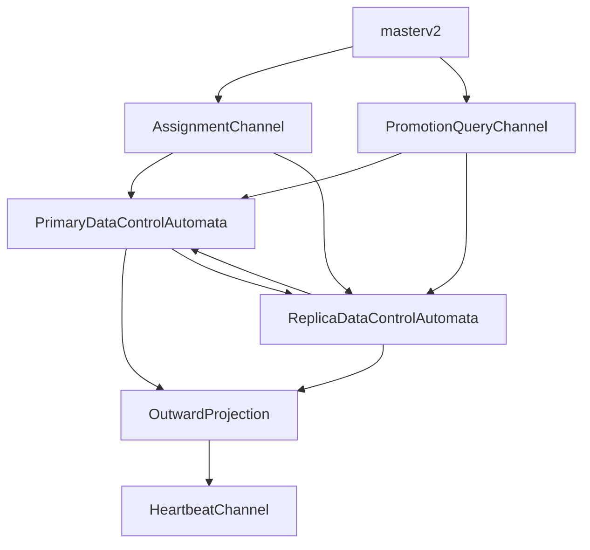

# V2 Automata Ownership Map

Date: 2026-04-05
Status: active

## Purpose

This note translates the two-loop protocol into automata ownership.

The goal is to answer a practical question for the next implementation step:

1. which decisions belong to `masterv2`
2. which decisions belong to the primary-side data-control automata
3. which current V2 events and commands already fit that split
4. which surfaces should remain compressed projections only

## Top-Level Split

There are four different layers of meaning:

1. identity authority
2. identity evidence
3. data-control truth
4. outward compressed projection

They must not be merged.

## Operating Model

One volume should be treated as a micro-cluster:

1. `masterv2` is outside the micro-cluster and grants identity authority
2. the selected primary is inside the micro-cluster and owns data-control truth
3. replicas contribute bounded evidence and execution progress to the primary

This means `masterv2` is allowed to authorize takeover, but not to act as the
continuous recovery planner.

## Channel Ownership

### 1. Heartbeat

Heartbeat is not a recovery-planning channel.

Heartbeat should answer only:

1. is the node alive
2. what role and epoch has been applied
3. what compressed mode is outwardly visible
4. whether replica receiver readiness is present

Heartbeat should not answer:

1. which LSN to catch up to
2. whether a reconnect gap is recoverable
3. which source to rebuild from
4. per-replica durable progress

### 2. Promotion Query

Promotion query is the only `masterv2` path that may request fresh promotion
evidence.

It should answer only:

1. what is your current `CommittedLSN`
2. what is your current `WALHeadLSN`
3. which `Epoch` do you recognize
4. what `Role` do you believe you have
5. are you eligible to become primary

Promotion query should not answer:

1. replay plan details
2. full session graph
3. retention budget internals
4. detailed catch-up progress

### 3. Assignment

Assignment is the identity authorization channel.

It should answer only:

1. who is primary
2. who is replica
3. which epoch is now active
4. which replica identities and addresses belong to the set
5. whether rebuilding role is assigned

Assignment should not answer:

1. committed boundary
2. durable boundary
3. catch-up target LSN
4. detailed recovery plan

### 3a. Takeover Authorization Versus Takeover Choreography

This distinction should stay explicit:

1. `masterv2` may authorize a replacement primary
2. the replacement primary must reconstruct bounded truth itself
3. the replacement primary must decide whether takeover is safe, degraded, or
   rebuild-only

So:

1. takeover authorization belongs to `Assignment`
2. takeover reconstruction belongs to `Loop 2`
3. detailed recovery sequencing belongs to the primary-led automata

### 4. Loop 2 Data Control

Loop 2 is where data-control truth lives.

It should answer:

1. what is committed
2. what is durable
3. whether barrier lineage is healthy
4. whether a replica is in `keepup`, `catchup`, `degraded`, or `needs_rebuild`
5. whether rebuild is currently the only safe path

It may consume one primary-side normalized sync fact envelope, but only as input
evidence, not as a second truth owner.

Current normalized sync fact kinds are:

1. `sync_quorum_acked`
2. `sync_quorum_timed_out`
3. `sync_replay_required`
4. `sync_rebuild_required`
5. `sync_replay_failed`

Interpretation:

1. these are primary-owned semantic facts, not new replica-visible wire messages
2. they are the seam between:
   - raw `syncAck` / timeout / callback observations
   - primary-owned recovery/session decisions
3. only Loop 2 may turn them into `keepup`, `catchup`, `rebuild`, or degraded
   projection changes

## Existing V2 Events Mapped To Owners

### Identity-Control Entry Event

These belong to assignment application or identity evidence:

1. `AssignmentDelivered`
2. `RoleApplied`
3. `ReceiverReadyObserved`

Interpretation:

- `AssignmentDelivered` enters from `Assignment`
- `RoleApplied` is local confirmation after identity application
- `ReceiverReadyObserved` is local evidence that may affect compressed outward mode

### Data-Control Events

These belong to the primary-led data-control automata:

1. `ShipperConfiguredObserved`
2. `ShipperConnectedObserved`
3. `DiagnosticShippedAdvanced`
4. `CommittedLSNAdvanced`
5. `BarrierAccepted`
6. `BarrierRejected`
7. `CheckpointAdvanced`
8. `CatchUpPlanned`
9. `RecoveryProgressObserved`
10. `CatchUpCompleted`
11. `NeedsRebuildObserved`
12. `RebuildStarted`
13. `RebuildCommitted`

Interpretation:

- these events must stay inside `Loop 2`
- they may influence outward `Mode`
- they must not be surfaced to `masterv2` as raw automata state

## Existing V2 Commands Mapped To Owners

### Identity Commands

These belong to assignment realization:

1. `ApplyRoleCommand`
2. `StartReceiverCommand`

These are still executed locally, but they exist to realize identity control.

### Data-Control Commands

These belong to the primary-led data-control automata:

1. `ConfigureShipperCommand`
2. `StartRecoveryTaskCommand`
3. `DrainRecoveryTaskCommand`
4. `StartCatchUpCommand`
5. `StartRebuildCommand`
6. `InvalidateSessionCommand`

Interpretation:

- these commands must not be emitted by `masterv2`
- these commands are consequences of data-control truth

### Projection Command

`PublishProjectionCommand` is neither identity truth nor data-control truth.

It is the compressed outward surface emitted from the core.

This command exists so:

1. heartbeat can expose compressed state
2. debug and product surfaces can stay consistent
3. runtime seams do not invent independent meanings

## Logic Judgments

This is the decision table that should guide future changes.

### Judgment: Is this enough for heartbeat?

If a fact is needed only to answer:

1. alive
2. applied role
3. outward mode

then it belongs in heartbeat projection.

If it is needed to answer:

1. which node is safest to promote
2. whether recovery is catch-up or rebuild
3. how far durability actually advanced

then it does not belong in normal heartbeat.

### Judgment: Does master need this continuously?

If a fact affects:

1. assignment ownership
2. lease ownership
3. fencing
4. failover authorization

then `masterv2` may need it.

If a fact affects:

1. replay planning
2. retention decisions
3. barrier lineage
4. rebuild execution

then `masterv2` must not own it continuously.

### Judgment: Is master authorizing or choreographing?

If the action is:

1. choose a legal owner
2. fence stale owners
3. publish epoch and replica identity

then it belongs to `masterv2`.

If the action is:

1. reconstruct bounded truth from summaries
2. decide `keepup` vs `catchup`
3. select rebuild source and progress target
4. gate takeover on degraded or ambiguous lineage

then it belongs to the selected primary, not `masterv2`.

### Judgment: Does this belong to promotion query?

A fact belongs to promotion query when all are true:

1. it is needed only during promotion arbitration
2. stale cached heartbeat would be unsafe
3. the fact is still smaller than full recovery truth

Examples:

1. `CommittedLSN`
2. `WALHeadLSN`
3. `Epoch`
4. promotion eligibility

### Judgment: Does this belong to Loop 2?

A fact belongs to `Loop 2` when it changes at write/barrier/reconnect scale or
when it directly affects recovery planning.

Examples:

1. `ReplicaFlushedLSN`
2. `CatchUpTarget`
3. retention floor
4. session invalidation
5. recovery progress

## What Should Change Next

Before any major implementation, these changes should be reflected in code
structure:

1. `masterv2` types should split heartbeat, query, and assignment surfaces
2. `volumev2` control session should stop pretending heartbeat and promotion
   evidence are the same message shape
3. engine-facing runtime seams should explicitly tag which observations are
   identity evidence and which are data-control observations
4. tests should separately prove:
   - heartbeat convergence
   - promotion query freshness
   - data-control progress closure

## Non-Goals

This note does not freeze every field of the future wire protocol.

It only fixes:

1. ownership
2. judgment boundaries
3. which existing V2 automata pieces are already valid
