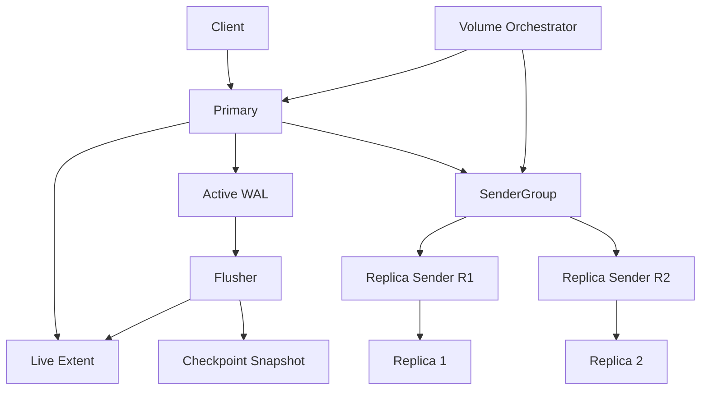
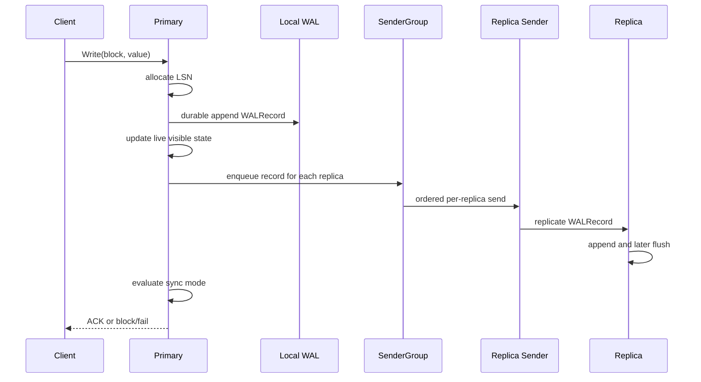
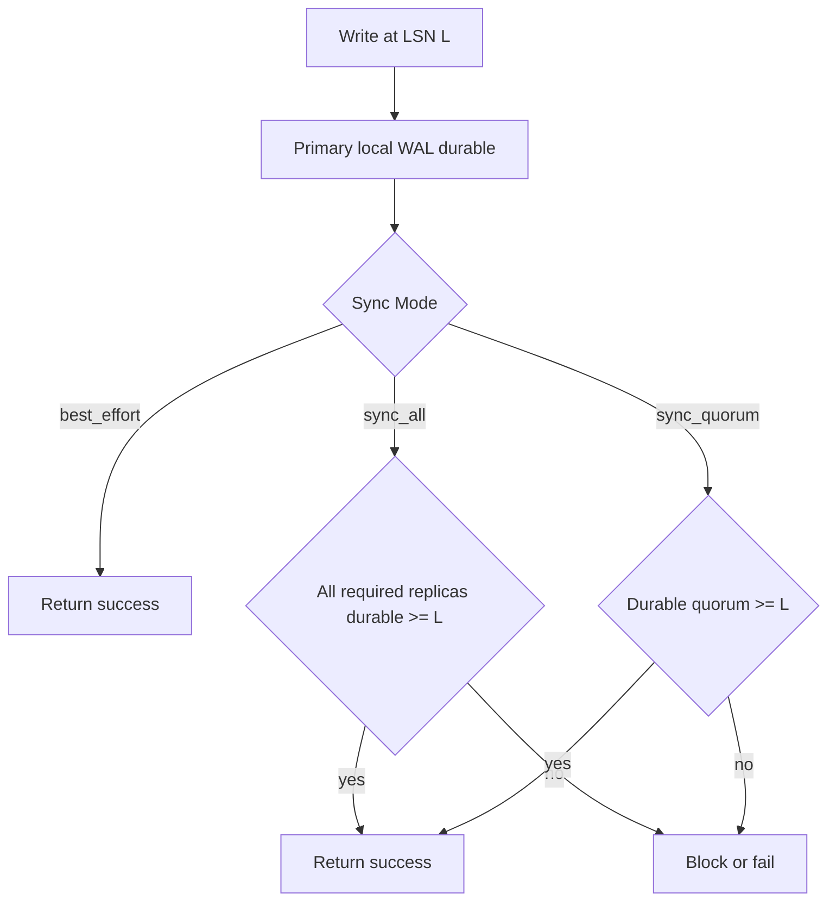
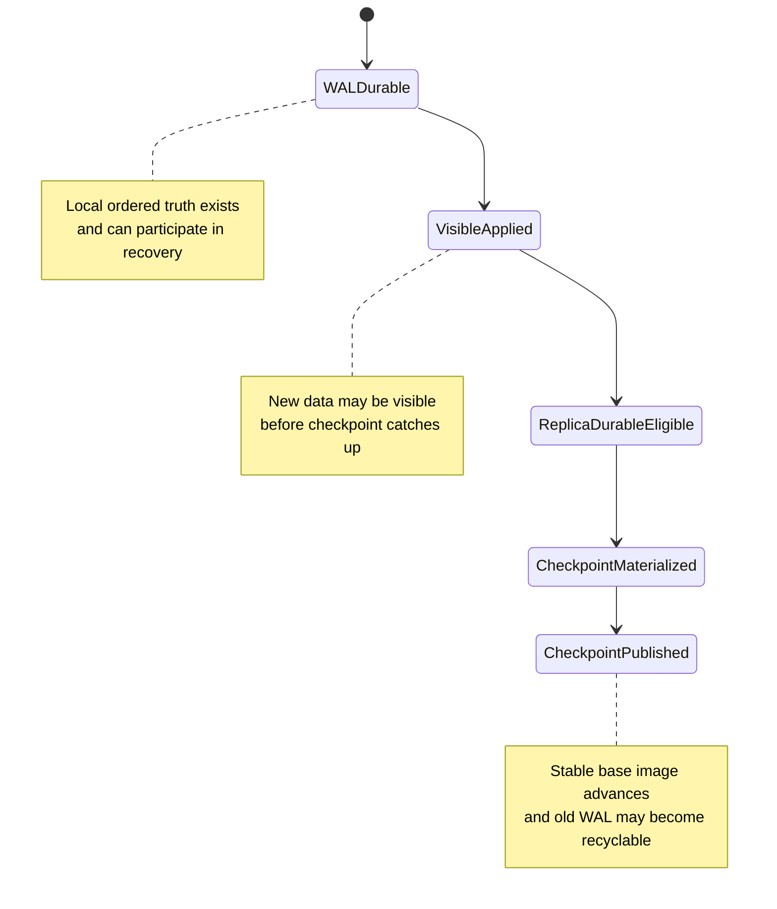
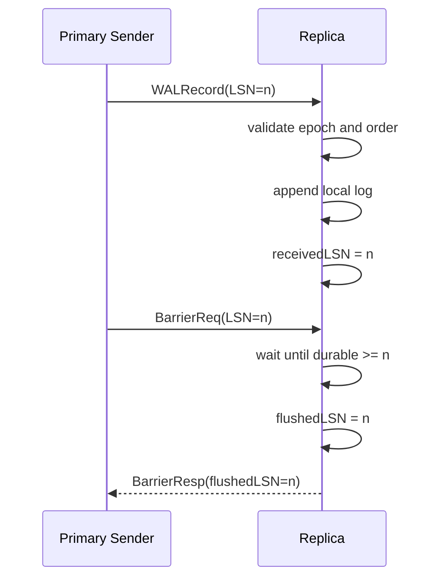
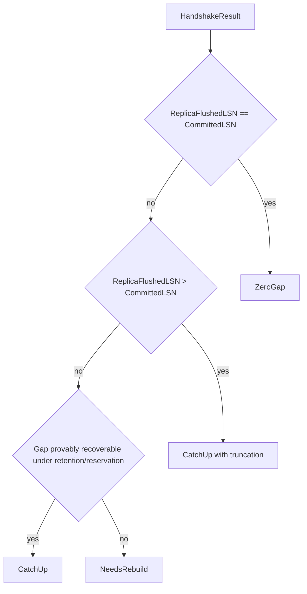
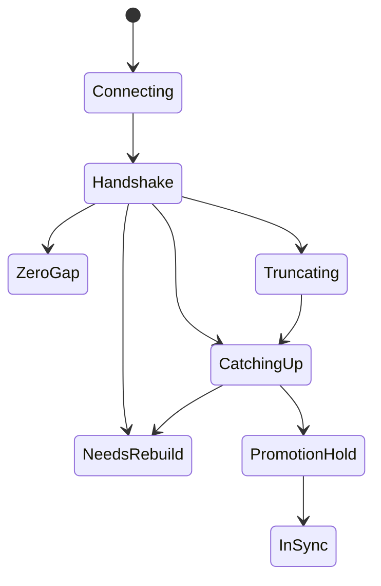
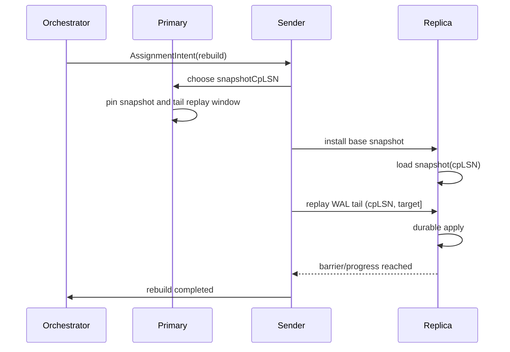
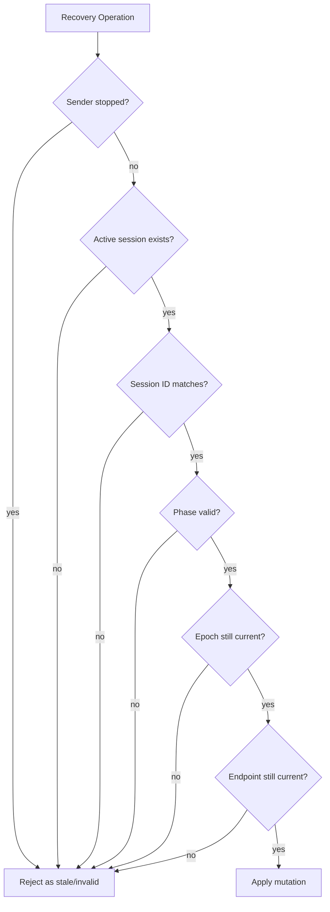
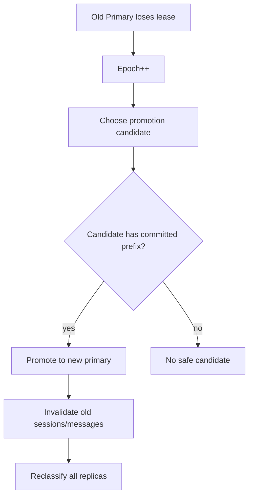

# V2 详细算法设计

日期：2026-03-27
状态：详细算法草案
读者：架构设计、simulator、prototype、实现负责人

## 1. 文档目的

这份文档不是 CEO 综述，也不是 phase 汇报。

它的目标是把 `sw-block V2` 的核心算法写成一份更接近“协议规格”的设计文档，回答下面几个问题：

- 系统里的正式状态对象是什么
- 写路径如何推进
- 不同 `sync mode` 如何决定是否可以返回成功
- replica 掉队后如何决定 `catch-up` 还是 `rebuild`
- primary crash / failover / epoch bump 后哪些状态仍然有效
- 什么叫做“允许的 WAL-first 可见性”，什么叫做不允许的幽灵状态

本文默认接受一个核心前提：

- **已 durable 的 WAL 是系统正式状态的一部分**

因此：

- `visible state` 可以领先于 `checkpoint`
- 只要该状态仍然有合法的恢复依据，它就不是 bug

真正的错误是：

- `acked state > recoverable state`
- 或 `visible state > recoverable state`

## 2. 设计目标

V2 的目标不是把所有事情都交给 `WAL`。

V2 的目标是：

1. 用 `WAL` 提供严格顺序、短间隙恢复和明确的 durable history
2. 用 `extent + checkpoint/snapshot` 提供稳定读镜像和长距离恢复基线
3. 用显式的 `epoch + sender + RecoverySession` 管住恢复 authority
4. 用显式的 `CommittedLSN` 管住对外承诺边界
5. 用显式的 `catch-up` / `rebuild` 分类避免长期模糊状态

## 3. 核心对象

### 3.1 LSN 边界

- `HeadLSN`
  primary 当前已分配并写入本地 WAL 的最高 LSN

- `CommittedLSN`
  当前对外可承诺、可用于 failover / recovery 目标的 lineage-safe 边界

- `ReplicaReceivedLSN`
  replica 已收到并追加的最高 LSN，不代表 durable

- `ReplicaFlushedLSN`
  replica 已 durable 的最高 LSN，是 sync/barrier 判断的正式依据

- `CheckpointLSN`
  当前 checkpoint / base snapshot 所代表的稳定物化边界

- `RecoverableLSN`
  某节点 crash 之后，仍可由 `checkpoint + retained WAL` 或等价机制恢复出的最高边界

### 3.2 存储层对象

- `Active WAL`
  当前保留的 WAL 历史，用于：
  - 顺序写入
  - crash recovery
  - short-gap catch-up

- `Extent`
  当前运行中的块视图，可以比 checkpoint 更新

- `Checkpoint / Snapshot`
  一个真实历史点的稳定镜像，用于：
  - rebuild base
  - 长距离恢复
  - GC / retention 的正确边界

### 3.3 协议层对象

- `Epoch`
  primary lineage / fencing 边界。旧 epoch 的消息和恢复结果不能修改当前系统。

- `Sender`
  primary 上对每个 replica 的唯一发送 authority。

- `RecoverySession`
  对一个 replica 的一次有界恢复尝试。它必须被：
  - 一个 sender 拥有
  - 一个 epoch 约束
  - 一个 session ID 唯一标识

- `AssignmentIntent`
  orchestrator 对 sender group 的意图输入。它决定：
  - 哪些 replica 被保留
  - 哪些 replica 要恢复
  - 恢复目标和 epoch 是什么

## 4. 全局结构图



这个结构的关键点是：

- 前台写路径只负责产生顺序和推进正式边界
- 每个 replica 的恢复执行由自己的 sender/session 管理
- flusher / checkpoint 负责物化和长期恢复基线
- orchestrator 负责 volume 级 admission、epoch 和 failover

## 5. 数据真相与可见性规则

V2 必须明确区分 5 种状态：

1. `visible state`
2. `WAL durable state`
3. `replica durable state`
4. `checkpointed state`
5. `committed / acked state`

它们不是同一个概念。

### 5.1 允许的情况

下列情况是允许的：

- `visible state > CheckpointLSN`
- `WAL durable state > CheckpointLSN`
- replica 在后台追赶，extent 已经更“新”

只要：

- crash 后这些状态仍有恢复依据
- client 所收到的 ACK 语义没有被夸大

### 5.2 禁止的情况

下列情况是 V2 必须阻止的：

- `AckedLSN > RecoverableLSN`
- `VisibleLSN > RecoverableLSN`
- 根据 socket/send progress 而不是 durable progress 给出 sync 成功
- replica 实际已不可能 catch-up，却长期停留在 `CatchingUp`

### 5.3 可执行 invariant

V2 的 simulator / prototype 至少应围绕下面三条 invariant 展开：

1. `RecoverabilityInvariant`
   所有已 ACK 的边界在 crash / restart / failover 后仍必须可恢复

2. `VisibilityInvariant`
   所有向用户暴露的状态都必须有合法恢复来源

3. `CatchUpLivenessInvariant`
   replica 要么收敛，要么显式升级为 `NeedsRebuild`

## 6. 写路径算法

### 6.1 写路径目标

写路径要满足两件事：

- 维持 primary 本地严格顺序
- 不把复杂恢复逻辑塞进前台热路径

### 6.2 写入步骤

对一次逻辑写入 `Write(block, value)`，V2 的基本步骤是：

1. primary 检查自己是否拥有当前 `epoch` 的 serving authority
2. 分配下一个单调递增的 `LSN`
3. 生成 `WALRecord{LSN, Epoch, Block, Value, RecoveryClass}`
4. 本地 durable append 到 `Active WAL`
5. 更新 primary 的运行期可见状态
6. 把该记录放入每个 replica 的 sender queue
7. 根据 volume 的 `sync mode` 决定是否需要 barrier / durable quorum / all replicas
8. 在满足对应 mode 条件后返回成功，否则阻塞或失败

### 6.3 写路径图



### 6.4 写路径伪算法

```text
OnWrite(req):
  require PrimaryState == Serving
  require LocalEpoch == VolumeEpoch

  lsn = AllocateNextLSN()
  rec = BuildWALRecord(lsn, req, epoch)

  DurableAppendLocalWAL(rec)
  ApplyToLiveVisibleState(rec)
  EnqueueToReplicaSenders(rec)

  if Mode == best_effort:
      return success after local durable WAL

  if Mode == sync_all:
      wait until every required replica reports durable progress >= lsn
      else timeout/fail

  if Mode == sync_quorum:
      wait until true durable quorum reports progress >= lsn
      else timeout/fail

  AdvanceCommittedLSN(lsn) only at the correct lineage-safe boundary
  return success
```

## 7. 三种 sync mode

### 7.1 `best_effort`

语义：

- 只要求 primary 本地达到 durability point
- replica 可以异步恢复
- 不应对 client 承诺多副本 durable

适合：

- 后台恢复优先
- 临时 degraded 仍继续服务

### 7.2 `sync_all`

语义：

- 所有 required replica 都必须在目标 `LSN` durable
- 不能因为“看起来网络还活着”而提前 ACK
- 一旦达不到条件，应阻塞或失败，不能偷偷降级

### 7.3 `sync_quorum`

语义：

- 必须形成真实 durable quorum
- 只统计满足当前 epoch 和 state 资格的 replica
- 不能只数 healthy socket 或 sender 已发送

### 7.4 sync 决策图



### 7.5 sync mode 的正式原则

所有 sync mode 都必须遵守：

- durable truth 只来自 `ReplicaFlushedLSN`
- 不来自 `ReplicaReceivedLSN`
- 不来自 send queue
- 不来自 transport 连接存活

## 8. 本地 WAL / extent / checkpoint 算法

V2 必须把本地状态推进拆成三个动作：

1. `WAL append`
2. `extent materialization`
3. `checkpoint advancement`

### 8.1 本地生命周期



### 8.2 关键规则

- `extent` 可以比 `checkpoint` 更新
- 但 crash 后真正可恢复的是：
  - `checkpoint`
  - 加上仍被保留、可 replay 的 WAL

所以：

- `VisibleLSN > CheckpointLSN` 可以合法
- 但 `VisibleLSN > RecoverableLSN` 绝不合法

### 8.3 flusher / checkpoint 职责

flusher 不负责决定 ACK。

flusher 负责：

- 将 WAL-backed dirty state 物化到 extent
- 产生新的 checkpoint / snapshot
- 在有了新的稳定基线后，帮助推进 WAL retention / GC 边界
- 保证被对外承诺的数据仍然可恢复

## 9. Replica 正常复制算法

### 9.1 steady-state

每个 replica 有一个稳定 sender。

sender 负责：

- 顺序发 WAL record
- 发 barrier
- 处理 reconnect / handshake
- 执行 catch-up / rebuild 尾部 replay
- 拒绝旧 session 的结果

### 9.2 正常复制步骤

1. sender 从 queue 取出下一个 record
2. 按顺序发给 replica
3. replica 验证 epoch 和顺序
4. replica 先 append 到本地 WAL 或等价 durable log
5. replica 更新 `receivedLSN`
6. 若收到 barrier，则等待本地 durable progress 达到目标
7. replica 更新 `flushedLSN`
8. 返回 `BarrierResp`

### 9.3 steady-state 图



## 10. 恢复总算法

### 10.1 恢复的正式入口

当 replica 不再能作为正常 `InSync` 复制对象时，系统不能直接“猜测”怎么修。

必须走明确的恢复入口：

1. orchestrator 识别该 replica 已失去 sync eligibility
2. 对该 replica 发出新的 `AssignmentIntent`
3. sender 建立或 supersede 一个新的 `RecoverySession`
4. 通过 handshake 获得该 replica 的正式 durable 点
5. 对恢复路径做显式分类

### 10.2 handshake 输入

一次恢复决策至少需要：

- `ReplicaFlushedLSN`
- `CommittedLSN`
- `RetentionStartLSN`
- 当前 `epoch`
- endpoint/version 视图

### 10.3 恢复分类

V2 把恢复明确分成三类：

1. `ZeroGap`
   `ReplicaFlushedLSN == CommittedLSN`

2. `CatchUp`
   gap 在 recoverable window 内，或 replica 需要先 truncate divergent tail

3. `NeedsRebuild`
   gap 超过 retention / payload / snapshot 可恢复边界

### 10.4 恢复决策图



### 10.5 为什么用 `CommittedLSN`

恢复目标必须是 `CommittedLSN`，而不是 `HeadLSN`。

原因是：

- `HeadLSN` 可能包含还未形成正式外部承诺的尾部
- failover / promotion 的安全边界必须围绕 committed prefix
- 否则会把“primary 看起来更新”误当成“lineage-safe truth”

## 11. Catch-up 算法

### 11.1 进入条件

只有当下面条件同时满足时，才允许进入 `CatchUp`：

1. session authority 有效
2. 当前 epoch 未失效
3. endpoint/version 未变化
4. gap `(ReplicaFlushedLSN, CommittedLSN]` 可恢复
5. 对应恢复窗口已被 reservation pin 住

### 11.2 执行步骤

1. session 进入 `Connecting`
2. handshake 后进入 `Handshake`
3. classifier 返回 `CatchUp`
4. session 设置：
   - `StartLSN`
   - `TargetLSN`
   - 如有需要，`TruncateRequired`
5. sender 开始按顺序回放 WAL records
6. replica durably 应用并持续汇报进展
7. sender 更新 `RecoveredTo`
8. 若达到 `TargetLSN` 且 barrier 条件满足，则 session 完成
9. replica 进入 `InSync` 或进入短暂 `PromotionHold`

### 11.3 catch-up 状态图



### 11.4 catch-up 失败规则

以下任何情况都必须终止当前 catch-up：

- reservation 失效
- payload / WAL 保留条件失效
- epoch bump
- endpoint change
- session 被 supersede
- 长时间无净进展

一旦终止，必须：

- 拒绝旧 session 的后续结果
- 根据原因进入 `NeedsRebuild` 或等待新的 assignment

## 12. Rebuild 算法

### 12.1 何时进入 rebuild

下列情况进入 `NeedsRebuild`：

- `ReplicaFlushedLSN + 1 < RetentionStartLSN`
- 历史 payload 不再可解析
- 对应 snapshot / base image 不存在或无法 pin 住
- catch-up 期间 recoverability 条件丢失

### 12.2 rebuild 步骤

1. orchestrator 为该 replica 发出 rebuild assignment
2. sender 建立新的 rebuild session
3. primary 选择一个真实 `snapshotCpLSN`
4. pin 住：
   - snapshot/base image
   - `snapshotCpLSN` 之后的 tail replay window
5. replica 安装 base image
6. sender 从 `snapshotCpLSN + 1` 开始 replay 到目标 `TargetLSN`
7. barrier 确认 durable reach
8. replica 进入 `PromotionHold` / `InSync`

### 12.3 rebuild 图



## 13. RecoverySession 与 authority 算法

### 13.1 为什么要有 RecoverySession

块设备前端看起来没有“session”概念，但恢复执行内部必须有一个 bounded object。

否则无法明确回答：

- 谁拥有这次恢复尝试
- 哪个结果是新的，哪个是晚到的旧结果
- endpoint 变了之后旧连接还能不能继续生效
- epoch bump 后旧 catch-up 结果还能不能落地

### 13.2 authority 规则

一个恢复 API 调用只有同时满足下面条件才有效：

1. sender 当前仍存在
2. sender 未 stopped
3. sender 当前 session 不为空
4. `sessionID` 与当前 active session 一致
5. session 仍处于 active phase
6. sender 的 epoch 与 volume epoch 一致
7. endpoint/version 未变化

### 13.3 authority 图



## 14. Failover / promotion 算法

### 14.1 触发条件

当 primary lease 丢失、节点 crash 或被明确 demote 时，需要 volume 级 failover。

这不是单个 replica 的本地状态迁移，而是：

- 整个 volume lineage 重新定根

### 14.2 failover 步骤

1. 旧 primary 丧失 authority
2. volume `Epoch++`
3. 选择 promotion candidate
4. candidate 必须满足：
   - running
   - epoch 可对齐
   - state 允许提升
   - `FlushedLSN >= CommittedLSN`
5. 新 primary 开始 serving
6. 旧 primary 相关的 recovery sessions 全部失效
7. 其余 replicas 相对新 primary 重新做 handshake / classify

### 14.3 failover 图



### 14.4 promotion 的原则

默认规则应当是保守的：

- 宁可没有 candidate，也不要提升一个不具备 committed prefix 的节点

否则最危险的错误就是：

- 用户以为已 durable / 已 ACK 的数据，在 failover 后找不到

## 15. Crash recovery 语义

### 15.1 primary 本地 crash

primary restart 后必须能够根据：

- 最近 checkpoint
- retained WAL

重建出新的运行状态。

### 15.2 重要边界

必须允许：

- `visible state > checkpoint`

但必须保证：

- 所有已 visible 的状态都有合法恢复来源，或者 crash 后不会再被当作正式状态

### 15.3 crash 语义图

```mermaid
flowchart TD
    run[Running state]
    cp[CheckpointLSN = C]
    wal[Retained WAL covers (C, R]]
    crash[Crash]
    restart[Restart]
    replay[Replay retained WAL]
    recover[Recoverable state up to R]
    illegal[Illegal: visible/acked beyond recoverable]

    run --> cp
    run --> wal
    cp --> crash
    wal --> crash
    crash --> restart
    restart --> replay
    replay --> recover
    run --> illegal
```

## 16. Simulator 应重点验证的算法义务

V2 如果要进入更真实实现，simulator 至少要系统证明以下几类事情：

### 16.1 ACK 可恢复性

- `flush/sync ACK` 返回成功后
- crash / restart / failover 后仍可恢复到该边界

### 16.2 可见性合法性

- 运行期看到的新数据
- 必须来自 WAL durable 或 checkpoint lineage
- 不能出现 visible-but-unrecoverable state

### 16.3 Catch-up 收敛性

- replica 不能无限期 `CatchingUp`
- 要么收敛，要么显式 `NeedsRebuild`

### 16.4 历史正确性

- 对目标 `LSN` 的恢复结果必须匹配 reference state
- 不能拿 current extent 伪造旧历史

### 16.5 stale authority fencing

- epoch 变化
- endpoint 变化
- session supersede
- late barrier / late catch-up result

都不能修改当前 truth

## 17. 方向微调：第一性思考与 Mayastor 启发

这一节不是推翻 `V2`，而是回答一个更关键的问题：

- 在确认 `V2` 大方向正确之后，是否还需要收紧目标、减少复杂恢复逻辑？

当前判断是：

- **需要微调，但不需要换方向**

### 17.1 思维过程：先看 block 的第一性问题

判断 `V2` 是否该微调，不能先从“现有代码已经写了什么”出发，而应先问 block 产品最不可回避的本质是什么。

从第一性原理看，block 的核心不是：

- volume 编排
- 控制面外形
- 接口包装

而是下面四件事：

1. `write` 在什么时候算成立
2. `flush/fsync ACK` 到底承诺了什么
3. failover 后用户已收到 ACK 的边界是否仍然成立
4. replica 永远不完全同步时，系统如何定义真实可承诺边界

这四件事如果没有被做硬，那么无论产品外形多完整，都还不能算真正可信的 block 产品。

因此，`V2` 最值得坚持的主轴仍然是：

- `CommittedLSN`
- durable progress
- `RecoverySession`
- stale fencing
- `CatchUp / NeedsRebuild / Rebuild`

### 17.2 为什么还要微调

虽然主轴正确，但 `V2` 仍然存在一种风险：

- 为了尽量避免 `rebuild`，把 `catch-up` 做得越来越聪明

这会带来新的债：

- recovery session 生命周期过长
- target 跟着 live head 漂移
- 一个 lagging replica 长期消耗 primary 的 WAL retention
- recover 与 live WAL 并存时形成双流复杂度
- 系统长期停留在 `CatchingUp`，却没有真正恢复

也就是说，`V2` 的风险不在于方向错，而在于：

- **可能在正确方向上走得过深，重新长出不必要的复杂 transmission**

### 17.3 Mayastor 的第一性启发

`Mayastor` 给 `sw-block` 的最大启发，不是某个具体的 WAL 算法，而是另一种产品化思维：

- block 产品不必把所有恢复复杂度都压在增量追赶上
- `rebuild` 不是羞耻路径，而是正式主路径
- volume / replica / target / control plane 应该是明确对象
- 系统要接受“某些副本不值得继续低成本追赶”的现实

从这个角度看，`Mayastor` 更接近：

- block 产品的工程外形
- volume 服务的组织方式
- 明确的 replica lifecycle

但 `Mayastor` 并没有替代 `V2` 的核心语义问题：

- `flush ACK` 到底何时成立
- failover 后 committed truth 如何保住
- stale authority 如何 fencing

所以正确的吸收方式不是“改走 Mayastor 路线”，而是：

- **保留 `V2` 的语义内核**
- **吸收 `Mayastor` 对正式 rebuild 路径和产品组织的启发**

### 17.4 微调结论：用正式 rebuild 替换过度复杂的 catch-up

因此，当前最合理的方向微调是：

- 不把 `CatchUp` 当作“尽量避免 rebuild 的万能恢复手段”
- 而把它收紧为：
  - 短 gap
  - 有界 target
  - 有时间预算
  - 有进展预算
  - 有 recoverability/reservation 预算

一旦超出这些边界，就应该：

- 明确终止当前 `CatchUp`
- 进入 `NeedsRebuild`
- 再走正式 `Rebuild`

这不是保守，而是更接近成熟 block 产品的现实：

- `CatchUp` 是便宜路径
- `Rebuild` 是正式路径
- 不能为了少做 rebuild，而把系统拖进长期复杂恢复状态

### 17.4A catch-up 与 rebuild 的职责划分

这里需要进一步把 `CatchUp` 与 `Rebuild` 的职责说清楚，否则实现很容易再次滑回“尽量避免 rebuild，所以不断扩大 catch-up 能力”的旧习惯。

`CatchUp` 不应被理解为一个与 `Rebuild` 对等、且可以无限扩展的恢复体系。更准确地说：

- `CatchUp` 是 `KeepUp` 的放松态
- 它只负责短 gap、短期、有界、可证明可恢复的 WAL replay
- 它依赖 replica 当前 base 仍然可信
- 它依赖 primary 仍保留 `(ReplicaFlushedLSN, TargetLSN]` 所需历史
- 它的价值在于成本明显低于 `Rebuild`

一旦这些前提不再成立，系统不应继续把复杂度堆入 `CatchUp`，而应显式进入 `NeedsRebuild`，再走正式 `Rebuild`。

`Rebuild` 则应被视为更 general 的恢复框架。它不假设 target replica 当前状态仍可直接追赶，而是通过一个可信 `base` 把 replica 带回某个明确目标点：

1. 冻结 `TargetLSN`
2. 选择并 pin 一个可信 `base`
3. 将 replica 恢复到该 `base`
4. 如有需要，补齐 `(BaseLSN, TargetLSN]` 的 tail
5. 通过 durable barrier 确认 replica 已达到 `TargetLSN`
6. 再接回 `KeepUp / InSync`

因此，`full rebuild` 与 `partial rebuild` 不应被理解为两套不同协议，而应被理解为同一 `Rebuild` 合同下对 `base` 和传输量的不同选择：

- `full rebuild`
  - 下载完整 pinned snapshot / base image
  - 必要时再补 tail
- `partial rebuild`
  - replica 已有较老但可信的 base
  - 通过 `bitmap` / `diff` / `snapshot + tail` 只补足达到 target 所需的数据

两者共同的正确性前提都是：

- 恢复目标必须是冻结的 `TargetLSN`
- 恢复依赖的 snapshot / base 必须被 pin 住
- 不允许直接用持续变化的 live extent 作为历史目标点数据来源

这一定义意味着：

- `CatchUp` 应继续收紧为短 gap、低成本、强约束路径
- `Rebuild` 应被当作正式主恢复路径，而不是失败后的羞耻 fallback
- 后续优化（例如 `bitmap` / range rebuild）应优先被建模为 `Rebuild` 的优化分支，而不是继续把复杂度堆入 `CatchUp`

### 17.5 建议收紧的具体点

#### 1. 收紧 `CatchUp`

`CatchUp` 应只覆盖：

- 短 outage
- 短 gap
- recoverability 清楚
- 成本明显低于 rebuild

不应覆盖：

- 长时间追 moving head
- 长时间阻塞 WAL GC
- 长时间无净进展

#### 2. 恢复 contract 只追 bounded target

一个 recovery session 只对 `(R, H0]` 负责：

- `R = ReplicaFlushedLSN`
- `H0 = 本次 primary 分配的目标边界`

`> H0` 的 live WAL 不应让当前 session 的完成条件漂移。

#### 3. `recover -> keepup` 必须有明确 handoff

session 完成后：

- 释放 reservation 和历史恢复债
- 经过 `PromotionHold` 或等价稳定条件
- 再回 `KeepUp / InSync`

而不是让 recovery session 无限延长为长期 keepup。

#### 4. `Rebuild` 升格为一级路径

`Rebuild` 不应只被视为：

- catch-up 失败后的被动补丁

而应被视为：

- 长 gap
- 高成本恢复
- recoverability 不稳定
- 持续 tail-chasing

时的正式恢复选择。

### 17.6 微调后的核心判断

微调后的 `V2` 不应再被理解成：

- “把 WAL 恢复做得越来越聪明”

而应理解成：

- **把 block 的真实同步边界做硬**
- **把 `CatchUp` 收紧成短 gap、低成本、有限时间的 contract**
- **把 `Rebuild` 升格成正式主路径**
- **把 Smart WAL 等更高复杂度扩展延后到基础复制契约稳定之后**

一句话总结就是：

- **`V2` 不换方向，但要从“雄心更大”微调为“边界更硬、目标更窄、恢复更有预算”。**

## 18. 推荐的实现切片

为了让实现顺序和算法风险一致，推荐切片如下：

### Slice 1: Sender / RecoverySession authority

先解决：

- 每 replica 一个 sender
- 一次只允许一个 active recovery session
- stale session result rejection

### Slice 2: Outcome classification + assignment orchestration

再解决：

- `ZeroGap / CatchUp / NeedsRebuild`
- `AssignmentIntent`
- sender group reconcile

### Slice 3: Historical recoverability model

再把：

- `CommittedLSN`
- WAL retention
- checkpoint/snapshot base
- recoverability proof

做成可执行模型

### Slice 4: Crash-consistency simulator

最后重点加强：

- `visible state`
- `recoverable state`
- `acked state`
- flusher / checkpoint / replay 之间的边界

## 19. 总结

V2 的真正算法核心，不是“有一个 WAL”这么简单。

它真正要建立的是一整套明确边界：

- 用 `WAL` 表示顺序与近期历史
- 用 `CommittedLSN` 表示外部承诺边界
- 用 `RecoverySession` 表示恢复 authority
- 用 `catch-up` / `rebuild` 表示恢复分类
- 用 `checkpoint + replay` 表示 crash 后正式可恢复状态

因此 V2 可以允许：

- `WAL-first visibility`

但绝不能允许：

- `ACK-first illusion`
- `visible-but-unrecoverable state`
- `stale authority mutates current lineage`

如果这几个边界都被 simulator、prototype 和真实 runner 分层证明，那么 `V2` 才有资格从“架构方向”进入“真实引擎实现”。
