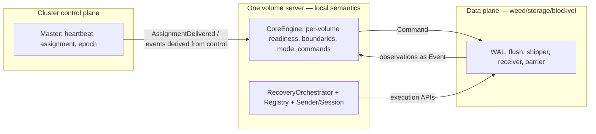

# V2 Engine — Maintainer Tutorial

Audience: engineers taking over `sw-block/engine/replication` and its integration in `weed/server`.

Goal: know **where truth lives**, **how to read the code in order**, and **where to add new rules** without breaking layering.

---

## 1. Mental model (keep this picture)

- **CoreEngine**: one **reducer** per volume — `Event` in → updated `VolumeState` + `Command` + `PublicationProjection`. No I/O.
- **Sender / Session / Registry / RecoveryOrchestrator**: **per-replica recovery authority** — session phases, fencing, catch-up/rebuild execution, handshake from `RetainedHistory`.
- **blockvol / server**: muscles **execute** commands and **report** facts; they must not silently fork “publication truth” outside events.

See also: `v2-protocol-truths.md`, `v2-two-loop-protocol.md`.

---

## 2. Repository map (what file does what)

| Area | Primary paths | Responsibility |
|------|----------------|----------------|
| Package entry & invariants | `sw-block/engine/replication/doc.go` | Read first — lists ownership/fencing rules. |
| Core shell (Phase 14) | `engine.go`, `state.go`, `event.go`, `command.go`, `projection.go` | Volume-level mode, readiness, boundaries, emitted commands. |
| Per-replica recovery | `sender.go`, `session.go`, `registry.go`, `budget.go`, `rebuild.go`, `outcome.go`, `history.go` | Session FSM, handshake classification, bounded catch-up. |
| Orchestration | `orchestrator.go`, `driver.go`, `executor.go` | `ProcessAssignment`, `ExecuteRecovery`, stepwise recovery plans. |
| Boundaries | `adapter.go` | `StorageAdapter` — engine never reaches into storage directly. |
| Runtime helpers | `engine/replication/runtime/*.go` | Pending/step execution helpers — not the semantic core. |
| Host integration | `weed/server/volume_server_block.go`, `block_recovery.go`, `block_protocol_state.go`, `weed/storage/blockvol/v2bridge` | Wires engine, applies observations, executes commands. |

---

## 3. Suggested first read order (~1–2 hours)

1. **`doc.go`** — invariant list (what must stay true).
2. **`types.go`** — `SessionKind`, `SessionPhase`, `ReplicaState`, `Endpoint`.
3. **`event.go` + `command.go`** — vocabulary of the core: what can be observed, what can be decided.
4. **`state.go`** — `VolumeState`, `ReadinessView`, `BoundaryView`, `commandState` (idempotence keys).
5. **`engine.go`** — `ApplyEvent`, `recompute`, `applyAssignment`, `primaryEligibleForPublish`, `bootstrapReason`.
6. **`sender.go`** (execution APIs + `SessionSnapshot`) — how session fencing works.
7. **`registry.go` + `orchestrator.go`** — how assignments become senders and recovery runs.
8. **Host**: grep `ApplyEvent` / `v2Core` / `applyCoreEvent` in `weed/server` to see how events are produced.

---

## 4. Where to add a “new rule” (decision tree)

Ask: **what kind of rule is it?**

| Your change is about… | Put it in… | Typical pattern |
|------------------------|------------|-----------------|
| When the volume is `publish_healthy` / `bootstrap_pending`, or how readiness/boundary combine | **`CoreEngine`** — `recompute`, `primaryEligibleForPublish`, or new/extended `Event` handling | Add/adjust `Event`, update `ApplyEvent` branch, extend `recompute`; keep commands **pure** (no I/O). |
| When a replica may receive live WAL tail, catch-up bounds, session invalidation | **`Sender` / `Session`** and/or **`RecoveryOrchestrator`** | Extend phase checks, `checkAuthority`, handshake/budget; **do not** duplicate mode logic in blockvol. |
| Gating execution (e.g. live ship) from host-visible engine snapshots | **`weed/server`** (e.g. protocol execution sync) — **derive** from engine/registry, **set** policy on `BlockVol` | Keep engine free of TCP; host binds policy to data plane. |
| Cluster-wide who is primary / epoch | **Master / assignment path** — not inside `CoreEngine` alone | VS consumes assignment as `AssignmentDelivered` (or equivalent adapter event). |

**Rule of thumb**: if the rule needs **only local observations** already modeled as `Event`, it belongs in **`engine.go`**. If it needs **per-replica session identity or LSN ranges**, it belongs in **`sender.go` / `session.go`**. If it needs **disk retention / pins**, use **`StorageAdapter`** and **`RecoveryDriver`** paths.

---

## 5. Checklist: adding a new **CoreEngine** `Event`

1. Define the type in **`event.go`** — implement `VolumeID() string`.
2. Add handling in **`ApplyEvent`** in **`engine.go`** — update `VolumeState` fields only; no side effects.
3. If the event implies work for the host, emit a **`Command`** (see **`command.go`**) or reuse an existing one.
4. Call **`recompute(st)`** if you added fields that affect `Mode` / `Publication` (or rely on final `recompute` at end of `ApplyEvent` — today every path ends with `recompute`).
5. Extend **`VolumeState.Snapshot()`** in **`state.go`** if you added new copyable state.
6. Add/extend **tests**: `phase14_*_test.go` or focused tests in `engine` package.
7. **Wire the host**: wherever the observation is detected in `weed/server`, enqueue **`CoreEngine.ApplyEvent`** (or the project’s adapter) so the event stream is **complete**.

---

## 6. Checklist: changing **Mode** or **Publication** semantics

- Read **`recompute`** and **`bootstrapReason`** end-to-end — they are the **single place** for outward mode naming on the bounded path.
- If you add a new `ModeName`, add it in **`state.go`** and handle it in **`recompute`** (and any projection consumers).
- **Do not** infer publish health only from shipper logs in random packages — align with **`primaryEligibleForPublish`** or deliberately extend it with new `Event`s (e.g. new boundary).

---

## 7. Integration: `weed/server` expectations

- **Assignments** from master should eventually surface as **`AssignmentDelivered`** (or the unified adapter equivalent) with correct **epoch** and **replica IDs**.
- **Observations** (receiver ready, shipper configured/connected, barrier OK/fail, LSN advances) must be **turned into events**; missing events ⇒ core state diverges from reality.
- **Commands** returned by `ApplyEvent` must be **executed or explicitly dropped** by policy — silent ignore leads to stuck `bootstrap_pending`.

Grep starting points: `v2Core`, `ApplyEvent`, `applyCoreEvent`, `coreProj`.

---

## 8. Testing strategy (short)

| Layer | What to prove |
|-------|----------------|
| `engine` package tests | Deterministic transitions: given event list ⇒ final `VolumeState` / projection. |
| Sender/session tests | Session ID fencing, phase transitions, budget escalation. |
| `weed/server` tests | Host wiring: policy + observations ⇒ expected gating or readiness. |

See `v2-proof-and-retest-pyramid.md`.

---

## 9. Common pitfalls

- **Duplicating “truth”** — updating readiness or durable LSN only in ad-hoc variables without emitting **`Event`**.
- **Treating `WriteLBA` success as commit** — core **`publish_healthy`** requires **`DurableLSN > 0`** for primary path via **`primaryEligibleForPublish`**; align client docs with barrier/group commit semantics.
- **Mixing Core and Sender rules** — mode in `CoreEngine`, per-replica execution in `Sender`; avoid cross-importing the wrong way from `blockvol`.
- **Breaking idempotence** — `commandState` tracks what was already commanded; new commands need stable keys (epoch + replica + target LSN where applicable).

---

## 10. Related documents

- `v2-automata-ownership-map.md` — who owns which automaton.
- `v2-session-protocol-shape.md` — current VS-to-VS sync/session/data surface.
- `v2-rebuild-mvp-session-protocol.md` — implementation target for the first rebuild MVP.
- `v2-protocol-aware-execution.md` — host-side execution gating.
- `wal-replication-v2-state-machine.md` — replica FSM (design-level).
- `engine/replication/doc.go` — source-level invariant list (always keep in sync when you change semantics).
