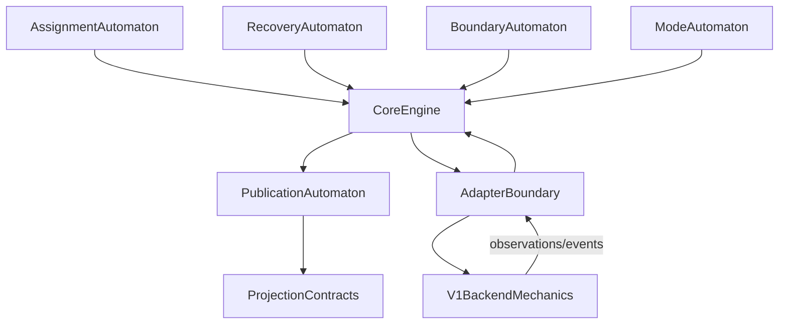

# V2 Phase 14+ Semantic-First Framework

Date: 2026-04-03
Status: active
Purpose: define the overall `Phase 14+` implementation framework so `V2`
runtime extraction is driven by semantics first: core-owned state and
transitions, then command rules, then projection contracts, and only then
adapter rebinding

## Why This Document Exists

`Phase 13` closed one bounded constrained-runtime contract package:

1. real-workload validation
2. assignment/publication closure
3. bounded mode normalization

That package is valuable, but it is not yet a completed `V2 runtime`.

The next problem is therefore no longer:

1. keep deepening constrained-`V1` validation by default

It is:

1. how to turn the accepted semantic constraints into a real `V2 core`
2. how to sequence `Phase 14+` so `V1` mixed runtime state does not silently
   regain semantic authority

## Core Rule

For `Phase 14+`, implementation order must be:

1. define core-owned state and transitions
2. define command-emission rules
3. define projection contracts
4. only then connect adapters

Do not invert this order.

If adapter/runtime wiring appears first, `V1` mixed state will silently regain
semantic authority through convenience behavior.

## Existing Inputs To Preserve

These are fixed inputs, not optional references:

1. `v2_mini_core_design.md`
2. `v2-reuse-replacement-boundary.md`
3. `v2-protocol-claim-and-evidence.md`
4. `v2-phase-development-plan.md`
5. `sw-block/engine/replication/`

## Overall Composition Model

The full `V2` runtime should be composed from smaller automata rather than one
monolithic state machine.

## The Five Core-Owned Automata

### 1. Assignment automaton

Owns:

1. volume intent
2. role intent
3. stable replica identity
4. epoch
5. desired replica set

Primary constraints preserved:

1. `CP13-2`
2. identity-vs-transport separation

Current seeds:

1. `sw-block/engine/replication/registry.go`
2. `sw-block/engine/replication/state.go`

### 2. Recovery automaton

Owns:

1. per-replica recovery state
2. session ownership and fencing
3. catch-up vs rebuild selection

Primary constraints preserved:

1. `CP13-4`
2. `CP13-5`
3. `CP13-6`
4. `CP13-7`

Current seeds:

1. `sw-block/engine/replication/sender.go`
2. `sw-block/engine/replication/session.go`
3. `sw-block/engine/replication/orchestrator.go`
4. `sw-block/engine/replication/outcome.go`

### 3. Boundary automaton

Owns:

1. committed truth
2. checkpoint truth
3. durable barrier truth
4. rebuild/catch-up target truth

Primary constraints preserved:

1. `T1`
2. `T9`
3. `CP13-3`

Current seeds:

1. `sw-block/engine/replication/state.go`
2. `sw-block/engine/replication/engine.go`

### 4. Mode automaton

Owns:

1. `allocated_only`
2. `bootstrap_pending`
3. `replica_ready`
4. `publish_healthy`
5. `degraded`
6. `needs_rebuild`

Primary constraints preserved:

1. `CP13-9`
2. fail-closed external meaning

Current seeds:

1. `sw-block/engine/replication/state.go`
2. `sw-block/engine/replication/engine.go`

### 5. Publication automaton

Owns:

1. readiness closure
2. publication closure
3. outward healthy vs non-healthy truth

Primary constraints preserved:

1. `CP13-8A`
2. `CP13-9`

Current seeds:

1. `sw-block/engine/replication/projection.go`
2. `sw-block/engine/replication/engine.go`

## Phase 14+ Execution Order

### Phase 14A: Core-owned automata

Goal:

1. make the five automata explicit in the core package

Deliver:

1. state definitions
2. transition tables/rules
3. event vocabulary

Validation:

1. structural acceptance tests in `sw-block/engine/replication`

Non-goal:

1. no live adapter hook

### Phase 14B: Command semantics

Goal:

1. freeze command-emission rules from semantic state, not runtime convenience

Deliver:

1. command rules for role apply, receiver start, shipper configure, invalidation,
   and publication

Validation:

1. tests that one event sequence produces one bounded command sequence

Non-goal:

1. no `weed/` execution yet

### Phase 14C: Projection contracts

Goal:

1. define what external surfaces are allowed to claim and from which core state

Deliver:

1. projection structs and normalization rules for lookup/heartbeat/debug/tester
   meanings

Validation:

1. mode/readiness/publication surface-consistency tests

Non-goal:

1. no live registry rewrite yet

### Phase 15A: Minimal adapter hook

Goal:

1. connect one narrow adapter ingress to the new core

Deliver:

1. one event path from `weed/` into the core
2. one command path back out

Validation:

1. prove no semantic split between adapter and core on that narrow path

### Phase 15B: Projection-store rebinding

Goal:

1. make `weed/` projection/state surfaces consume core-owned projection truth

Deliver:

1. bounded rebinding of registry / lookup / tester-facing surfaces

Validation:

1. prove assignment delivered != ready != publish healthy on the real path

### Phase 16: V2-native runtime closure

Goal:

1. make the integrated runtime behave as a `V2`-owned system rather than
   constrained-`V1` semantics plus fixes

Deliver:

1. one bounded runtime path where core-owned semantics drive adapters and
   projections

Validation:

1. end-to-end failover/recovery/publication scenarios on the core-driven path

## Algorithm Review Rule

For any new transition rule, command rule, or projection rule, require a short
justification in code review or delivery notes:

1. semantic constraint satisfied:
   - which item from `v2-protocol-claim-and-evidence.md`,
     `v2-protocol-truths.md`, or `CP13-*`
2. overclaim avoided:
   - what false healthy / ready / durable / recoverable claim is being prevented
3. proof preserved:
   - which accepted test or checkpoint remains valid because of this rule

This is the minimum bar for `Phase 14+`.

## Immediate Next Slice

Do not broaden `Phase 13` further.

Use the new `Phase 14` core skeleton in `sw-block/engine/replication` as the
base for one complete semantic chain:

1. `mode`
2. `readiness`
3. `publication`

This is the best next slice because it turns the newest accepted `CP13-8A` and
`CP13-9` constraints directly into core-owned state and transition logic before
adapter rebinding begins.
