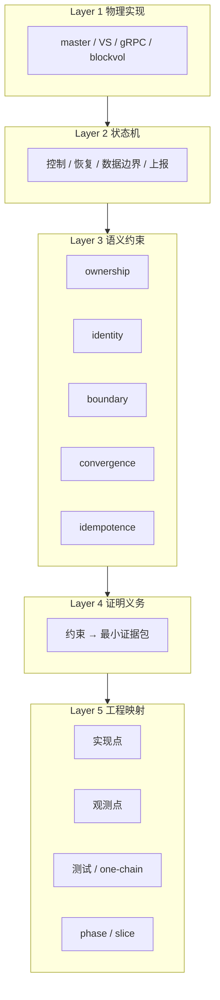
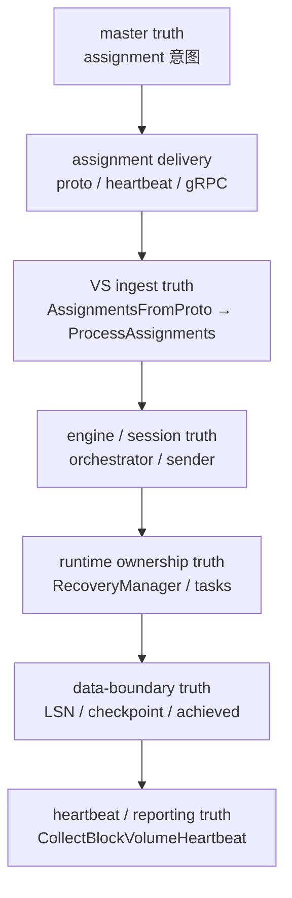
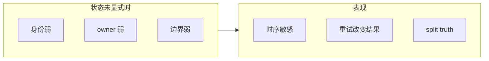

# V2 协议闭环图

日期：2026-04-02
状态：active
读者：架构设计、实现负责人、tester、reviewer

## 1. 文档目标

这份文档不是单纯介绍算法。

它的目标是把 `V2` 在当前 chosen path 上的协议结构整理成一张“闭环图”，回答下面几个问题：

1. `V2` 当前有哪些正式状态对象
2. 这些对象之间有哪些关键事件和迁移
3. `V2` 当前维持哪些语义约束
4. 这些约束分别由哪些证明义务支撑
5. 这些证明义务已经映射到哪些 phase / slice / 实现点 / 测试点

这份文档想说明的是：

- `V2` 不是一组散乱 patch
- 而是在明确边界内逐步建立的协议闭环

这里的“闭环”是有范围的。

当前默认边界仍然是：

1. `RF=2`
2. `sync_all`
3. 现有 master / volume-server heartbeat path
4. `blockvol` 作为当前执行 backend

所以本文不宣称“所有模式全部完备”。
它宣称的是：

- 在 chosen path 上，`V2` 已经建立了一个结构化、可验证、可扩展的协议闭环框架

### 1.1 五层模型总览（Mermaid）

自上而下：从代码与运行时，到语义、证明与工程落地（读图：下层是承载，上层是约束与 close）。



## 2. V2 的五层模型

## Layer 1：物理实现层

这一层列出当前承载 `V2` truth 的真实工程对象。

### 2.1 主要实现对象

1. master 侧：
   - `master_grpc_server.go`
   - `master_grpc_server_block.go`
   - `master_block_failover.go`
   - `BlockAssignmentQueue`
2. volume server 侧：
   - `volume_grpc_client_to_master.go`
   - `volume_server_block.go`
   - `CollectBlockVolumeHeartbeat()`
3. V2 控制 / 恢复桥接：
   - `v2bridge/control.go`
   - `RecoveryManager`
4. V2 执行层：
   - `CatchUpExecutor`
   - `RebuildExecutor`
   - `v2bridge/executor.go`
5. backend 执行层：
   - `blockvol`
   - `WAL`
   - `snapshot`
   - `flusher`

### 2.2 这一层的意义

这一层回答的是：

1. 协议最终在哪些真实代码路径里运行
2. 哪些对象是真正的 authority carrier
3. 哪些地方是观测点

但它本身不定义协议语义。

## Layer 2：状态机层

这一层定义 `V2` 的正式状态对象与关键事件。

### 2.3 控制面状态对象

| 对象 | 作用 | 典型字段 |
|------|------|----------|
| Assignment truth | master/VS 之间的控制意图 | `Path`, `Epoch`, `Role`, replica identity, replica addrs |
| Stable identity | 防止地址形态混淆 authority | `ServerID`, local server identity |
| Role truth | 定义当前是 primary / replica / rebuilding | `Role`, `LeaseTtlMs` |

### 2.4 恢复状态对象

| 对象 | 作用 | 典型状态 |
|------|------|----------|
| Sender | V2 的恢复主体 | `in_sync`, `catchup`, `needs_rebuild`, disconnected |
| Session | 一次恢复意图的 authority 载体 | created, superseded, removed |
| Recovery task | live runtime owner | running, draining, done |

### 2.5 数据边界状态对象

| 对象 | 作用 |
|------|------|
| `CommittedLSN` | 当前对外可承诺、可用于 recovery 目标的边界 |
| `CheckpointLSN` | 稳定物化边界 |
| `WALHeadLSN` | 当前 WAL 最高边界 |
| `receivedLSN` | receiver 当前已连续接收边界 |
| `targetLSN` | recovery plan 的目标边界 |
| `achievedLSN` | 实际 rebuild / transfer 达到的边界 |
| `snapshotBaseLSN` | snapshot 所代表的基线边界 |

### 2.6 对外可见状态对象

| 对象 | 作用 |
|------|------|
| Heartbeat truth | VS 对 master / 外部报告的 block 状态 |
| Reported replica addr | 当前 externally visible replica truth |
| Reported role / epoch | 当前 externally visible control truth |

### 2.7 关键事件

当前 chosen path 上最关键的事件包括：

1. `AssignmentDelivered`
2. `EpochBumped`
3. `SessionCreated`
4. `SessionSuperseded`
5. `SessionRemoved`
6. `CatchUpPlanned`
7. `CatchUpCompleted`
8. `RebuildStarted`
9. `RebuildCommitted`
10. `SnapshotTransferred`
11. `TruncationEscalated`
12. `RepeatedAssignmentDelivered`
13. `HeartbeatCollected`

### 2.8 Truth 流水线（Mermaid）

`V2` 的主要工作，是保证这条链上的各层 truth 在关键场景下**不长期分裂**（no persistent split truth）。



文字版（与上图一致）：

```text
master truth → delivery → VS ingest → engine/session → runtime owner → data boundary → heartbeat/reporting
```

### 2.9 V1 与 V2：哪些“未显式状态”会让结果不确定

这一节用**同一套 truth 流水线**来对比：不是比较“代码行数”，而是比较**协议层是否显式持有状态**。

下列概括针对**常见 V1 工程形态**与 **V2 chosen-path 显式化** 的对比，用于直觉理解；具体实现细节以代码与 phase 证据为准。

| Truth 环节 | V1 常见风险（状态隐含时） | V2 显式化后更可回答的问题 |
|-------------|---------------------------|---------------------------|
| master truth | 仅地址/临时约定，failover 后身份易混淆 | stable `ServerID` 与 `epoch` 是否一致 |
| delivery | 重复投递、重复副作用 | 同 truth 是否幂等（`P3`） |
| VS ingest | 隐式 fallback 成地址身份 | 是否 fail-closed（`P1`） |
| engine/session | 旧 session 与新 session 边界不清 | supersede 后旧 authority 是否失效 |
| runtime owner | goroutine 级“好像还在跑” | 是否 serialized drain（`Phase 09 P4`） |
| data boundary | “完成”与本地 LSN 不一致 | `achievedLSN` 与 checkpoint/receiver 是否收敛（`Phase 09 P1`） |
| heartbeat | 上报与控制意图漂移 | 与 assignment 是否一致（`Phase 10 P2`） |

不确定性的典型结构：



**一句话**：`V1` 在很多路径上仍然可用，但上述环节一旦缺少显式对象，系统在边界场景下会更容易出现**结果不确定**（依赖时序、依赖重试、或内部 truth 与外部报告不一致）。`V2` 的方向是把它们变成**可命名状态 + 可证义务**。

更细的“方法层”叙述见：`v2-semantic-methodology.zh.md` 第 10 节。

## Layer 3：语义约束层

这一层定义协议必须长期维持的核心约束。

### 3.1 Ownership constraints

目标：

- 明确当前谁拥有 recovery authority

当前约束：

1. 同一 replica 不能同时存在两个合法 live owner
2. supersede 后旧 owner 必须失效
3. shutdown 后不得残留 live owner
4. 旧 session 不能在新 truth 下继续提交有效结果

### 3.2 Identity constraints

目标：

- 不用 transport address 猜身份

当前约束：

1. stable `ServerID` 是 control truth 的正式部分
2. `ReplicaID` 应从 `<path>/<ServerID>` 构造
3. 缺失 stable ID 时 chosen path 应 fail closed
4. local server identity 应使用 canonical `volumeServerId`

### 3.3 Boundary safety constraints

目标：

- rebuild / snapshot / truncate 的边界必须物理成立

当前约束：

1. full-base rebuild 的完成边界必须显式暴露并与 runtime 对齐
2. snapshot rebuild 的边界必须由 manifest / hash / base LSN 约束
3. truncation 只有在安全条件成立时才允许本地修复
4. 做不到安全修复时必须 escalate，而不是伪装成功

### 3.4 Convergence constraints

目标：

- 不允许长期 split truth

当前约束：

1. assignment truth、runtime truth、heartbeat truth 必须收敛
2. reassignment 后旧 truth 不应继续对外可见
3. `achievedLSN`、checkpoint、receiver progress 在 accepted contract 下应收敛
4. control truth 变化后，旧 runtime residue 不应残留

### 3.5 Idempotence constraints

目标：

- 同样 truth 重复出现时，不应不断产生额外副作用

当前约束：

1. repeated unchanged assignment 不应重复触发 recovery
2. repeated unchanged delivery 不应重复 relisten / restart
3. repeated delivery 不应破坏已收敛的 truth

## Layer 4：证明义务层

这一层把上述语义约束变成“必须被证明”的义务。

## 4. 当前主要证明义务地图

| 语义约束 | 证明义务 | 对应 phase / slice | 当前状态 |
|----------|----------|--------------------|----------|
| ownership | old owner 被 drain，replacement 前不得重叠 | `Phase 09 P4` | accepted |
| ownership | shutdown 后 active task = 0 | `Phase 09 P4` | accepted |
| identity | stable ID survives proto/decode/ingress | `Phase 10 P1` | accepted |
| identity | missing stable ID fails closed | `Phase 10 P1` | accepted |
| convergence | reassignment 后 old sender removed / new sender present | `Phase 10 P2` | accepted |
| convergence | heartbeat truth 收敛到新 replica truth | `Phase 10 P2` | accepted |
| convergence | stale runtime residue removed | `Phase 10 P2` | accepted |
| idempotence | repeated unchanged assignment 不增加 V2 side effect | `Phase 10 P3` | accepted |
| idempotence | repeated unchanged assignment 不重复 V1 relisten/setup | `Phase 10 P3` | accepted |
| boundary safety | full-base achieved boundary 与 runtime/engine accounting 对齐 | `Phase 09 P1` | accepted |
| boundary safety | snapshot boundary exactness and fail-closed | `Phase 09 P2` | accepted |
| boundary safety | unsafe truncate escalates to rebuild | `Phase 09 P3` | accepted |
| control-loop closure | master-originated truth through fuller heartbeat/gRPC loop | `Phase 10 P4` | accepted |

### 4.1 证明义务不是穷举

这里的义务不是说：

- 所有状态空间已经被穷举证明

而是说：

- 在 chosen path 上，关键协议约束都被映射成了具体、可检查、可 close 的证明义务

这比“随机多跑一些 case”更强，因为它更明确。

## 5. 已经关闭的主要协议闭环

为了更直观，可以把当前 accepted 闭环按主题来看。

### 5.1 Recovery ownership 闭环

已关闭：

1. live recovery owner 的 start / cancel / replace / drain
2. stale owner removal
3. no overlap replacement

主要来源：

- `Phase 09 P4`
- `Phase 10 P2`

### 5.2 Identity/control truth 闭环

已关闭：

1. stable ID on wire
2. local canonical identity
3. `ReplicaID` 不再依赖 address fallback
4. missing ID fail closed

主要来源：

- `Phase 10 P1`

### 5.3 Boundary safety 闭环

已关闭：

1. full-base rebuild achieved boundary closure
2. snapshot exact-boundary closure
3. truncation safe/unsafe split and escalate

主要来源：

- `Phase 09 P1`
- `Phase 09 P2`
- `Phase 09 P3`

### 5.4 Reassignment / convergence 闭环

已关闭：

1. reassignment 后 old sender removed
2. new sender created
3. heartbeat truth updated
4. stale runtime residue removed

主要来源：

- `Phase 10 P2`

### 5.5 Repeated unchanged truth 闭环

已关闭：

1. repeated unchanged assignment is idempotent
2. no duplicate orchestrator/recovery side effects
3. no duplicate relisten/setup side effects

主要来源：

- `Phase 10 P3`

## 6. 当前仍然开放的闭环

当前主要剩余的 open item 是：

### 6.1 Master-driven control-loop closure

问题不是 VS 本地处理是否成立，而是：

1. master 产生的 truth 是否经过真实 heartbeat / gRPC loop 到达 VS
2. 到达后是否仍保持 accepted identity / convergence / idempotence
3. 对外报告是否仍与同一 master-originated truth 一致

当前对应 slice：

- `Phase 10 P4`

这是当前协议闭环图上最大的未关闭项。

## Layer 5：工程映射层

这一层把抽象对象映射回真实实现、观测点和测试。

## 7. 语义对象到实现点的映射

| 语义对象 / 约束 | 主要实现点 | 主要观测点 | 主要测试/证据 |
|-----------------|-----------|-----------|--------------|
| Stable identity | `master.proto`, `block_heartbeat_proto.go`, `v2bridge/control.go` | sender registry, local server ID | `qa_block_identity_test.go` |
| Assignment ingress | `AssignmentsFromProto()`, `ProcessAssignments()` | engine sender / role application | `qa_block_identity_test.go`, `qa_block_convergence_test.go` |
| Recovery ownership | `block_recovery.go` | task map, done channel, sender state | `block_recovery_test.go` |
| Reassignment convergence | `ProcessAssignments()`, `CollectBlockVolumeHeartbeat()` | sender registry, runtime task map, heartbeat output | `qa_block_convergence_test.go` |
| Repeated-assignment idempotence | `volume_server_block.go` assignment tracking | V2 event log, repl state, heartbeat output | `qa_block_idempotence_test.go` |
| Full-base boundary closure | `v2bridge/executor.go`, `blockvol` rebuild install path | checkpoint, head, achieved progress | `transfer_test.go` / one-chain tests |
| Snapshot boundary closure | snapshot export/import path | base LSN, hash, post-install convergence | snapshot rebuild tests |
| Truncation safety | `TruncateToLSN()`, executor escalation path | sender state, local LSN state | truncation tests |

## 8. Phase 到语义约束的映射

### 8.1 `Phase 09`

`Phase 09` 的主题是：

- backend execution closure

它主要关掉的是：

1. boundary safety
2. recovery execution realism
3. live runtime ownership

### 8.2 `Phase 10`

`Phase 10` 的主题是：

- control-plane closure

它主要关掉的是：

1. identity truth
2. reassignment convergence
3. idempotence
4. fuller master-driven control-loop proof

## 9. 一个简化的“从语义到开发”流程

如果以后再开新 slice，可以用下面这个框架：

### 9.1 先定义状态对象

例如：

1. assignment truth
2. runtime owner
3. heartbeat truth

### 9.2 再定义关键事件

例如：

1. epoch bump
2. repeated delivery
3. crash / restart

### 9.3 再定义要关闭的语义约束

例如：

1. no split truth
2. fail closed
3. idempotence

### 9.4 再写证明义务

例如：

1. old owner drained
2. unsafe path escalates
3. repeated unchanged truth does not create side effects

### 9.5 最后才写实现和测试

例如：

1. 改哪个入口点
2. 观测哪个 runtime / heartbeat / event log
3. 用哪种 one-chain proof close

## 10. 这份闭环图想表达什么

它想表达的不是：

- `V2` 所有模式全部完成

它想表达的是：

1. `V2` 已经有正式状态对象，而不是只靠代码隐含状态
2. `V2` 已经有显式语义约束，而不是主要靠补 bug 建立正确性
3. `V2` 已经把关键 correctness 问题写成证明义务，而不是只靠随机 case
4. `V2` 已经把这些义务映射回 phase、实现点和测试点
5. 在 chosen path 上，协议闭环已经大体成形，只剩有限 open item

## 11. 推荐和哪些文档一起阅读

建议按下面顺序阅读：

1. `v2-semantic-methodology.zh.md`
2. `v2-detailed-algorithm.zh.md`
3. `v2-protocol-closure-map.zh.md`
4. `v2-product-completion-overview.md`
5. `v2-phase-development-plan.md`

这样可以依次看到：

1. 方法
2. 算法
3. 闭环地图
4. 产品完成度
5. phase 推进计划
