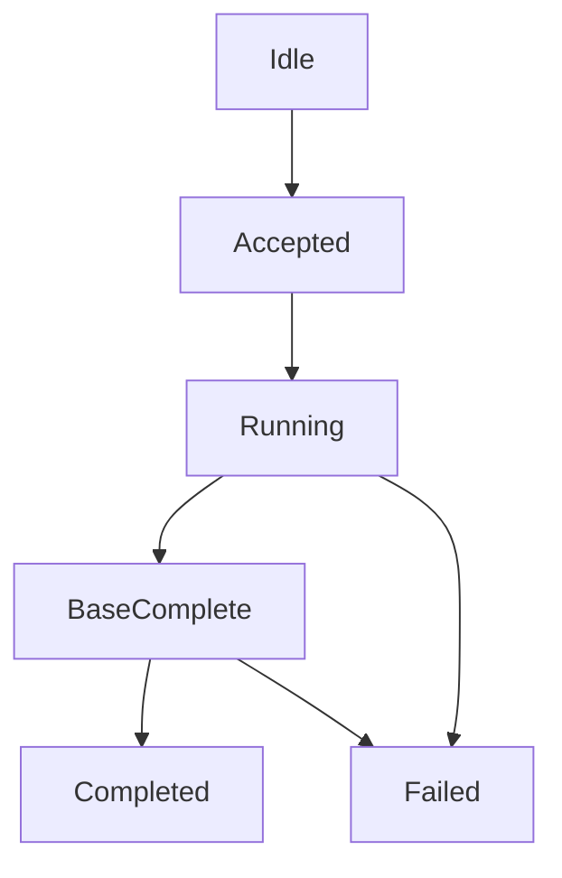

# V2 Rebuild MVP Session Protocol

Date: 2026-04-07
Status: active draft

## Goal

Define the smallest reliable VS-to-VS protocol that is sufficient to build a
working `rebuild` MVP on top of:

1. trusted flushed-extent base transfer
2. live WAL ingestion
3. primary-owned session control
4. replica-reported session progress

This document is intentionally narrower than the long-term protocol. It is the
implementation target for the first rebuild MVP.

## Non-Goals

This MVP does not try to define:

1. a full `catchup` protocol
2. `rangeBitmap` or delta-block rebuild execution
3. partial session resume from volatile in-memory rebuild state
4. advanced retransmit/window semantics beyond simple transport needs
5. broad product-ready transport or multi-host rollout guarantees

## Control Model

The protocol keeps one strict rule:

1. `sync` asks for facts
2. the primary decides whether to issue `rebuild`
3. the replica executes the session
4. the replica reports session progress
5. only the primary decides when the session is complete

The replica does not choose:

1. the next session kind
2. the target boundary
3. whether it is quorum-eligible again

## Message Set

The MVP needs four semantic message families:

1. `sync`
2. `syncAck`
3. `sessionControl`
4. `sessionAck`

And two data-plane lanes:

1. `walData`
2. `sessionData`

Optional:

1. `sessionDataAck`
   transport/window control only

## Message Definitions

### `sync`

Direction:

1. primary -> replica

Minimum fields:

1. `volume_id`
2. `replica_id`
3. `epoch`
4. `sync_id`
5. `target_lsn`
6. `deadline_ms`

Purpose:

1. get bounded replica facts
2. observe whether a session is already active
3. decide whether to stay `keepup` or start `rebuild`

### `syncAck`

Direction:

1. replica -> primary

Minimum fields:

1. `volume_id`
2. `replica_id`
3. `epoch`
4. `sync_id`
5. `ack_kind`
6. `applied_lsn`
7. `durable_lsn`
8. `session_active`
9. `session_id` optional
10. `session_kind` optional
11. `session_phase` optional
12. `reason` optional

Allowed `ack_kind` values:

1. `quorum`
2. `timed_out`
3. `transport_lost`
4. `epoch_mismatch`

Rule:

1. `syncAck` returns facts only
2. it does not recommend `keepup` / `catchup` / `rebuild`

### Primary-side normalized sync facts

The wire `syncAck` is still the only replica-to-primary sync control message.
However, the primary/server layer may normalize raw wire facts and local
control-path observations into a smaller primary-side fact vocabulary before
feeding them into decision logic.

This normalized vocabulary is not a new wire protocol. It is the primary-owned
semantic envelope for "what kind of sync fact just arrived?"

Current normalized kinds:

1. `sync_quorum_acked`
   normal quorum-style sync closure reached through the target boundary
2. `sync_quorum_timed_out`
   control-plane sync closure timed out before normal quorum-style completion
3. `sync_replay_required`
   fresh facts show the replica is behind but still replay-recoverable
4. `sync_rebuild_required`
   fresh facts show the replica is outside retained replay coverage, so rebuild
   is required
5. `sync_replay_failed`
   a replay/catch-up attempt failed and the primary must re-decide from fresh
   facts

Normalization rules:

1. normalized kinds never recommend an action by themselves
2. they preserve the same ownership rule: replica reports facts, primary
   decides the next session
3. multiple sources may produce the same normalized kind:
   - raw `syncAck`
   - barrier timeout / closure callback
   - catch-up failure callback
   - planner classification after reading fresh facts
4. only the primary may turn normalized sync facts into `keepup`, `catchup`, or
   `rebuild` decisions

### `sessionControl`

Direction:

1. primary -> replica

The MVP needs only:

1. `start_rebuild`
2. `cancel_session`

Minimum fields for `start_rebuild`:

1. `volume_id`
2. `replica_id`
3. `epoch`
4. `session_id`
5. `session_kind = rebuild`
6. `base_kind = flushed_extent`
7. `base_lsn`
8. `target_lsn`
9. `deadline_ms`

Rules:

1. `session_id` must be unique under the current primary authority
2. a new session may supersede an older one
3. epoch mismatch must be rejected
4. `base_lsn` for rebuild is the primary's flushed/checkpoint boundary, not a
   merely committed boundary
5. the base lane is allowed to stream the current extent image directly as long
   as that image is known to represent `base_lsn`

### `sessionAck`

Direction:

1. replica -> primary

Minimum fields:

1. `volume_id`
2. `replica_id`
3. `epoch`
4. `session_id`
5. `session_kind = rebuild`
6. `phase`
7. `wal_applied_lsn`
8. `base_progress`
9. `base_complete`
10. `achieved_lsn` on completion
11. `reason` on failure

Allowed `phase` values for the MVP:

1. `accepted`
2. `running`
3. `base_complete`
4. `completed`
5. `failed`

### `sessionData`

Direction:

1. primary -> replica

Purpose:

1. send trusted flushed-extent base chunks

Minimum fields:

1. `volume_id`
2. `replica_id`
3. `epoch`
4. `session_id`
5. `chunk_id`
6. `offset_or_lba_range`
7. `payload`
8. `is_last_chunk`

### `walData`

Direction:

1. primary -> replica

Purpose:

1. continue live WAL ingestion during rebuild

Minimum fields:

1. `volume_id`
2. `replica_id`
3. `epoch`
4. `lsn`
5. `writes[]`

Each write should carry:

1. `lba_range`
2. `payload`

## Replica Apply Rules

### Base Rule

Rebuild runs as two concurrent lanes:

1. base lane from trusted flushed extent at `base_lsn`
2. live WAL lane from `base_lsn`

### Bitmap Rule

The replica maintains a bitmap of LBAs covered by applied WAL.

The bit is set when the WAL write is:

1. applied into replica-local WAL/recovery truth
2. replayable after restart

The bit is not set when data is only:

1. received on the network
2. queued but not yet applied locally

### Write Conflict Rule

When a base chunk targets an LBA:

1. if the bitmap bit is clear, base data may be written
2. if the bitmap bit is set, base data for that LBA must be skipped

Short form:

1. `WAL applied` wins over older base data

### Flush Rule

For bitmap protection, `applied` does not require:

1. flushing the write into the final extent image

Replica-local WAL durability and replay are sufficient for the MVP.

## Completion Rule

The primary may accept `rebuild completed` only when all are true:

1. `base_complete = true`
2. `wal_applied_lsn >= target_lsn`
3. the session has not been cancelled or superseded
4. the replica reports one explicit `achieved_lsn`

`base transfer finished` alone is not completion.

Only after the primary accepts this completion may the replica become eligible
again for normal quorum-style sync closure.

## Failure Rule

Session failure does not decide the next semantic recovery path.

`failed(reason)` means only:

1. this rebuild session did not complete

After failure:

1. the replica reports fresh facts again through `syncAck`
2. the primary re-decides whether to issue a new rebuild session

No local component may self-promote the failure into semantic `needs_rebuild`.

In normalized primary-side vocabulary, this means:

1. session failure may first surface as `sync_replay_failed`
2. a fresh sync/planner pass may then normalize to `sync_rebuild_required`
3. only after that fresh re-decision may the primary issue `start_rebuild`

## Crash Rule

The MVP assumes bitmap may be session-local volatile state.

Therefore after replica crash or session loss:

1. do not resume a partially completed rebuild from volatile bitmap state
2. restart with a fresh `sync`
3. let the primary issue a fresh rebuild session

Current contract:

1. crash recovery for rebuild means `restart rebuild`, not `resume rebuild`
2. the system may reuse only durable facts that survived the crash:
   - local durable WAL coverage
   - the fresh rebuild `base_lsn`
   - fresh primary-side decision after `sync`
3. the system does not currently reuse prior in-flight base-copy offset,
   prior in-memory bitmap state, or prior session identity as protocol facts

This means the MVP supports:

1. safe restart from durable WAL facts

But does not support:

1. arbitrary mid-session resume of partial base-copy progress
2. durable `base_progress`
3. persistent rebuild bitmap / checkpoint state
4. CBT-based repair of previously transferred extent ranges

### Issue #3 fix detail: crash restart bitmap hydration

The volatile bitmap itself is not resumed across crashes, but its protection
surface must be rebuilt before a fresh rebuild session becomes visible.

Required startup rules for a fresh rebuild session:

1. **strict ordering barrier**
   - before sending or observing `sessionAck(accepted)`, and before opening the
     base lane for `sessionData`, the replica must finish local bitmap
     hydration
   - the fresh session is not externally visible until hydration is complete
2. **hydration source**
   - rebuild the bitmap from replica-local durable WAL coverage newer than
     `base_lsn`
   - scan only the surviving local WAL coverage after `base_lsn`; older WAL is
     already represented by the flushed base image
3. **coverage rule**
   - every recovered local write/trim record with `lsn > base_lsn` marks its
     covered LBAs in the bitmap before any base chunk may be applied
   - this reconstructs the "WAL already wins here" immunity shield after
     restart
4. **achieved boundary rule**
   - initial session progress may start at `base_lsn`
   - if local durable WAL survives beyond `base_lsn`, the replica may raise its
     initial `wal_applied_lsn` to that recovered boundary
5. **silent truncation guard**
   - if the replica can prove its local durable base is already newer than the
     claimed `base_lsn`, startup must fail closed
   - do not start a dual-lane rebuild with a stale base boundary and a partial
     bitmap

Operational interpretation:

1. the session bitmap remains volatile
2. the bitmap protection set is deterministically re-derived from local durable
   WAL before the new session starts
3. if that re-derivation cannot be trusted, the session must be rejected and
   the primary must re-decide from fresh facts
4. this hydration step is required for safe `restart rebuild`; it is not a
   claim that the MVP can resume an interrupted rebuild session from its prior
   in-flight base-copy position

## Primary Decision Rule

The MVP decision rule should stay intentionally simple:

1. if `syncAck.ack_kind = quorum`, remain `keepup`
2. otherwise, if the replica is not safely closed in normal sync semantics, issue
   `rebuild`

The first MVP does not need a full negotiated `catchup` protocol.

Equivalent normalized reading:

1. `sync_quorum_acked` -> remain `keepup`
2. `sync_replay_required` -> future `catchup` path, not required for rebuild MVP
3. `sync_rebuild_required` -> issue `start_rebuild`
4. `sync_replay_failed` or `sync_quorum_timed_out` -> gather fresh facts and
   re-run the same primary decision rule

## MVP Implementation Skeleton

To reduce wiring ambiguity, the first implementation should expose one explicit
replica-side control surface in `blockvol`:

1. `StartRebuildSession(config)`
2. `ApplyRebuildSessionWALEntry(session_id, entry)`
3. `ApplyRebuildSessionBaseBlock(session_id, lba, data)`
4. `MarkRebuildSessionBaseComplete(session_id, total_blocks)`
5. `TryCompleteRebuildSession(session_id)`
6. `CancelRebuildSession(session_id, reason)`
7. `ActiveRebuildSession()`

Contract:

1. `blockvol` owns only replica-local session state and dual-lane apply rules
2. host/server wiring owns transport routing and message decoding
3. stale packets must be rejected by `session_id`
4. supersede is explicit: a new `session_id` replaces the old active session
5. completion remains queryable until the host emits the matching
   `SessionCompleted`-style event and clears the session

Current MVP implementation choices:

1. use a dedicated `RebuildBitmap`, not `DirtyMap`
2. use direct extent transfer from the primary's flushed/checkpoint image for
   the base lane
3. reuse the existing rebuild TCP path for `sessionData` rather than inventing
   a new transport first
4. anchor rebuild start at flushed/checkpoint `base_lsn`, not merely committed
   LSN, because committed data may still live only in WAL

Current server-layer skeleton:

1. `BlockService.StartReplicaRebuildSession(path, config)`
2. `BlockService.ApplyReplicaRebuildWALEntry(path, session_id, entry)`
3. `BlockService.ApplyReplicaRebuildBaseBlock(path, session_id, lba, data)`
4. `BlockService.MarkReplicaRebuildBaseComplete(path, session_id, total_blocks)`
5. `BlockService.TryCompleteReplicaRebuildSession(path, session_id)`
6. `BlockService.CancelReplicaRebuildSession(path, session_id, reason)`
7. `BlockService.ReplicaRebuildSession(path)`
8. `BlockService.ObserveReplicaRebuildSessionAck(path, replica_id, ack)`

Server-layer responsibility:

1. decode incoming `sessionControl` / `walData` / `sessionData`
2. map them onto the local volume path
3. route them into the `BlockService` skeleton above
4. build `sessionAck` from `ReplicaRebuildSession(path)`
5. feed received `sessionAck` back into core via
   `ObserveReplicaRebuildSessionAck(path, replica_id, ack)`

## Replica State Machine

Interpretation:

1. `accepted`
   session contract is valid and epoch/session id are accepted
2. `running`
   base lane and WAL lane are active
3. `baseComplete`
   trusted base transfer is complete, WAL lane still determines final closure
4. `completed`
   replica reports one achieved boundary at or beyond target
5. `failed`
   session stopped without semantic completion

## Test Matrix

The rebuild MVP should not be considered ready until these tests exist.

### Protocol

1. `syncAck` returns facts only and never recommends an action
2. `start_rebuild` is rejected on epoch mismatch
3. a new `session_id` supersedes the previous session

### Correctness

1. base lane plus live WAL lane converge to target
2. WAL-applied LBA is never overwritten by later base-copy data
3. bitmap bit is set on `applied`, not on `received`
4. a fresh rebuild session must hydrate bitmap coverage from locally recovered
   WAL before opening the base lane
5. rebuild start must fail closed if the local durable base is already newer
   than the claimed `base_lsn`

### Crash / Failure

1. crash after WAL receive but before apply leaves bitmap clear and base may
   still cover the LBA safely
2. crash after WAL apply preserves correctness through local WAL replay
3. crash restart before fresh base transfer hydrates bitmap from local WAL and
   skips stale base blocks correctly
4. stale or truncated base boundary fails closed instead of starting rebuild
5. transport loss during rebuild yields `failed(reason)` and requires primary
   re-decision
6. rebuild completion does not restore normal quorum eligibility until the
   primary accepts completion
7. crash during rebuild results in a fresh `sync` + fresh rebuild session,
   not reuse of prior in-flight `base_progress`

## Follow-On Work

After this MVP is working, the next candidates are:

1. negotiated `catchup`
2. `rangeBitmap` / delta-block rebuild
3. durable rebuild checkpoints for safe mid-session resume
4. richer `sessionDataAck` flow control
5. resumable rebuild with durable `base_progress`
6. primary-owned CBT / changed-block repair for previously transferred ranges
