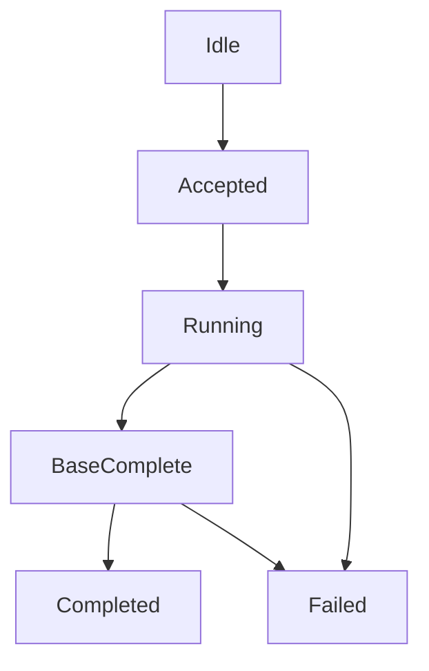

# V2 Rebuild MVP Session Protocol

Date: 2026-04-07
Status: active draft

## Goal

Define the smallest reliable VS-to-VS protocol that is sufficient to build a
working `rebuild` MVP on top of:

1. trusted snapshot/base transfer
2. live WAL ingestion
3. primary-owned session control
4. replica-reported session progress

This document is intentionally narrower than the long-term protocol. It is the
implementation target for the first rebuild MVP.

## Non-Goals

This MVP does not try to define:

1. a full `catchup` protocol
2. `rangeBitmap` or delta-block rebuild execution
3. partial session resume from volatile in-memory rebuild state
4. advanced retransmit/window semantics beyond simple transport needs
5. broad product-ready transport or multi-host rollout guarantees

## Control Model

The protocol keeps one strict rule:

1. `sync` asks for facts
2. the primary decides whether to issue `rebuild`
3. the replica executes the session
4. the replica reports session progress
5. only the primary decides when the session is complete

The replica does not choose:

1. the next session kind
2. the target boundary
3. whether it is quorum-eligible again

## Message Set

The MVP needs four semantic message families:

1. `sync`
2. `syncAck`
3. `sessionControl`
4. `sessionAck`

And two data-plane lanes:

1. `walData`
2. `sessionData`

Optional:

1. `sessionDataAck`
   transport/window control only

## Message Definitions

### `sync`

Direction:

1. primary -> replica

Minimum fields:

1. `volume_id`
2. `replica_id`
3. `epoch`
4. `sync_id`
5. `target_lsn`
6. `deadline_ms`

Purpose:

1. get bounded replica facts
2. observe whether a session is already active
3. decide whether to stay `keepup` or start `rebuild`

### `syncAck`

Direction:

1. replica -> primary

Minimum fields:

1. `volume_id`
2. `replica_id`
3. `epoch`
4. `sync_id`
5. `ack_kind`
6. `applied_lsn`
7. `durable_lsn`
8. `session_active`
9. `session_id` optional
10. `session_kind` optional
11. `session_phase` optional
12. `reason` optional

Allowed `ack_kind` values:

1. `quorum`
2. `timed_out`
3. `transport_lost`
4. `epoch_mismatch`

Rule:

1. `syncAck` returns facts only
2. it does not recommend `keepup` / `catchup` / `rebuild`

### `sessionControl`

Direction:

1. primary -> replica

The MVP needs only:

1. `start_rebuild`
2. `cancel_session`

Minimum fields for `start_rebuild`:

1. `volume_id`
2. `replica_id`
3. `epoch`
4. `session_id`
5. `session_kind = rebuild`
6. `base_kind = snapshot`
7. `base_lsn`
8. `target_lsn`
9. `snapshot_id`
10. `deadline_ms`

Rules:

1. `session_id` must be unique under the current primary authority
2. a new session may supersede an older one
3. epoch mismatch must be rejected

### `sessionAck`

Direction:

1. replica -> primary

Minimum fields:

1. `volume_id`
2. `replica_id`
3. `epoch`
4. `session_id`
5. `session_kind = rebuild`
6. `phase`
7. `wal_applied_lsn`
8. `base_progress`
9. `base_complete`
10. `achieved_lsn` on completion
11. `reason` on failure

Allowed `phase` values for the MVP:

1. `accepted`
2. `running`
3. `base_complete`
4. `completed`
5. `failed`

### `sessionData`

Direction:

1. primary -> replica

Purpose:

1. send trusted snapshot/base chunks

Minimum fields:

1. `volume_id`
2. `replica_id`
3. `epoch`
4. `session_id`
5. `snapshot_id`
6. `chunk_id`
7. `offset_or_lba_range`
8. `payload`
9. `is_last_chunk`

### `walData`

Direction:

1. primary -> replica

Purpose:

1. continue live WAL ingestion during rebuild

Minimum fields:

1. `volume_id`
2. `replica_id`
3. `epoch`
4. `lsn`
5. `writes[]`

Each write should carry:

1. `lba_range`
2. `payload`

## Replica Apply Rules

### Base Rule

Rebuild runs as two concurrent lanes:

1. base lane from trusted snapshot/base
2. live WAL lane from `base_lsn`

### Bitmap Rule

The replica maintains a bitmap of LBAs covered by applied WAL.

The bit is set when the WAL write is:

1. applied into replica-local WAL/recovery truth
2. replayable after restart

The bit is not set when data is only:

1. received on the network
2. queued but not yet applied locally

### Write Conflict Rule

When a base chunk targets an LBA:

1. if the bitmap bit is clear, base data may be written
2. if the bitmap bit is set, base data for that LBA must be skipped

Short form:

1. `WAL applied` wins over older base data

### Flush Rule

For bitmap protection, `applied` does not require:

1. flushing the write into the final extent image

Replica-local WAL durability and replay are sufficient for the MVP.

## Completion Rule

The primary may accept `rebuild completed` only when all are true:

1. `base_complete = true`
2. `wal_applied_lsn >= target_lsn`
3. the session has not been cancelled or superseded
4. the replica reports one explicit `achieved_lsn`

`base transfer finished` alone is not completion.

Only after the primary accepts this completion may the replica become eligible
again for normal quorum-style sync closure.

## Failure Rule

Session failure does not decide the next semantic recovery path.

`failed(reason)` means only:

1. this rebuild session did not complete

After failure:

1. the replica reports fresh facts again through `syncAck`
2. the primary re-decides whether to issue a new rebuild session

No local component may self-promote the failure into semantic `needs_rebuild`.

## Crash Rule

The MVP assumes bitmap may be session-local volatile state.

Therefore after replica crash or session loss:

1. do not resume a partially completed rebuild from volatile bitmap state
2. restart with a fresh `sync`
3. let the primary issue a fresh rebuild session

This means the MVP supports:

1. safe restart from durable WAL facts

But does not support:

1. arbitrary mid-session resume of partial base-copy progress

## Primary Decision Rule

The MVP decision rule should stay intentionally simple:

1. if `syncAck.ack_kind = quorum`, remain `keepup`
2. otherwise, if the replica is not safely closed in normal sync semantics, issue
   `rebuild`

The first MVP does not need a full negotiated `catchup` protocol.

## MVP Implementation Skeleton

To reduce wiring ambiguity, the first implementation should expose one explicit
replica-side control surface in `blockvol`:

1. `StartRebuildSession(config)`
2. `ApplyRebuildSessionWALEntry(session_id, entry)`
3. `ApplyRebuildSessionBaseBlock(session_id, lba, data)`
4. `MarkRebuildSessionBaseComplete(session_id, total_blocks)`
5. `TryCompleteRebuildSession(session_id)`
6. `CancelRebuildSession(session_id, reason)`
7. `ActiveRebuildSession()`

Contract:

1. `blockvol` owns only replica-local session state and dual-lane apply rules
2. host/server wiring owns transport routing and message decoding
3. stale packets must be rejected by `session_id`
4. supersede is explicit: a new `session_id` replaces the old active session
5. completion remains queryable until the host emits the matching
   `SessionCompleted`-style event and clears the session

Current MVP implementation choices:

1. use a dedicated `RebuildBitmap`, not `DirtyMap`
2. use snapshot/trusted-base transfer for the base lane
3. reuse the existing rebuild TCP path for `sessionData` rather than inventing
   a new transport first

Current server-layer skeleton:

1. `BlockService.StartReplicaRebuildSession(path, config)`
2. `BlockService.ApplyReplicaRebuildWALEntry(path, session_id, entry)`
3. `BlockService.ApplyReplicaRebuildBaseBlock(path, session_id, lba, data)`
4. `BlockService.MarkReplicaRebuildBaseComplete(path, session_id, total_blocks)`
5. `BlockService.TryCompleteReplicaRebuildSession(path, session_id)`
6. `BlockService.CancelReplicaRebuildSession(path, session_id, reason)`
7. `BlockService.ReplicaRebuildSession(path)`

Server-layer responsibility:

1. decode incoming `sessionControl` / `walData` / `sessionData`
2. map them onto the local volume path
3. route them into the `BlockService` skeleton above
4. build `sessionAck` from `ReplicaRebuildSession(path)`

## Replica State Machine

Interpretation:

1. `accepted`
   session contract is valid and epoch/session id are accepted
2. `running`
   base lane and WAL lane are active
3. `baseComplete`
   trusted base transfer is complete, WAL lane still determines final closure
4. `completed`
   replica reports one achieved boundary at or beyond target
5. `failed`
   session stopped without semantic completion

## Test Matrix

The rebuild MVP should not be considered ready until these tests exist.

### Protocol

1. `syncAck` returns facts only and never recommends an action
2. `start_rebuild` is rejected on epoch mismatch
3. a new `session_id` supersedes the previous session

### Correctness

1. base lane plus live WAL lane converge to target
2. WAL-applied LBA is never overwritten by later base-copy data
3. bitmap bit is set on `applied`, not on `received`

### Crash / Failure

1. crash after WAL receive but before apply leaves bitmap clear and base may
   still cover the LBA safely
2. crash after WAL apply preserves correctness through local WAL replay
3. transport loss during rebuild yields `failed(reason)` and requires primary
   re-decision
4. rebuild completion does not restore normal quorum eligibility until the
   primary accepts completion

## Follow-On Work

After this MVP is working, the next candidates are:

1. negotiated `catchup`
2. `rangeBitmap` / delta-block rebuild
3. durable rebuild checkpoints for safe mid-session resume
4. richer `sessionDataAck` flow control
