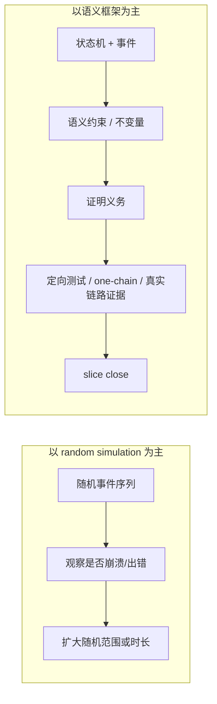
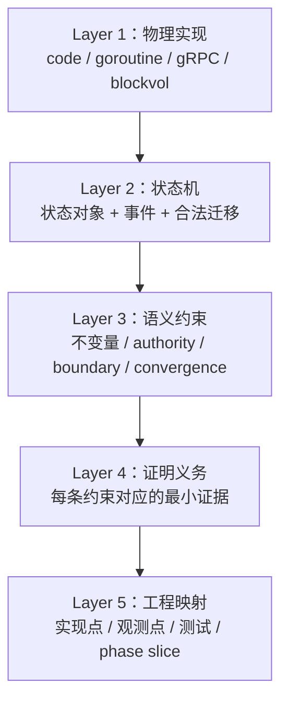
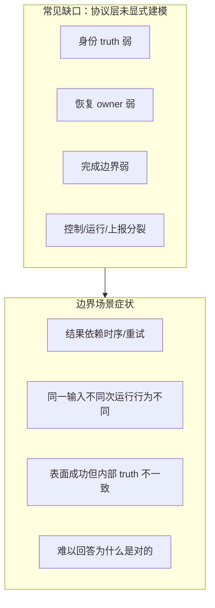

# V2 语义建模与协议开发方法

日期：2026-04-02
状态：active
读者：架构设计、实现负责人、tester、reviewer

## 1. 文档目标

这份文档回答的不是“某个函数怎么改”，而是下面几个更上层的问题：

1. 为什么 `V2` 不应该主要依赖“多跑一些随机模拟”来建立正确性信心
2. 为什么需要先定义状态机，再在其上叠加语义约束
3. 什么叫“证明义务”，它和普通 testcase 有什么不同
4. 如何把状态、约束、证明义务重新连接回实现、测试和 slice close

这份文档不是具体协议规格。
它是 `V2` 的方法论文档。

它的作用是把下面这条路线讲清楚：

1. 先定义系统状态空间
2. 再定义约束和语义
3. 再导出必须被证明的义务
4. 最后映射到实现、测试、review 和 phase slice

## 2. 为什么不能主要依赖 random simulation

随机模拟是有价值的，但它不是 closure framework。

它更适合：

1. 发现意外交互
2. 挖掘边缘 case
3. 暴露直觉之外的坏结果
4. 提高对某个设计的经验性信心

它不擅长直接回答下面这些问题：

1. 系统真正承诺的 truth 是什么
2. 哪些状态迁移是合法的，哪些必须被拒绝
3. 哪些失败应该 fail closed，哪些可以自动恢复
4. 为什么某个结果在协议上是正确的，而不是“测试刚好没炸”
5. 哪些性质是必须长期保持的不变量

所以 `V2` 的基本方法不是：

- 多跑随机事件，直到感觉系统比较稳

而是：

1. 先定义状态空间
2. 先定义协议语义
3. 先定义证明义务
4. 再用 simulator、one-chain test、真实链路测试去验证这些义务

一句话：

- random simulation 是 discovery tool
- 不是 protocol closure 的主骨架

### 2.1 两种建立信心的路径（直观对比）

要点：

- `A` 擅长发现意外，但不直接回答“协议承诺了什么”。
- `B` 先定义可证目标，再用证据 close，而不是只靠“跑得久没炸”。

## 3. 五层抽象模型

为了把 `V2` 做成一个可推演、可 close、可落回开发的系统，可以把它分成五层。

### 3.0 五层堆叠（一览）

读图方式：从下往上是“从代码到语义”，从上往下是“从语义到落地”。

### 3.1 第一层：物理实现层

这一层是实际运行的工程对象：

1. `master`
2. `volume server`
3. `ProcessAssignments()`
4. `ControlBridge`
5. `RecoveryManager`
6. `CatchUpExecutor`
7. `RebuildExecutor`
8. heartbeat / gRPC path
9. `blockvol` / `WAL` / `snapshot` / `flusher`

这一层回答的是：

- 系统最终跑在哪里
- 哪些代码路径真正执行

但它本身不是协议语义。

### 3.2 第二层：状态机层

这一层定义系统有哪些正式状态对象，以及事件如何推动状态迁移。

这一层回答的是：

1. 系统里真正的状态是什么
2. 哪些事件会改变状态
3. 状态如何从一个点迁移到另一个点

典型状态对象包括：

1. 控制面状态：
  - `epoch`
  - `role`
  - assignment truth
  - stable `ServerID`
2. 恢复状态：
  - sender
  - session
  - recovery owner
  - `in_sync` / `needs_rebuild` / `catchup`
3. 数据边界状态：
  - `CheckpointLSN`
  - `WALHeadLSN`
  - `receivedLSN`
  - `targetLSN`
  - `achievedLSN`
4. 对外可见状态：
  - heartbeat truth
  - reporting addresses
  - externally visible ownership

典型事件包括：

1. `AssignmentDelivered`
2. `EpochBumped`
3. `SessionCreated`
4. `SessionSuperseded`
5. `CatchUpCompleted`
6. `RebuildCommitted`
7. `TruncationEscalated`
8. `RepeatedAssignmentDelivered`
9. `HeartbeatCollected`
10. `Crash` / `Restart`

### 3.3 第三层：语义约束层

这一层不再只是说“系统会怎么动”，而是说“系统应该满足什么规律”。

这一层回答的是：

1. 哪些状态组合是允许的
2. 哪些状态组合是禁止的
3. 哪些迁移必须 fail closed
4. 哪些 truth 最终必须收敛

这层通常包含五类约束：

1. ownership 约束
2. identity 约束
3. boundary safety 约束
4. convergence 约束
5. idempotence 约束

这层的价值是把“会跑”变成“跑得对”。

### 3.4 第四层：证明义务层

这一层把语义约束变成有限个必须被证明的场景。

它回答的是：

1. 每条约束最少需要哪些证据
2. 哪些事件组合最能破坏这条约束
3. 怎样设计 proof case，而不是瞎跑随机 case

证明义务不是随便写一个测试。
它是对某条语义约束的最小必要证明。

### 3.5 第五层：工程映射层

这一层把抽象重新落回工程：

1. 哪条语义约束由哪个实现点负责
2. 哪些观测点能证明它成立
3. 哪些测试或 one-chain proof 覆盖它
4. 哪个 phase / slice 对应关闭它

如果没有这一层，模型容易停在 PPT。
有了这一层，模型才能真正指导实现和 close。

## 4. 什么是“语义约束”

语义约束是叠加在状态机之上的规则。

它不是代码风格，也不是临时 if 判断。
它是系统长期必须满足的性质。

### 4.1 ownership 约束

目标是明确“当前谁有 authority”。

例子：

1. 同一时刻，同一 replica 最多只能有一个 live recovery owner
2. 新 session 生效后，旧 owner 不能继续提交结果
3. supersede 后旧 goroutine 必须 drain

### 4.2 identity 约束

目标是明确“谁是谁”，而不是靠地址字符串猜身份。

例子：

1. stable `ServerID` 不能在 wire 上丢失
2. `ReplicaID` 应从 `<path>/<ServerID>` 构造，而不是从 transport address 推断
3. 缺失 stable identity 时应 fail closed，而不是随手 fallback

### 4.3 boundary safety 约束

目标是明确恢复边界必须在物理上成立。

例子：

1. snapshot 边界必须和 manifest 对齐
2. truncation 只有在安全条件成立时才能本地修正
3. full-base rebuild 的完成边界必须和 runtime / engine accounting 对齐

### 4.4 convergence 约束

目标是防止多个 truth 长期分裂。

例子：

1. master truth、runtime truth、heartbeat truth 最终必须收敛
2. reassignment 后旧 truth 不应继续对外可见
3. `achievedLSN`、checkpoint、receiver progress 应在 accepted contract 下收敛

### 4.5 idempotence 约束

目标是保证重复不变更的输入不会不断产生额外副作用。

例子：

1. repeated assignment 不应反复触发 recovery side effect
2. repeated unchanged delivery 不应重复 relisten / restart
3. repeated heartbeat delivery 不应破坏已收敛 truth

## 5. 什么是“证明义务”

证明义务不是“多写一些测试”。

证明义务的定义是：

- 为了证明某条语义约束成立，必须提供的最小证据单元

### 5.1 一个证明义务通常包含三部分

1. 要保护的约束
2. 最容易破坏它的事件组合
3. 可以观察到结果的观测点

### 5.2 证明义务的例子

#### 例子 A：唯一 owner

语义约束：

- 同一 replica 只能有一个 live owner

证明义务：

1. epoch bump 后旧 owner 被 drain
2. replacement 开始前旧 owner 已退出
3. shutdown 后不再残留 active owner

#### 例子 B：boundary safety

语义约束：

- 不安全 truncation 不得伪装成成功

证明义务：

1. safe case 本地修正成功
2. unsafe case 返回 escalation
3. sender state 进入 `needs_rebuild` 而不是错误地 `in_sync`

#### 例子 C：identity preservation

语义约束：

- stable ID 不得在 wire 上被地址 fallback 取代

证明义务：

1. proto round-trip preserves stable ID
2. real ingress path preserves stable ID
3. missing stable ID fails closed

### 5.3 为什么证明义务比 random simulation 更有效

因为它是围绕“必须成立的语义”来构造场景，而不是随机撞运气。

它回答的是：

- 我们到底在证明什么

而不只是：

- 我们又跑过了一些 case

## 6. 从语义约束到 slice close

`V2` 的 phase / slice 应该由语义约束驱动，而不是由“某个模块看起来需要改”驱动。

建议每个 slice 都回答五个问题：

1. 本 slice 关心哪些状态对象
2. 本 slice 关心哪些关键事件
3. 本 slice 要关闭哪条语义约束
4. 本 slice 需要哪些证明义务
5. 这些义务映射到哪些实现点和观测点

### 6.1 一个简单模板

#### Step 1：状态对象

例如：

- assignment truth
- recovery owner
- heartbeat truth

#### Step 2：关键事件

例如：

- epoch bump
- repeated assignment
- master-driven delivery

#### Step 3：语义约束

例如：

- unique owner
- no split truth
- idempotence

#### Step 4：证明义务

例如：

- old owner drained
- new truth becomes visible
- repeated delivery does not create new side effects

#### Step 5：工程映射

例如：

- `ProcessAssignments()`
- `RecoveryManager`
- `CollectBlockVolumeHeartbeat()`
- `AssignmentsToProto/FromProto`

## 7. simulator 在这个方法里的位置

simulator 仍然非常重要，但它处在语义框架之下。

它的价值主要是：

1. 探索复杂交互
2. 帮助寻找高风险事件组合
3. 验证某条约束在更大状态空间里是否容易被打破
4. 作为真实实现之前的设计验证层

它不应该替代：

1. contract
2. invariant
3. proof obligation
4. one-chain evidence

所以正确关系是：

1. 先有语义框架
2. 再用 simulator 扩大探索和验证覆盖

而不是反过来。

## 8. 直观理解：为什么这种方法比“逐渐修 bug”更强

很多工程系统的成长路径是：

1. 先做一个能工作的版本
2. 线上或测试出 bug
3. 修一个点
4. 再遇到新边界
5. 再补一个 patch

这种路线可以快速落地，但容易产生：

1. 隐含 truth
2. patch pile
3. 边界不清
4. 系统很难解释为什么是对的

`V2` 这套方法的差异在于：

1. 先抽象状态和事件
2. 先定义 authority、boundary、convergence、idempotence
3. 再把这些落回实现
4. 做不到的地方缩窄 contract，而不是继续模糊化

这会让前期更慢，但长期更稳，也更适合做为开源协议工程方法。

## 9. 方法总结

`V2` 的推荐方法可以压缩成一句话：

- 先定义状态机，再定义语义约束，再定义证明义务，最后把这些映射回工程实现与测试。

进一步展开，就是：

1. 状态机定义系统会怎么动
2. 语义约束定义系统应该满足什么
3. 证明义务定义我们必须提供哪些证据
4. 工程映射定义这些证据如何在代码与测试里落地

这条路径不是为了让系统“更学术”。
它的目标是让系统在复杂故障和恢复场景下：

1. 更可解释
2. 更可 close
3. 更不依赖运气
4. 更不容易退化成 patch-driven correctness

## 10. V1 与 V2：哪些状态在 V1 中常未显式建模，导致结果不确定

这一节不是贬低 `V1` 工程价值。
它想说明的是：

- 很多传统路径**能跑**，是因为实现里堆了经验与 patch
- 但在**协议层**若没有显式状态，遇到边界场景时，**系统行为会难以形式化预测**

下面用“缺失的显式状态”来对照：这些缺口在 happy path 往往不明显，在 failover / rebuild / 重复控制消息 / identity 变化时会放大为**不确定或 split truth**。

### 10.1 对照表：显式状态与典型后果

| 维度 | V1 常见情况（概括） | 若未显式建模时的典型不确定 | V2 的显式化方向（概括） |
|------|---------------------|---------------------------|-------------------------|
| 副本/节点身份 | 常隐含在 `ip:port`、连接串、临时约定里 | failover 后“同名不同人”、重复地址、owner 混淆 | stable `ServerID` + `ReplicaID = path/serverID` + wire 携带 |
| 恢复 authority | 常隐含在“当前 goroutine/函数在跑” | 旧任务与新任务重叠、cancel 不到执行层 | `session` + `RecoveryManager` + supersede/drain 语义 |
| 控制代际 / 围栏 | `epoch` 不一定贯穿所有层 | 旧消息/旧计划仍生效、幽灵进度 | `epoch` + sender/session 失效规则 |
| rebuild 完成边界 | 常停在“拷完 extent / 跑完某段逻辑” | engine 认为完成 vs 本地实际 LSN 不一致 | `achievedLSN` 与 runtime checkpoint/receiver 对齐 |
| snapshot / tail 边界 | 常弱化为“尽量一致” | 边界漂移、静默接受错误镜像 | manifest + `BaseLSN` + fail-closed |
| replica-ahead / truncate | 常混在一个“修一下元数据”的路径里 | extent 已污染却宣称已修好 | safe / unsafe 分流 + escalate |
| 控制面 vs 运行时 vs 上报 | 常分散在多个模块，缺少统一 truth | master 以为 A，VS 报 B，内部还在跑 C | convergence 证明：ingress/runtime/heartbeat 对齐 |
| 重复 assignment / 心跳投递 | 常靠“再跑一次应该差不多” | 重复 side effect、重复 relisten | idempotence：同 truth 不重复触发 |

说明：

- 上表是对**工程形态的概括**，不是逐文件审计结论。
- `V1` 的具体代码路径里可能已经**部分**具备某些字段或行为，但若未上升到**协议级显式对象**，在 review 和演进时仍容易漂移。

### 10.2 不确定性的结构（Mermaid）

### 10.3 和 `V2` 方法的关系

`V2` 的做法不是“多写一点 if”。

它是把上表里的缺口，尽量变成：

1. 正式状态对象
2. 语义约束
3. 证明义务
4. 工程映射与测试证据

这样“不确定”会从**黑盒运气**变成**可命名、可测试、可 close 的缺口清单**。

## 11. 推荐和哪些文档一起阅读

建议按下面顺序阅读：

1. `protocol-development-process.md`
2. `v2-semantic-methodology.zh.md`
3. `v2-detailed-algorithm.zh.md`
4. `v2-protocol-closure-map.zh.md`
5. `v2-phase-development-plan.md`

这样可以依次看到：

1. 开发流程
2. 方法论
3. 具体算法
4. 当前协议闭环地图
5. phase 级执行计划

另见：`v2-protocol-closure-map.zh.md` 中的 truth 流水线图与 `Phase` 映射表。

