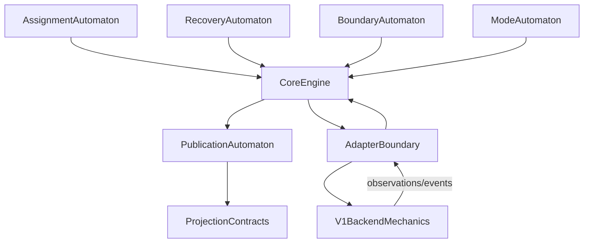

## 1. 设计目标

目标不是立即重写 `blockvol`，而是建立一个**纯 `V2` 语义核心**，使它成为系统唯一的语义 authority：

- `V2 core` 负责定义 truth、state、event、decision
- `adapter` 负责把外部输入翻译成 `V2` 事件，并把 `V2` 决策翻译成 runtime/backend 调用
- `V1 backend` 只保留执行能力，不再解释协议语义

当前 chosen path 不变：

- `RF=2`
- `sync_all`
- 当前 master / volume-server heartbeat path
- `blockvol` 作为执行 backend

这和已有设计是一致的，不是新改向。它只是把 `Phase 1-13` 一直在做的事显式化。

---

## 2. 核心分层

### 2.1 `V2 Core`
职责：

- 持有控制真相
- 持有恢复真相
- 持有数据边界真相
- 持有对外发布真相
- 根据事件做决策
- 输出 commands / projections

### 2.2 Adapter Boundary
职责：

- 把 master / heartbeat / runtime observation 翻译成 `V2 event`
- 把 `V2 command` 翻译成对 `blockvol` / transport / frontend 的调用
- 把 backend/runtime 事实翻译成 `projection`

### 2.3 `V1 Backend`
职责：

- WAL / extent / dirty map / flusher
- receiver / shipper transport
- iSCSI / NVMe frontend
- rebuild install primitive

规则：

- backend 报告事实
- core 解释语义
- adapter 做翻译
- 不允许 `blockvol` 的混合状态直接越权成为系统 truth

---

## 3. `V2 Core` 最小对象清单

下面是“最小可行”的 `struct / event / command / projection` 集合。

### 3.1 Struct 清单

#### A. Control structs
```go
type VolumeIntent struct {
    VolumeID string
    Epoch uint64
    PrimaryID string
    ReplicaIDs []string
    DurabilityMode string
}

type ReplicaIdentity struct {
    ReplicaID string
    ServerID string
}

type AssignmentView struct {
    VolumeID string
    Epoch uint64
    Role RoleIntent
    ReplicaEndpoints map[string]Endpoint
}
```

职责：

- 谁是 primary
- 谁是 replica
- 当前 epoch
- stable identity 是谁
- assignment intent 到底是什么

#### B. Recovery structs
```go
type ReplicaState string
const (
    StateDisconnected ReplicaState = "disconnected"
    StateConnecting   ReplicaState = "connecting"
    StateCatchingUp   ReplicaState = "catching_up"
    StateInSync       ReplicaState = "in_sync"
    StateDegraded     ReplicaState = "degraded"
    StateNeedsRebuild ReplicaState = "needs_rebuild"
)

type ReplicaSession struct {
    SessionID string
    ReplicaID string
    Epoch uint64
    Kind SessionKind
    Active bool
    Superseded bool
}

type RecoveryOwner struct {
    ReplicaID string
    SessionID string
    Running bool
}
```

职责：

- 当前 replica 的恢复状态是什么
- 当前 session 是谁
- 谁拥有 recovery authority
- 旧 session 是否已失效

#### C. Data-boundary structs
```go
type BoundaryView struct {
    CommittedLSN uint64
    CheckpointLSN uint64
    WALHeadLSN uint64
    ReceivedLSN uint64
    TargetLSN uint64
    AchievedLSN uint64
    SnapshotBaseLSN uint64
}
```

职责：

- durability boundary
- catch-up target
- rebuild target
- stable base image
- 实际已达到边界

#### D. Publication structs
```go
type ReadinessView struct {
    RoleApplied bool
    ReceiverReady bool
    ShipperConfigured bool
    ShipperConnected bool
    ReplicaEligible bool
    PublishHealthy bool
}

type LookupProjection struct {
    VolumeID string
    PrimaryServer string
    ISCSIAddr string
    ReplicaReady bool
    ReplicaDegraded bool
}
```

职责：

- 什么时候可以 publish
- lookup/heartbeat 应该看到什么
- “存在”与“ready”分离

---

## 4. `V2 Core` 最小事件清单

### 4.1 Control events
```go
AssignmentDelivered
EpochBumped
RepeatedAssignmentDelivered
IdentityResolved
```

### 4.2 Recovery events
```go
SessionCreated
SessionSuperseded
SessionRemoved
CatchUpPlanned
CatchUpCompleted
RebuildStarted
RebuildCommitted
```

### 4.3 Runtime observation events
```go
RoleApplied
ReceiverStarted
ReceiverReadyObserved
ShipperConfiguredObserved
ShipperConnectedObserved
BarrierAccepted
BarrierRejected
```

### 4.4 Data-boundary events
```go
CommittedLSNAdvanced
CheckpointLSNAdvanced
ReceivedLSNAdvanced
AchievedLSNAdvanced
RetentionEscalated
```

### 4.5 Publication events
```go
HeartbeatCollected
PublicationProjected
ReplicaMarkedReady
ReplicaMarkedDegraded
```

原则：

- event 是 observation 或 intent
- event 不是直接结果承诺
- `V2 core` 必须决定 event 的语义意义

---

## 5. `V2 Core` 最小 command 清单

这些 command 是 `V2 core` 输出给 adapter 的，不直接碰 backend。

```go
type Command interface{}

type ApplyRoleCommand struct {
    VolumeID string
    Epoch uint64
    Role RoleIntent
}

type StartReceiverCommand struct {
    VolumeID string
    DataAddr string
    CtrlAddr string
}

type ConfigureShipperCommand struct {
    VolumeID string
    Replicas []ReplicaEndpoint
}

type StartCatchUpCommand struct {
    ReplicaID string
    TargetLSN uint64
}

type StartRebuildCommand struct {
    ReplicaID string
    RebuildAddr string
    SnapshotBaseLSN uint64
}

type PublishProjectionCommand struct {
    VolumeID string
    Readiness ReadinessView
}

type InvalidateSessionCommand struct {
    ReplicaID string
    Reason string
}
```

原则：

- command 只表达“该做什么”
- backend 如何做，由 adapter 决定
- command 不依赖 `blockvol` 内部字段

---

## 6. `V2 Core` 最小 projection 清单

projection 是给外部世界看的，不是内部原始状态 dump。

### 6.1 Master / Lookup projection
- `PrimaryServer`
- `ISCSIAddr`
- `ReplicaReady`
- `ReplicaDegraded`
- `DurabilityMode`

### 6.2 Heartbeat projection
- 当前 role / epoch
- boundary fields
- readiness fields
- transport degraded
- receiver published addr

### 6.3 Diagnostic projection
- active recovery tasks
- session ownership
- publish gating reason
- pending rebuild / deferred promotion reason

### 6.4 Tester projection
- `wait_volume_healthy` 不再只看 “replica exists”
- 必须看 `replica_ready`
- 必须区分:
  - allocated
  - role applied
  - receiver ready
  - publish healthy

### 6.5 由五个小自动机构成的大自动机

`V2 core` 不应该被实现成一个“所有语义揉在一起”的大状态机。
更稳的方式是把它拆成五个 core-owned automata，再由 `CoreEngine` 组合：

1. `AssignmentAutomaton`
   - volume intent
   - role intent
   - stable replica identity
   - epoch
   - desired replica set
2. `RecoveryAutomaton`
   - session ownership
   - catch-up vs rebuild selection
   - per-replica recovery state
3. `BoundaryAutomaton`
   - committed truth
   - checkpoint truth
   - durable barrier truth
   - rebuild/catch-up target truth
4. `ModeAutomaton`
   - `allocated_only`
   - `bootstrap_pending`
   - `replica_ready`
   - `publish_healthy`
   - `degraded`
   - `needs_rebuild`
5. `PublicationAutomaton`
   - readiness closure
   - publication closure
   - outward healthy vs non-healthy truth

组合关系应该是：



这里最关键的工程规则是：

1. 先定义 core-owned state / transitions
2. 再定义 command-emission rules
3. 再定义 projection contracts
4. 最后才接 adapter

如果顺序反过来，`V1` mixed runtime state 会重新夺回语义 authority。

---

## 7. 直接映射到仓库路径

下面按“核心 / adapter / backend”映射。

### 7.1 `V2 Core` 现有基础
这些文件已经在扮演 core 的雏形。

- `sw-block/engine/replication/registry.go`
  - `AssignmentIntent`
  - `AssignmentResult`
  - `ReplicaAssignment`
- `sw-block/engine/replication/session.go`
  - session ownership / lifecycle
- `sw-block/engine/replication/sender.go`
  - sender state abstraction
- `sw-block/engine/replication/orchestrator.go`
  - assignment -> session/recovery orchestration
- `sw-block/engine/replication/types.go`
- `sw-block/engine/replication/outcome.go`
- `sw-block/engine/replication/observe.go`
- `weed/server/block_recovery.go`
  - runtime owner
- `weed/server/master_block_registry.go`
  - publication truth / cluster registry truth
- `weed/server/master_block_failover.go`
  - failover/rebuild truth

### 7.2 Adapter Boundary 现有基础
- `weed/storage/blockvol/v2bridge/control.go`
  - assignment -> engine intent
- `weed/server/volume_server_block.go`
  - assignment lifecycle / readiness closure / wiring
- `weed/server/block_heartbeat_loop.go`
  - heartbeat + assignment loop
- `weed/server/volume_server_block_debug.go`
  - readiness/debug projection
- `weed/server/master_grpc_server_block.go`
  - lookup projection
- `weed/server/master_server_handlers_block.go`
  - REST projection

### 7.3 `V1 Backend` 现有基础
- `weed/storage/blockvol/blockvol.go`
- `weed/storage/blockvol/flusher.go`
- `weed/storage/blockvol/replica_apply.go`
- `weed/storage/blockvol/wal_shipper.go`
- `weed/storage/blockvol/shipper_group.go`
- `weed/storage/blockvol/dist_group_commit.go`
- `weed/storage/blockvol/rebuild.go`
- `weed/storage/blockvol/iscsi/`
- `weed/storage/blockvol/nvme/`

---

## 8. 近期可做

这里说的是“现在应该做”的，不是中长期重构幻想。

### 8.1 让 `V2 core` 成为唯一 assignment 语义入口
目标：

- 所有 assignment 先进入 `V2 core`
- `BlockService` 不再自己解释太多语义
- `BlockService` 更像 command executor

直接涉及文件：

- `sw-block/engine/replication/orchestrator.go`
- `weed/storage/blockvol/v2bridge/control.go`
- `weed/server/volume_server_block.go`

### 8.2 把 readiness 做成正式 projection，不只是 service 内部状态
目标：

- `roleApplied`
- `receiverReady`
- `shipperConfigured`
- `shipperConnected`
- `replicaEligible`
- `publishHealthy`

这些状态进入稳定 projection，而不是只在 debug 内可见。

直接涉及文件：

- `weed/server/volume_server_block.go`
- `weed/server/master_block_registry.go`
- `weed/server/master_grpc_server_block.go`
- `weed/server/master_server_handlers_block.go`

### 8.3 把 `wait_volume_healthy`、lookup、heartbeat 都统一到同一个 readiness 定义
目标：

- 不再出现：
  - registry says healthy
  - VS side not ready
  - tester 误判 ready

直接涉及文件：

- `weed/storage/blockvol/testrunner/actions/devops.go`
- `weed/server/master_block_registry.go`
- `weed/server/volume_grpc_client_to_master.go`

### 8.4 把 `CP13-8` 用作 adapter/publication closure 的真实验证
目标：

- 确认当前 failure 到底是：
  - backend data bug
  - adapter timing/publication bug
  - core rule gap

这一步是近期必须做的，因为它是 live contradiction。

---

## 9. 中期演进

### 9.1 把 `V2 core` 真正做成 command/event 模式
目标：

- engine 输出 command
- adapter 执行 command
- runtime 返回 event
- core 更新 state

这会比现在 “ProcessAssignments 里又做判断又做执行” 更干净。

### 9.2 把 `master_block_registry` 从“半业务逻辑半存储”收敛成 projection store
目标：

- registry 不负责猜测 semantics
- registry 存放 `V2 projection`
- 真正的语义判断放在 core

### 9.3 把 backend 接口化
候选接口：

```go
type StorageBackend interface {
    StatusSnapshot() BoundaryView
    SetRetentionFloor(...)
}

type TransportBackend interface {
    StartReceiver(...)
    ConfigureReplicas(...)
    ShipperStates() ...
}

type RebuildBackend interface {
    StartRebuild(...)
    InstallSnapshot(...)
}

type FrontendBackend interface {
    PublishISCSI(...)
    PublishNVMe(...)
}
```

### 9.4 让 `blockvol` 逐渐退化成 pure backend
目标：

- `blockvol` 不再持有系统级语义 authority
- 它保留 local storage truth 和执行能力
- 语义解释都上提到 `V2 core`

---

## 10. 如何保持前面建立的约束和 envelope

这部分最重要。

### 10.1 已接受约束必须升格为 core invariants
前面 `CP13-1..7` 不能只留在测试里，必须进入 core 规则：

- canonical identity
- durable progress truth
- only eligible replicas count
- reconnect handshake
- retention fail-closed
- rebuild fallback

### 10.2 envelope 不允许被 core 重构顺手扩大
继续固定：

- `RF=2`
- `sync_all`
- 当前 heartbeat/gRPC path
- `blockvol` backend

不要因为做架构分层，就顺手放大：
- `RF>2`
- broader transport matrix
- broader rollout claim

### 10.3 每一步都做双重验收
每个演进 slice 必须同时证明：

- 旧约束仍成立
- 新边界更显式、更少混态

### 10.4 禁止“抽象重构先降低 bar”
不能接受：
- 为了重构，暂时弱化 fail-closed
- 为了抽接口，暂时模糊 readiness
- 为了分层，暂时把 publish truth 放宽

### 10.5 未来算法和状态转换的审查规则
从 `Phase 14+` 开始，任何新的 transition rule / command rule / projection
rule，都应该在 code review 或 delivery note 里回答三件事：

1. semantic constraint satisfied
   - 它满足的是哪条 `claim / truth / accepted checkpoint`
2. overclaim avoided
   - 它防止了哪种 false healthy / false ready / false durable / false recoverable
3. proof preserved
   - 它保持了哪个已接受 proof 仍然成立

这不是文书要求，而是防止 `V2 core` 重新退化成“runtime convenience +
事后解释”的最低工程 bar。

---

## 11. V2 如何从已接受 claim 变得可靠

`V2 core` 的可靠性不是来自“状态更多”或“架构更复杂”。
它的可靠性来自两个更严格的来源：

1. 只消费已经进入 claim/evidence ledger 的 accepted constraints
2. 只复用 `V1` 中已知可靠的实现行为，而不继承其隐含语义

### 11.1 `V2` 不是重新发明 truth，而是消费已接受 truth

`V2 core` 不应该把当前 runtime 中“看起来通常有效”的行为直接提升为语义 truth。

它只能建立在已经被 claim / evidence 支撑的约束上，例如：

- canonical identity
- durable progress authority = `replicaFlushedLSN`
- only eligible replica may satisfy sync durability
- reconnect must use explicit handshake / catch-up
- retention must fail closed
- unrecoverable gap must escalate to `NeedsRebuild`

这些约束不是设计说明的附属物，而应该是 `V2 core` 的输入边界。

换句话说：

- 能进入 core 的，只能是已经被 ledger 接受的 truth
- 没有进入 ledger 的运行假设，不能直接成为 core 依赖

### 11.2 claim 是 core 的输入约束，不只是 review 文档

`V2 core` 的一个基本规则是：

> 任何没有被 claim/evidence 接受的行为，只能作为 observation，不能作为 authority。

例如，下面这些不能直接进入 `V2` truth：

- “第一次写通常会触发 shipper 连接”
- “promote 之后 replication 大概会自己恢复”
- “`degraded=false` 大概就表示 ready”
- “有 published addr 就说明 replica 可用”

这些都只能当作 runtime observation，必须再经过 `V2` 的 readiness / eligibility / publication 规则过滤。

### 11.3 `V2` 的可靠性来自 fail-closed，而不是隐式收敛

`V1` 常见的问题不是“完全不能工作”，而是很多语义靠时序和重试隐式收敛：

- assignment delivered 之后，何时真正 ready
- promote 之后，何时真正恢复 replication
- `sync_all` 何时真的表示 cross-node durability

`V2 core` 必须拒绝从这些模糊状态直接宣布 success。

它应该采用更硬的规则：

- 不满足 accepted claim 的条件时，保持 not-ready / degraded / blocked
- 不允许从 convenience state 猜测 publish healthy
- 不允许用工作负载本身去“顺便推动系统进入正确状态”

一句话：

- `V2` 的可靠性来自明确边界 + fail-closed
- 不来自“系统大概率最终会自己好起来”

### 11.4 `V2 core` 使用哪些 accepted claim

| Claim / Constraint | 用于 core 的哪里 | 作用 |
|---|---|---|
| canonical identity | control truth | 不再从地址猜身份 |
| durable progress = `replicaFlushedLSN` | boundary truth | 不再从 success/ack 猜 durability |
| eligible-only barrier | readiness / publication | 不让非闭环 replica 参与 durability |
| reconnect handshake | recovery truth | 不再靠第一次写触发隐式恢复 |
| retention fail-closed | recovery truth | 不让 lagging replica 以模糊状态长期存在 |
| rebuild fallback | fail-closed policy | gap 不再长期悬挂在 degraded |

这些 claim 越清楚，`V2 core` 就越可靠。

---

## 12. `V2` 复用哪些 `V1` 可靠行为

`V2` 不是完全抛弃 `V1`。
它复用的是 `V1` 中已经被证明是局部可靠、实现性稳定的行为。

但必须明确区分：

- **可复用的可靠行为**
- **不应继续复用的旧语义**

### 12.1 可复用的可靠行为

这些行为可以继续作为 backend primitive 使用：

| `V1` behavior | 为什么可复用 | 为什么不构成语义 authority |
|---|---|---|
| WAL append / read | 局部实现、可验证 | 不决定外部 durability meaning |
| flusher / checkpoint | 局部物化机制 | 不决定 cluster-level readiness |
| dirty-map local read/write | 局部一致性行为 | 不决定 publication truth |
| receiver transport | 纯执行路径 | 不决定 session authority |
| shipper transport | 纯传输机制 | 不决定 eligibility / publish truth |
| rebuild installer / extent install | 局部 install primitive | 不决定 rebuild policy |
| iSCSI / NVMe serving | frontend primitive | 不决定 replicated visibility truth |

这些行为的共同特征是：

1. 局部
2. 可测试
3. 不依赖 cluster-level 推断
4. 不应该自己解释系统语义

### 12.2 不继续复用的 `V1` 语义

下面这些即使在 `V1` 中曾经“工作过”，也不应该进入 `V2` truth：

- ready from existence
- healthy from non-empty publication
- `sync_all` from vacuous barrier success
- promote implies replication closure
- assignment arrival implies runtime closure
- first write implicitly fixes transport state

`V2` 可以复用 `V1` 的动作，但不能继承这些旧语义。

### 12.3 `weed/` 中当前改动的地位

当前 branch 中 `weed/` 的很多改动更接近：

- 现象验证
- integration closure
- debug/diagnostic surfaces
- 暂时性 runtime fix

它们的价值在于暴露现实、定位问题、验证边界。

但长期语义 authority 不应该放在这些改动本身上。

长期可保留的，应当是那些已经被 `V2` 吸收为：

- backend primitive
- adapter boundary
- projection surface

的部分。

---

## 13. 长期资产 vs 当前实现现实

当前项目中最重要的区分不是“哪个文件在跑”，而是“哪个资产值得长期保留”。

### 13.1 长期资产

长期需要保留和演进的是 `sw-block/` 中的 `V2` 语义资产：

- `v2-protocol-truths.md`
- `v2-protocol-closure-map.zh.md`
- `v2-protocol-claim-and-evidence.md`
- `v2-reuse-replacement-boundary.md`
- `v2_mini_core_design.md`
- `sw-block/engine/replication/` 中逐步成形的 core semantics

这些资产定义的是：

- truth
- claim
- closure
- reliability model
- reusable semantics

### 13.2 当前实现现实

`weed/` 中的当前改动更多代表：

- 当前 chosen path 的运行现实
- backend / adapter / publication 的实现尝试
- 用来暴露矛盾和验证边界的现实载体

因此，它们不应该被自动视为长期保留资产。

更准确的原则是：

- `weed/` 中的改动，只有在被 `V2` 语义明确吸收之后，才应该作为长期实现保留
- 否则，它们可以只是阶段性的验证资产

### 13.3 一个总规则

> `V2 core` 的可靠性不是来自信任当前 `weed/` 分支实现。
> 它来自只消费被 claim/evidence ledger 接受的约束，并只复用 `V1` 中已知可靠的实现行为。
> 因此，`weed/` 中的当前改动可以是临时验证资产，而 `sw-block/` 中的 truth / claim / core design 才是长期保留资产。

这个规则的好处是：

1. 不会因为当前 integration patch 看起来有效，就把它误当成长期语义
2. 不会因为 `V1` 仍被复用，就把旧混态继续当作 authority
3. 后续收敛分支时，可以明确区分：
   - 哪些东西应进入长期 `V2` 资产
   - 哪些东西只是当前实现现实

---

## 14. `V2 core` 的 Go package 目录建议

下面不是要求一次性重排仓库，而是给出一个与当前代码现实相容的目标布局。

建议把长期 `V2` 资产继续收敛在 `sw-block/engine/replication/` 之下，并按职责细分：

```text
sw-block/engine/replication/
  core/
    types.go
    state.go
    event.go
    command.go
    projection.go
    engine.go
  session/
    session.go
    ownership.go
  boundary/
    lsn.go
    retention.go
    rebuild.go
  adapter/
    contract.go
    observe.go
  projection/
    heartbeat.go
    lookup.go
    diagnostic.go
```

如果短期不想新建这么多子目录，也可以先保持现有目录平铺，但按相同职责收敛文件：

1. `types.go`: 基础 types
2. `state.go`: state/ownership structs
3. `event.go`: incoming events
4. `command.go`: emitted commands
5. `projection.go`: outward projections
6. `engine.go`: `ApplyEvent() -> Decide()`
7. `session.go` / `sender.go` / `registry.go`: 继续作为现有核心实现承载

### 14.1 与现有代码的最小映射

当前已经存在的可直接承接 `V2 core` 的文件：

- `sw-block/engine/replication/types.go`
- `sw-block/engine/replication/session.go`
- `sw-block/engine/replication/sender.go`
- `sw-block/engine/replication/registry.go`
- `sw-block/engine/replication/orchestrator.go`
- `sw-block/engine/replication/outcome.go`
- `sw-block/engine/replication/rebuild.go`
- `sw-block/engine/replication/observe.go`

这些文件已经说明：

- `V2 core` 不是概念草图
- 它已经有 sender/session/ownership/orchestrator 的真实雏形
- 后续更工程化的工作主要是把这些对象的职责再显式化，而不是重新发明

### 14.2 `weed/` 中的对应位置

`weed/` 中长期应当只保留：

- backend primitive
- adapter boundary
- projection surface

不应该让 `weed/` 成为长期语义 authority。

当前可暂时对应为：

- adapter boundary:
  - `weed/storage/blockvol/v2bridge/control.go`
  - `weed/server/volume_server_block.go`
  - `weed/server/block_heartbeat_loop.go`
- projection surface:
  - `weed/server/master_block_registry.go`
  - `weed/server/master_grpc_server_block.go`
  - `weed/server/master_server_handlers_block.go`
  - `weed/server/volume_server_block_debug.go`
- backend primitive:
  - `weed/storage/blockvol/*`

---

## 15. `struct / event / command / projection` 推荐文件落点

### 15.1 Struct

建议放置：

- `types.go`
  - `Endpoint`
  - `ReplicaID`
  - `VolumeID`
  - `SessionKind`
  - `ReplicaState`
- `state.go`
  - `VolumeIntent`
  - `AssignmentView`
  - `ReplicaSession`
  - `RecoveryOwner`
  - `BoundaryView`
  - `ReadinessView`

规则：

- 基础标识和 enum 放 `types.go`
- 可变的 core state 放 `state.go`

### 15.2 Event

建议放 `event.go`：

- `AssignmentDelivered`
- `EpochBumped`
- `RepeatedAssignmentDelivered`
- `RoleApplied`
- `ReceiverReadyObserved`
- `ShipperConfiguredObserved`
- `ShipperConnectedObserved`
- `BarrierAccepted`
- `BarrierRejected`
- `CommittedLSNAdvanced`
- `CheckpointLSNAdvanced`
- `RebuildCommitted`
- `HeartbeatCollected`

规则：

- event 只描述 observation 或 intent
- event 不直接携带“成功解释”

### 15.3 Command

建议放 `command.go`：

- `ApplyRoleCommand`
- `StartReceiverCommand`
- `ConfigureShipperCommand`
- `StartCatchUpCommand`
- `StartRebuildCommand`
- `InvalidateSessionCommand`
- `PublishProjectionCommand`

规则：

- command 只表达“core 决定要做什么”
- backend 如何完成，不在 command 内定义

### 15.4 Projection

建议放 `projection.go`，再按需要拆出：

- `projection_lookup.go`
- `projection_heartbeat.go`
- `projection_diagnostic.go`

至少包括：

- `LookupProjection`
- `HeartbeatProjection`
- `DiagnosticProjection`
- `TesterProjection`

规则：

- projection 是外部可见 truth
- 不是内部 state dump

### 15.5 当前仓库里的最小过渡落点

在不大改目录的前提下，可以先这样放：

- `sw-block/engine/replication/types.go`
  - 基础 type / enum
- `sw-block/engine/replication/session.go`
  - session ownership
- `sw-block/engine/replication/registry.go`
  - assignment reconcile
- `sw-block/engine/replication/orchestrator.go`
  - engine entrypoint / event handling 骨架
- 新增：
  - `sw-block/engine/replication/event.go`
  - `sw-block/engine/replication/command.go`
  - `sw-block/engine/replication/projection.go`

这样不会一开始就做大规模 package 重排，但可以先把抽象边界立起来。

---

## 16. 最小 `ApplyEvent() -> Decide() -> EmitCommands()` 伪代码骨架

下面给一个最小核心骨架，说明 `V2 core` 如何工作。

```go
type Core struct {
    volumes map[string]*VolumeState
}

type VolumeState struct {
    Intent      VolumeIntent
    Assignment  AssignmentView
    Session     map[string]*ReplicaSession
    Ownership   map[string]*RecoveryOwner
    Boundary    BoundaryView
    Readiness   ReadinessView
}

func (c *Core) ApplyEvent(ev Event) []Command {
    st := c.mustVolumeState(ev.VolumeID())

    switch e := ev.(type) {
    case AssignmentDelivered:
        st.Intent = mergeIntent(st.Intent, e.Intent)
        st.Assignment = buildAssignmentView(e)
        return c.decideFromAssignment(st)

    case RoleApplied:
        st.Readiness.RoleApplied = true
        return c.decidePublication(st)

    case ReceiverReadyObserved:
        st.Readiness.ReceiverReady = true
        st.Readiness.ReplicaEligible = true
        return c.decidePublication(st)

    case ShipperConfiguredObserved:
        st.Readiness.ShipperConfigured = true
        return nil

    case ShipperConnectedObserved:
        st.Readiness.ShipperConnected = true
        return c.decidePublication(st)

    case BarrierAccepted:
        st.Boundary.CommittedLSN = e.FlushedLSN
        return c.decideDurability(st)

    case CheckpointLSNAdvanced:
        st.Boundary.CheckpointLSN = e.CheckpointLSN
        return nil

    case RebuildCommitted:
        st.Boundary.AchievedLSN = e.AchievedLSN
        st.Readiness.ReplicaEligible = true
        return c.decidePublication(st)

    default:
        return nil
    }
}

func (c *Core) decideFromAssignment(st *VolumeState) []Command {
    var cmds []Command

    cmds = append(cmds, ApplyRoleCommand{
        VolumeID: st.Assignment.VolumeID,
        Epoch:    st.Assignment.Epoch,
        Role:     st.Assignment.Role,
    })

    if st.Assignment.Role == RoleReplica {
        cmds = append(cmds, StartReceiverCommand{
            VolumeID: st.Assignment.VolumeID,
            DataAddr: st.Assignment.ReplicaDataAddr(),
            CtrlAddr: st.Assignment.ReplicaCtrlAddr(),
        })
    }

    if st.Assignment.Role == RolePrimary && len(st.Assignment.ReplicaEndpoints) > 0 {
        cmds = append(cmds, ConfigureShipperCommand{
            VolumeID: st.Assignment.VolumeID,
            Replicas: st.Assignment.ReplicaEndpoints.All(),
        })
    }

    return cmds
}

func (c *Core) decidePublication(st *VolumeState) []Command {
    st.Readiness.PublishHealthy =
        st.Readiness.RoleApplied &&
        ((st.Assignment.Role == RolePrimary) ||
         (st.Readiness.ReceiverReady && st.Readiness.ReplicaEligible))

    return []Command{
        PublishProjectionCommand{
            VolumeID:  st.Assignment.VolumeID,
            Readiness: st.Readiness,
        },
    }
}
```

这个骨架的重点不是代码细节，而是三件事：

1. `event` 先进入 core
2. core 决定 state transition
3. command 由 core 发出，adapter 去执行

这样就不会再出现：

- runtime 自己偷偷解释语义
- workload 自己顺便把系统推到 healthy
- publication 在 readiness 闭环前提前放行

---

## 17. `V2 prototype` 与 `mini core design` 的关系

这份 `mini core design` 不是脱离 prototype 重新发明的。
它和 `V2 prototype` 是继承关系，不是替代关系。

### 17.1 prototype 提供了什么

prototype / FSM / simulator 已经证明了：

1. 哪些状态对象必须存在
2. 哪些事件必须显式
3. 哪些 failure class 必须 fail-closed
4. 哪些 boundary 不能靠实现便利重新解释

也就是说，prototype 提供的是：

- 语义骨架
- 状态机对象
- failure-class closure 直觉
- ownership / session / boundary 的必要性

### 17.2 mini core design 补的是什么

`mini core design` 解决的不是“语义是否存在”，而是：

1. 这些语义对象在当前仓库里应该落在哪些 package / file
2. 谁拥有这些对象
3. 哪些通过 adapter 进入 `weed/`
4. 哪些 `V1` 行为可以复用
5. 哪些当前 `weed/` 改动只是现实验证资产

所以：

- prototype 负责回答 “应该是什么”
- mini core design 负责回答 “在当前代码库里怎么做”

### 17.3 为什么不能直接把 prototype 当 production 目录

因为 production 还必须处理：

- heartbeat / master registry
- frontend projection
- diagnostics
- current backend reuse
- bounded envelope / claim / evidence integration

所以不能简单把 prototype 原样搬进 `weed/` 或 production path。

更合理的关系是：

1. prototype 提供语义模板
2. `sw-block/engine/replication/` 承接 core semantics
3. adapter 把这些 semantics 翻译到当前 runtime
4. backend 继续执行 I/O / transport primitives

### 17.4 一个总规则

> `mini core design` 的任务不是重新设计 prototype 已经证明必要的语义对象。
> 它的任务是把这些对象放到当前代码库中可落地、可维护、可验证的位置，并明确它们与 `V1 backend` 的边界。

### 17.5 在 `V2 core` 建立前如何解释当前测试

在 `V2 core` 还没有以明确 package / file / event-command loop 形式落地之前，
当前大多数 integrated tests 都应该这样解释：

1. 不是在验证一个已经完成的 `V2 runtime`
2. 而是在用 `V2` 的 truth / constraint / acceptance bar 去检查当前 `V1` runtime 的表现

更准确地说：

- 现在已经存在的是：
  - `V2` 的 truth
  - `V2` 的 claim boundary
  - `V2` 的 failure-class discipline
  - `V2` 的 prototype / FSM / mini-core design
- 现在还没有完全存在的是：
  - 明确拥有 runtime 语义 authority 的 `V2 core`
  - 真实 live path 上的 `ApplyEvent() -> Decide() -> EmitCommands()` 闭环
  - 被正式降级成 adapter / backend reality 的 `weed/` 运行结构

因此，像 `CP13-8` 这样的结果，当前最准确的解释不是：

- `V2 runtime` 已验证

而是：

- 当前 `V1` 运行现实在 `V2` 约束下，通过了一个 bounded envelope 的真实 workload 检查

这类检查点的价值依然很高，因为它证明：

1. 当前复用路径不是完全错误的
2. `V2` 约束能够识别和纠正真实 bug
3. 当前运行现实值得继续被抽象、剥离，并最终收敛成真正的 `V2 core`

所以在后续 phase 中，应当默认区分三种东西：

1. `V2` 语义证明
2. `V1-under-V2-constraints` 的运行验证
3. 后续真正的 `V2 core` 提取与 runtime closure

---

## 18. 推荐的实施顺序

### 近期
1. 继续收紧 assignment -> readiness -> publication closure
2. 用 `CP13-8` 证明当前 split 能否识别真实 bug 类型
3. 把 readiness / projection 固化为稳定 surface

### 中期
1. 引入 command/event 风格的 `V2 core`
2. 减少 `BlockService` 中的语义判断
3. 把 registry 收敛为 projection store
4. 抽 backend interface

### 更后面
1. 评估是否需要物理独立的 `V2 core process`
2. 如果需要，那是因为逻辑已经独立，不是为了“好看”

---

## 19. 最短结论

你要的“更工程化”版本可以归纳为一句话：

- `V2 core` 负责定义 truth、state、event、command、projection
- `adapter` 负责隔离 `V1` 污染并翻译输入输出
- `V1 backend` 负责 WAL / transport / frontend / rebuild 执行
- 后续 phase 的方向不是换路线，而是把这件事一步步显式化并固化成正式结构

如果你愿意，下一步我可以继续给你一版更像真正设计文档里的内容：

- `V2 core` 的 Go package 目录建议
- 每个 struct/event/command 放在哪个文件
- 一个最小 `ApplyEvent() -> Decide() -> EmitCommands()` 伪代码骨架