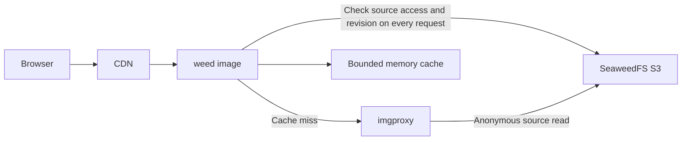

# On-demand image gateway

`weed image` is an optional public image endpoint. Original images remain in
SeaweedFS. On a cache miss, a separate imgproxy service resizes and encodes the
image; results enter a bounded in-process cache. Subsequent requests recheck
anonymous source access before reusing results. Cache eviction and process
restarts do not affect stored objects. No S3 objects, Filer entries, or application
file records are created for processed images.



## Request interface

```text
/image.png?x-oss-process=image/resize,w_640/quality,Q_85/format,webp
/image.png?x-oss-process=image/resize,w_240,h_240,m_lfit,limit_1/format,webp
/image.png?x-oss-process=image/format,jpg/quality,Q_85
```

- `resize` accepts `w`, `h`, `m_lfit`, and `limit_1`. It preserves aspect ratio
  and never enlarges the source. One dimension determines the other; two
  dimensions specify a bounding box.
- `quality,Q_1` through `quality,Q_100` specify absolute quality, defaulting to 85.
  Aliyun's relative quality `q` has no equivalent here and returns 400.
- `format` accepts `jpg`, `jpeg`, `png`, and `webp`, defaulting to WebP.
- The default maximum output dimension is 4096. Repeated parameters, unknown
  operations, cropping, watermarks, animation processing, automatic format
  negotiation, and other OSS operations are unsupported. PNG output is lossless;
  quality mainly affects JPEG/WebP. Animated sources use imgproxy's default
  first-frame behavior.
- A single `versionId` may select a specific source version. Other query
  parameters are rejected.
- GET, HEAD, Range, and conditional requests apply to the returned representation.
  Processed images have independent SHA-256 ETags and byte lengths. Derived
  responses use ETag validators rather than the source modification date, which
  cannot distinguish overwrites within the same second. Without a processing
  parameter the gateway reads the original image, including single byte ranges.

This implements a limited subset of OSS image processing parameters, rather than
full Aliyun OSS compatibility. It runs on a separate port and does not change
existing `weed s3`, Filer, or Volume services.

## Running the gateway

Start a separate imgproxy service, then run:

```sh
weed image \
  -source=http://s3:8333/public-bucket \
  -imgproxy=http://imgproxy:8080 \
  -ip.bind=0.0.0.0 -port=8334 \
  -cacheCapacityMB=64 -concurrency=8 \
  -maxSourceMB=25 -maxResultMB=10 -maxDimension=4096 -timeout=15s
```

`source` fixes the source HTTP(S) URL, optionally including a bucket path or a
bucket domain pointing to S3. With `http://s3:8333/public-bucket`, a client request
for `/a/b.png` reads `http://s3:8333/public-bucket/a/b.png`. Both backend URLs must
omit credentials, queries, and fragments. Dot segments and backslashes, including
repeatedly escaped forms, are rejected to prevent backend path normalization from
escaping a fixed bucket prefix. The gateway and imgproxy must reach the same source.

Configure imgproxy limits and isolate the encoder with container or process
resource limits. Suggested imgproxy settings:

```text
IMGPROXY_WORKERS=2
IMGPROXY_REQUESTS_QUEUE_SIZE=8
IMGPROXY_MAX_SRC_FILE_SIZE=26214400
IMGPROXY_MAX_SRC_RESOLUTION=25
IMGPROXY_MAX_RESULT_DIMENSION=4096
IMGPROXY_MAX_ANIMATION_FRAMES=1
IMGPROXY_MAX_REDIRECTS=0
IMGPROXY_ALLOWED_PROCESSING_OPTIONS=rs,q,f
IMGPROXY_ALLOWED_SOURCES=http://s3:8333/public-bucket/
```

These variables apply to imgproxy 3.x. In imgproxy 4.x, some source security limits
move to separate source configuration; configure equivalent restrictions according
to that version's documentation. File size limits do not replace pixel and memory
limits. The gateway does not decode images and cannot enforce encoder-side limits.

Set hexadecimal `IMGPROXY_KEY` and `IMGPROXY_SALT` in both services to sign backend
requests. The gateway supports one key/salt pair with full SHA-256 signatures;
imgproxy must use the default 32-byte signature length. Unsigned requests are only
appropriate on an isolated trusted network. Keep signing material out of command
lines, public configuration, and logs.

## Access and caching

The endpoint only accepts anonymous public reads. It rejects client Authorization,
S3 signature parameters, and `x-amz-*` request headers. Browser cookies are ignored
and never forwarded to backends. The gateway does not create administrative
credentials or signed source URLs for private objects. Use the existing S3 endpoint
for private images.

Every derived request performs an anonymous source HEAD, including cache hits,
HEAD, and 304 requests. The encoder uses anonymous GET, so the source must apply
the same public-read policy to HEAD and GET; SeaweedFS S3 authorizes both as object
reads. A source 403 or 404 rejects derived requests even if cached bytes remain.
Source URL, ETag, modification time, length, version ID, and canonical processing
options form the cache key. Sources without ETags are not cached. A revision
change detected during encoding returns 409, allowing a client retry. Use immutable
object names for unversioned sources to avoid races between metadata checks and
frequent source overwrites.

Concurrent misses for the same result share one encoding job. A cancelled waiter
does not cancel work needed by other waiters. If all waiters leave, the job may run
until its independent processing timeout; separate work tokens still bound such
background jobs. Backend processing and client writes each receive a full timeout
budget. Requests, result sizes, duration, and concurrency are bounded. Original
single-range responses are limited by the complete object's size, not just the
selected range. Excess concurrency returns 429; errors are never cached. The cache
is limited by bytes and 1024 entries, defaults to 64 MiB, and can be disabled with
`-cacheCapacityMB=0`. Each instance has its own cache, empty after restart.

Responses default to `Cache-Control: no-cache`, allowing downstream storage with
mandatory revalidation so source access is checked on every request. A CDN must
preserve `x-oss-process` and `versionId` and include the complete query in its cache
key. If you explicitly set a CDN TTL for permanently public immutable objects,
CDN hits bypass the gateway. Revocation or deletion then requires a CDN purge,
otherwise access changes only take effect after TTL expiry. Errors use `no-store`.

Configure HTTPS, CORS, and external rate limits in the existing reverse proxy or
CDN. Route only public image GET/HEAD requests to this gateway. Uploads, listings,
signed reads, and other S3 operations continue using the existing S3 endpoint.

## Validation

```sh
go test -race ./weed/images/gateway
go vet ./weed/images/gateway
CGO_ENABLED=0 go build ./weed
```

Tests cover revocation and deletion, overwrite invalidation, explicit versions,
shared work and cancellation, resource limits, backend failures, signatures and
path escaping, and HEAD/ETag/Range semantics. Before deployment, also test real
SeaweedFS and imgproxy for dimensions, media types, transparency, and regeneration
after clearing the cache.
