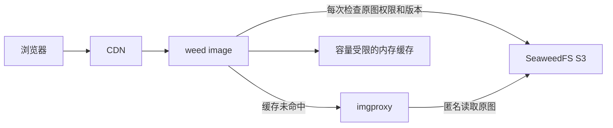

# 按需图片网关

`weed image` 是可选的公开图片入口。原图保存在 SeaweedFS，首次请求由独立
imgproxy 服务缩放和编码，结果只进入容量受限的进程内缓存。后续请求核验原图
仍可匿名访问后复用结果。缓存可随时丢弃或重启重建，不产生 S3 对象、Filer
条目或业务文件记录。



## 请求接口

```text
/image.png?x-oss-process=image/resize,w_640/quality,Q_85/format,webp
/image.png?x-oss-process=image/resize,w_240,h_240,m_lfit,limit_1/format,webp
/image.png?x-oss-process=image/format,jpg/quality,Q_85
```

- `resize` 接受 `w`、`h`、`m_lfit` 和 `limit_1`。保持比例，始终不放大。
  只指定一边时另一边按比例计算；同时指定两边时适应边界。
- `quality,Q_1` 至 `quality,Q_100` 表示绝对质量，默认 85。
  阿里云相对质量 `q` 没有等价实现，会返回 400。
- `format` 支持 `jpg`、`jpeg`、`png`、`webp`，默认 WebP。
- 默认最大输出边长 4096。重复参数、未知操作、裁剪、水印、动画处理、自动
  格式协商及其他 OSS 操作不属于第一版支持范围。PNG 为无损编码，质量参数
  主要影响 JPEG/WebP；动画源按 imgproxy 的默认策略只输出首帧。
- 可附带单个 `versionId` 读取原图的特定版本。其他查询参数均被拒绝。
- GET、HEAD、Range、条件请求作用于返回的表示；派生图有自己的 SHA-256
  ETag 和字节长度。无处理参数时读取原图。

这是 OSS 图片处理参数的有限子集，不是完整阿里云 OSS 协议兼容实现。它是
独立端口，现有 `weed s3`、Filer 和 Volume 服务不受影响。

## 启动

先运行独立 imgproxy 服务，然后启动网关：

```sh
weed image \
  -source=http://s3:8333/public-bucket \
  -imgproxy=http://imgproxy:8080 \
  -ip.bind=0.0.0.0 -port=8334 \
  -cacheCapacityMB=64 -concurrency=8 \
  -maxSourceMB=25 -maxResultMB=10 -maxDimension=4096 -timeout=15s
```

`source` 固定原图 HTTP(S) 地址，可带桶路径，也可使用指向 S3 的桶域名。
例如源为 `http://s3:8333/public-bucket`，客户端 `/a/b.png` 读取
`http://s3:8333/public-bucket/a/b.png`。源与处理服务都不能在 URL 中携带凭据、
查询参数或片段。网关和 imgproxy 必须能访问同一个源地址。

建议为 imgproxy 配置下列环境变量，并通过独立容器或进程资源限额隔离编码：

```text
IMGPROXY_WORKERS=2
IMGPROXY_REQUESTS_QUEUE_SIZE=8
IMGPROXY_MAX_SRC_FILE_SIZE=26214400
IMGPROXY_MAX_SRC_RESOLUTION=25
IMGPROXY_MAX_RESULT_DIMENSION=4096
IMGPROXY_MAX_ANIMATION_FRAMES=1
IMGPROXY_MAX_REDIRECTS=0
IMGPROXY_ALLOWED_PROCESSING_OPTIONS=rs,q,f
IMGPROXY_ALLOWED_SOURCES=http://s3:8333/public-bucket/
```

这些变量适用于 imgproxy 3.x。imgproxy 4.x 将部分源安全限制改为独立的来源
配置；使用 4.x 时按其文档配置同等限制。文件大小限制不能代替像素和内存
限制；网关本身不解码图片，也不能代替编码服务的限制。

在网关和 imgproxy 中同时设置十六进制环境变量 `IMGPROXY_KEY`、
`IMGPROXY_SALT` 可签名后端处理请求。网关支持一组完整 SHA-256 签名，
imgproxy 应使用默认的 32 字节签名长度。未配置时仅适合封闭的可信网络。
签名材料不要写入命令行、公开配置或日志。

## 权限与缓存

入口仅接受匿名公开读取，拒绝客户端 Authorization、S3 签名参数
和 `x-amz-*` 请求头。浏览器 Cookie 不转发给后端，也不用于提升读取权限。
它不为私有对象生成管理凭据或签名取图地址。私有图片
继续使用原 S3 服务。

每次派生请求都会对原对象执行匿名 HEAD，包括缓存命中、HEAD 和 304 请求。
编码服务也以匿名 GET 读取原图，因此源的 HEAD 与 GET 应采用相同的公开读取
策略；SeaweedFS S3 将二者都作为对象读取进行授权。原图返回 403 或 404 时，
即使仍有旧缓存也会拒绝派生请求。原图地址、ETag、修改时间、长度、版本 ID
和规范化处理参数共同组成缓存键。没有 ETag 时禁用结果复用；处理期间检测
到版本变化返回 409，客户端可重试。非版本化原图应使用不可变对象名，避免
高频覆盖引起处理与元数据检查之间的竞争。

相同结果的并发首次请求合并为一次编码；请求、结果大小、请求时长和并发
都有上限。超过并发返回 429，错误不缓存。缓存按字节和最多 1024 个条目
淘汰，默认 64 MiB，`-cacheCapacityMB=0` 可禁用。多实例各自缓存，重启后为空。

默认响应 `Cache-Control: no-cache`，允许下游保存但要求重新验证，从而每次
访问都检查原图权限。CDN 必须保留 `x-oss-process` 与 `versionId`，并将完整
参数纳入缓存键。如果对永久公开的不可变对象显式设置 CDN 缓存 TTL，命中时
不会请求网关，撤销公开访问或删除原图后需清除 CDN 缓存；否则权限更新仅在
TTL 到期后生效。失败响应始终 `no-store`。

请将 HTTPS、跨域响应和外部流量限速配置在现有反向代理或 CDN。仅将公开
图片 GET/HEAD 路由至图片网关，S3 上传、列举、签名读取及其他协议操作仍然
访问原 S3 入口。

## 验证

```sh
go test -race ./weed/images/gateway
go vet ./weed/images/gateway
CGO_ENABLED=0 go build ./weed
```

测试覆盖权限撤销和删除、覆盖失效、版本读取、并发合并、资源上限、后端错误、
签名及路径转义，以及派生图的 HEAD/ETag/Range。发布前还应以真实 SeaweedFS
和 imgproxy 验证输出尺寸、媒体格式、透明度及缓存清除后重新处理。
